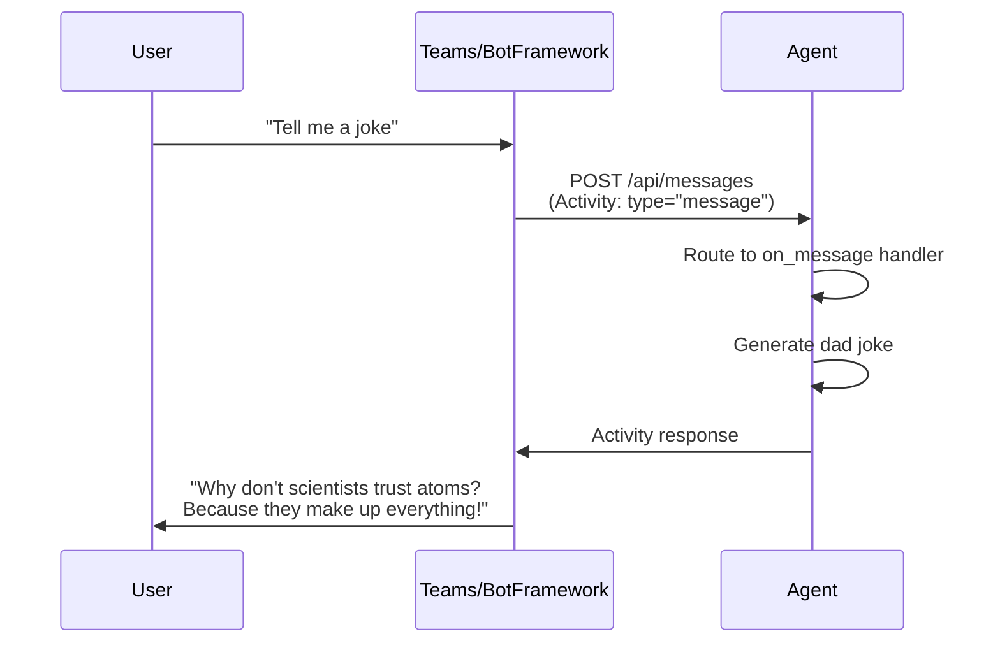
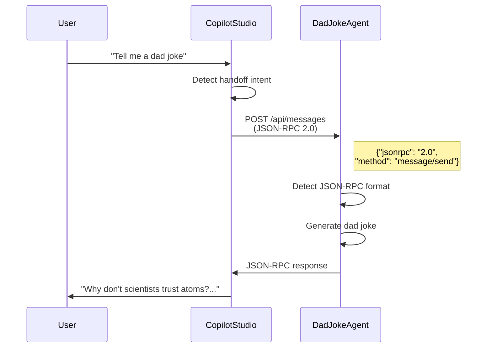

> **원문:** [From Dad Jokes to A2A: Building Python Agents That Talk to Copilot Studio](https://microsoft.github.io/mcscatblog/posts/A2A-Dad-jokes-Building-Python-Agents-with-Microsoft-365-SDK-for-MCS/)
> **게시일:** 2025-12-13 · **저자:** Roel Schenk

**두 개의 프로토콜, 하나의 에이전트, 무한한 확장 가능성**

---

## 왜 Copilot Studio용 외부 에이전트를 만들어야 할까요?

[YMAD의 재미있는 아재 개그 영상](https://www.youtube.com/@YMAD)을 보다가 "이런 걸 해주는 에이전트가 필요해!"라고 생각해 본 적이 있으신가요? 그렇다면 잘 오셨어요! 저는 신음이 절로 나오는 아재 개그를 들려주는 아재 개그 에이전트(Dad Joke Agent)를 만들었어요. 더 중요한 건, 이 에이전트가 **외부 에이전트로 Copilot Studio를 확장하는 방법**이라는 강력한 개념을 보여준다는 점이에요.

*A2A: Adult-to-Agent 프로토콜. 자식 에이전트와 연결된 에이전트가 있을 때, 궂은일을 처리해 줄 어른이 필요한 법이니까요! 🕵️*

**제 동료가 던진 진짜 질문은 이것이었어요.** "이게 어떤 비즈니스 과제를 해결하나요?"

훌륭한 질문이에요. 답은 바로 **에이전트를 통한 확장성**이에요. Copilot Studio는 강력하지만, 가끔은 그 기본 경계 밖에 있는 자율적인 특화 에이전트를 불러와야 할 때가 있어요. 자체 기능과 로직, 통합을 갖춘 에이전트 말이죠.

이것은 단순히 Python 코드를 호출하는 문제가 아니에요. **진정한 멀티 에이전트 오케스트레이션**<sup>1</sup>에 관한 이야기예요.

- 특정 도메인을 담당하고 그 도메인에 대해 추론할 수 있는(단순히 함수를 실행하는 것이 아닌) **특화 에이전트**
- Microsoft 365 Agents SDK, LangChain, Semantic Kernel 같은 프레임워크로 구축한 **프로코드(pro-code) 에이전트**
- 팀이 이미 만들어 둔, Copilot Studio에 연결하고 싶은 **기존 에이전트**
- ML 추론, 다단계 워크플로, 외부 시스템 통합 등 코드의 유연성이 필요한 **복잡한 기능을 가진 에이전트**

Copilot Studio에서 새롭게 발표된 Activity Protocol과 Agent-to-Agent(A2A) 통신(둘 다 프리뷰)을 사용하면 이제 외부 에이전트를 진정한 멀티 에이전트 아키텍처로 연결할 수 있어요. Copilot Studio가 오케스트레이터가 되어, 전문성이 필요할 때 특화 에이전트에게 작업을 넘겨줘요.

이 글에서는 그 방법을 보여드려요. 예제로는 Python과 Microsoft 365 Agents SDK를 사용하지만, A2A 프로토콜은 어떤 프레임워크로 구축한 에이전트와도 동작해요.

> **주의:** 🚨 **중요한 면책 조항**: 이것은 현재 프리뷰 기능으로 만든 학습용 프로젝트예요. 코드는 교육 목적이며, 이 중 어떤 것이라도 프로덕션에 적용하기로 결정했다면 그 책임은 여러분(아빠!)에게 있어요. (방금 뭐 했는지 눈치채셨나요?) 반드시 적절한 테스트와 보안 검토를 수행하세요.

---

## 실제 시나리오: 실제로 일을 하는 에이전트들

아재 개그 예제는 재미있지만, 이 패턴이 진가를 발휘하는 곳은 따로 있어요. 이것들은 단순한 Python 스크립트가 아니라, Copilot Studio가 작업을 넘겨줄 수 있는 **자율적인 기능을 가진 에이전트**예요.

| 에이전트 | 하는 일 | 단순 코드가 아니라 에이전트인 이유 |
|-------|--------------|-----------------------------------|
| **문서 인텔리전스 에이전트** | Azure Document Intelligence와 커스텀 ML을 사용해 인보이스, 계약서, 양식에서 데이터를 추출하고 검증 | 문서 구조를 추론하고, 예외 상황을 처리하며, 맥락에 따라 무엇을 추출할지 결정 |
| **레거시 시스템 에이전트** | 검증된 기존 코드를 활용해 SAP, Salesforce 또는 자체 개발 시스템과 통합 | 복잡한 인증을 관리하고, 재시도를 처리하며, 시스템별 특이 사항을 이해 |
| **ML 추론 에이전트** | 이탈 예측, 수요 예측, 이상 탐지 모델을 실행 | 결과를 해석하고, 신뢰 수준을 제공하며, 예측에 기반해 조치를 제안 |
| **워크플로 오케스트레이터 에이전트** | 조건부 로직, 병렬 경로, 오류 복구가 포함된 복잡한 승인 흐름을 처리 | 라우팅에 대한 의사 결정을 내리고, 예외를 처리하며, 워크플로 상태를 유지 |
| **외부 데이터 에이전트** | 여러 API(날씨 + 교통 + 일정)를 집계해 실행 가능한 인사이트를 종합 | 데이터를 지능적으로 결합하고, 충돌을 해결하며, 통합된 권장 사항을 제시 |

**핵심 인사이트**: 이 에이전트들은 *자신의 도메인을 소유*해요. Copilot Studio가 대화를 오케스트레이션하지만, 전문성이 필요할 때는 추론하고, 결정하고, 행동할 수 있는 에이전트에게 작업을 넘겨요. 단순히 함수를 실행하는 것이 아니에요.

---

## 왜 Python일까요? 왜 Microsoft 365 Agents SDK일까요?

A2A 프로토콜은 프레임워크에 구애받지 않으므로 어떤 것으로든 에이전트를 만들 수 있어요. 하지만 이 예제에서는 다음을 선택했어요.

**Python**을 선택한 이유:
- 기술 전문가와 준기술 인력 모두에게 접근하기 쉬움
- 거의 모든 것에 대한 방대한 커뮤니티 지원과 라이브러리
- ML/AI 워크로드의 사실상 표준 언어
- 기존 Python 에이전트나 코드가 있다면 A2A를 통해 노출 가능

**Microsoft 365 Agents SDK**를 선택한 이유:
- Microsoft 생태계 및 Copilot Studio와의 네이티브 통합
- 프로토콜의 복잡성을 대신 처리해 줌
- Activity Protocol과 A2A 모두 기본 지원
- 처음부터 시작한다면 이것이 권장 경로

**하지만 이미 다른 프레임워크로 만든 에이전트가 있다면?** 바로 그래서 이 예제에서 *두 가지* 프로토콜을 모두 보여주도록 만들었어요. A2A/JSON-RPC<sup>2</sup> 방식은 LangChain, Semantic Kernel, AutoGen 또는 어떤 커스텀 프레임워크로 만든 에이전트와도 동작해요. Copilot Studio는 에이전트가 어떻게 만들어졌는지 신경 쓰지 않아요. 프로토콜만 말할 줄 알면 돼요.

---

## 두 프로토콜 자세히 알아보기

코드로 들어가기 전에, 우리가 다루는 것이 무엇인지 이해해 봐요.

| 프로토콜 | 사용 주체 | 사용 시점 |
|----------|---------|-------------|
| **Activity Protocol** | Bot Framework, Teams, Microsoft 365 Agents SDK | SDK로 새 에이전트를 구축하거나, 풍부한 기능(카드, 첨부 파일, 대화 업데이트)이 필요할 때 |
| **A2A (JSON-RPC 2.0)** | Copilot Studio의 에이전트 간 핸드오프<sup>3</sup> | 어떤 프레임워크로든 구축된 기존 에이전트를 Copilot Studio에 연결할 때 |

**멋진 점은?** 같은 엔드포인트<sup>4</sup>에서 두 프로토콜을 모두 지원할 수 있다는 것이에요! 이 에이전트는 어떤 프로토콜이 사용되고 있는지 감지해서 그에 맞게 응답해요. 둘 다 *필요*하지는 않겠지만, 가능하다는 것을 보여드리고 싶었어요.

### Activity Protocol 흐름



### A2A 프로토콜 흐름 (Copilot Studio용 JSON-RPC)



---

## 빠른 설정: 클론하고 실행하기

한번 시도해 볼까요? 5분 안에 실행하는 방법이에요.

### 사전 요구 사항

- Python 3.9 이상
- [uv 패키지 관리자](https://github.com/astral-sh/uv) (또는 pip 사용)
- VS Code (dev tunnel용)

### 1단계: 클론 및 설치

```bash
# Clone the repository
git clone https://github.com/Roelzz/dad-joke-a2a-agent.git
cd "Dad joke Agent example"

# Install dependencies
uv sync

# Configure environment
cp .env.example .env
# Edit .env with your OpenAI API key (optional) and BASE_URL

# Run the agent
uv run python main.py
```

다음과 같은 출력이 표시돼요.

```
🤣 Dad Joke Agent Starting...
📡 Listening on http://localhost:2009/api/messages
🔑 OpenAI Integration: Enabled
```

### 2단계: 로컬에서 테스트

```bash
# Check health
curl http://localhost:2009/health

# Send a message
curl -X POST http://localhost:2009/api/messages \
  -H "Content-Type: application/json" \
  -d '{
    "type": "message",
    "text": "Tell me a dad joke",
    "from": {"id": "user123", "name": "Test User"},
    "recipient": {"id": "bot", "name": "Dad Joke Agent"},
    "conversation": {"id": "test-conv"},
    "channelId": "test"
  }'
```

### 3단계: VS Code Dev Tunnel<sup>5</sup>로 외부에 노출

Copilot Studio에 연결하려면 공개 HTTPS URL이 필요해요.

1. VS Code에서 **2009 포트를 포워딩**해요 (포트(Ports) 패널)
2. **공개로 설정**해요 (마우스 오른쪽 버튼 클릭 → Port Visibility → Public)
3. **터널 URL을 복사**해요 (예: `https://abc123-2009.uks1.devtunnels.ms`)
4. **`.env`를 업데이트**해요: `BASE_URL=https://your-tunnel-url` 설정
5. **에이전트를 재시작**해요

터널을 테스트해요.

```bash
curl https://your-tunnel-url/health
```

---

## 코드 살펴보기: 핵심 부분

무슨 일이 일어나는지 정확히 볼 수 있도록 이 에이전트에는 **로깅을 광범위하게** 넣어 두었어요. 교육용 코드다 보니, 흐름을 추적할 수 있도록 모든 요청을 이모지 표시와 함께 로그로 남겨요.

### 프로토콜 감지와 라우팅

마법은 `messages_endpoint`에서 일어나요. 하나의 엔드포인트, 두 개의 프로토콜이에요.

```python
async def messages_endpoint(request):
    body = await request.json()

    # JSON-RPC 2.0 Detection (A2A Protocol)
    if body.get("jsonrpc") == "2.0" and body.get("method") == "message/send":
        print("🔀 Detected JSON-RPC 2.0 A2A message")

        # Extract message from JSON-RPC params
        params = body.get("params", {})
        message = params.get("message", {})
        parts = message.get("parts", [])

        # Get text from parts
        text = ""
        for part in parts:
            if part.get("kind") == "text":
                text = part.get("text", "")
                break

        # Generate response
        joke = await get_dad_joke(text)

        # Build JSON-RPC response
        jsonrpc_response = {
            "jsonrpc": "2.0",
            "id": body.get("id"),
            "result": {
                "message": {
                    "kind": "message",
                    "parts": [{"kind": "text", "text": joke}],
                    "role": "assistant"
                }
            }
        }
        return json_response(jsonrpc_response)

    # Activity Protocol (Bot Framework)
    else:
        print("🔀 Detected Bot Framework Activity")
        activity = Activity(**body)
        # Route to appropriate handler...
```

**여기서 일어나는 일:**
- `"jsonrpc": "2.0"`을 확인해 A2A 메시지를 감지해요
- 중첩된 `params.message.parts` 구조에서 텍스트를 추출해요
- `id`가 일치하는 올바른 JSON-RPC 응답을 만들어요
- 그 외 모든 것은 Activity Protocol로 폴백해요

### Activity 핸들러

SDK는 데코레이터를 사용해 핸들러를 등록해요.

```python
@AGENT_APP.activity("message")
async def on_message(context: TurnState, activity: Activity):
    """Handle incoming message activities"""
    user_message = activity.text.strip() if activity.text else ""

    # Check for help command
    if user_message.lower() in ["/help", "help"]:
        await context.send_activity(help_text)
        return

    # Generate or retrieve a dad joke
    joke = await get_dad_joke(user_message)
    await context.send_activity(joke)
```

### 핸드오프 지원

핸드오프 메커니즘은 에이전트 간 작업 이관을 처리해요.

```python
async def handle_handoff(context: TurnState, activity: Activity):
    """Handle agent-to-agent handoff from Copilot Studio"""
    handoff_context = activity.value if hasattr(activity, 'value') else {}

    # Send acknowledgment
    await context.send_activity("🤝 Hey there! I'm the Dad Joke Agent...")

    # Support multiple field names for compatibility
    if handoff_context and isinstance(handoff_context, dict):
        request = (handoff_context.get("request") or
                  handoff_context.get("message") or
                  handoff_context.get("userMessage") or
                  handoff_context.get("text"))

        if request:
            joke = await get_dad_joke(request)
            await context.send_activity(joke)
```

> **참고:** **왜 여러 필드 이름을 지원할까요?** Copilot Studio가 어떤 필드를 사용하는지 문서가 명확하지 않아서 모두 지원하도록 했어요. 모호한 스펙을 엄격히 따르는 것보다 최대한의 호환성이 나아요!

### 검색(Discovery) 엔드포인트

Copilot Studio는 에이전트의 기능을 검색할 수 있어야 해요.

```python
# Agent card - describes the agent
@app.router.add_get("/.well-known/agent-card.json")

# Agent manifest - Teams/Copilot Studio integration  
@app.router.add_get("/api/manifest")

# Discovery document - comprehensive metadata
@app.router.add_get("/.well-known/agent-discovery.json")
```

모든 엔드포인트는 `{BASE_URL}` 플레이스홀더를 `.env`의 실제 URL로 동적으로 치환해요.

```python
card_str = json.dumps(card_data).replace("{BASE_URL}", BASE_URL)
card_data = json.loads(card_str)
```

덕분에 JSON 파일을 수정하지 않고도 로컬, 터널, 프로덕션 URL을 자유롭게 전환할 수 있어요!

---

## Copilot Studio에 연결하기

이제 재미있는 부분이에요. 실제로 에이전트를 연결해 봐요!

### 1단계: 터널이 실행 중인지 확인

```bash
curl https://your-tunnel-url/health
# Should return: {"status": "healthy", "agent": "Dad Joke Agent"}
```

### 2단계: Copilot Studio 구성

1. **Copilot Studio를 열고** 에이전트를 만들거나 편집해요
2. **에이전트(Agents)로 이동**해 에이전트 추가를 선택한 다음 **외부 에이전트(External agent)** 추가를 선택해요
3. 선택한 구현 방식에 따라 **Microsoft 365 Agent SDK 또는 Agent2Agent** 중 하나를 선택해요
4. **에이전트 카드 URL을 입력**해요:
   ```
   https://your-tunnel-url/.well-known/agent-card.json
   ```
5. 이름과 설명을 **입력**해요. 연결된 에이전트에 대한 좋은 설명을 작성하세요 (예: "요청 시 재미있는 아재 개그와 말장난을 들려줍니다")
6. 연결(connection) 설정을 잊지 마세요
7. Copilot Studio에 에이전트가 표시되는지 **확인**해요

### 3단계: 에이전트 호출

이게 전부예요. 추가로 설정할 것이 없어요. 에이전트에게 특정 카테고리의 재미있는 아재 개그를 요청하면, 설명을 기반으로 연결된 에이전트를 사용해요.

### 4단계: 로그 지켜보기

여기서 광범위한 로깅이 빛을 발해요.

```
🌐 POST /api/messages from 20.12.34.56
📨 INCOMING REQUEST
==============================================================
Body:
{
  "jsonrpc": "2.0",
  "method": "message/send",
  "id": "abc123",
  "params": {
    "message": {
      "parts": [{"kind": "text", "text": "Tell me a dad joke"}]
    }
  }
}
==============================================================

🔀 Detected JSON-RPC 2.0 A2A message
📝 Extracted text: Tell me a dad joke
✅ Request processed successfully
📤 Sending JSON-RPC 2.0 response
```

뭔가 잘못되더라도 로그가 정확히 어디서 문제가 생겼는지 알려줘요!

---

## 배운 교훈: 주의할 점들

이 프로젝트가 순탄하기만 했던 것은 아니에요. 제가 발견한 것들을 공유해요.

### 1. 405 오류의 미스터리

**문제**: Copilot Studio가 연결될 때 `405 Method Not Allowed` 오류가 발생했어요.

**근본 원인**: `/.well-known/agent-card.json`에 POST를 구현했는데, GET만 지원해야 했어요.

**해결책**: 검색 엔드포인트는 GET, 메시징 엔드포인트는 POST예요.

### 2. URL 구성의 골칫거리

**문제**: 터널 URL을 하드코딩해 두니 터널이 바뀔 때마다 4개 이상의 파일을 수정해야 했어요.

**해결책**: 모든 곳에 `{BASE_URL}` 플레이스홀더를 사용하고 동적으로 치환하세요. 환경 변수는 여러분의 친구예요!

### 3. 핸드오프 컨텍스트의 필드 이름

**문제**: Copilot Studio는 어떤 필드를 사용할까요? `request`? `message`? `userMessage`?

**해결책**: 전부 지원하세요.

```python
request = (handoff_context.get("request") or
          handoff_context.get("message") or
          handoff_context.get("userMessage") or
          handoff_context.get("text"))
```

### 4. 프리뷰 기능은 어디까지나 프리뷰 기능

이 기능들은 Ignite에서 발표되었으며 프리뷰 상태예요.
- Microsoft 365 Agents SDK
- Copilot Studio의 A2A 프로토콜
- 일부 검색 엔드포인트

변경될 수 있고, 문서도 계속 발전하며, 예상치 못한 동작이 있을 수 있어요. 문제가 발생하면 공식 채널을 통해 피드백을 공유해 주세요!

---

## 다음 단계는?

이제 두 프로토콜을 모두 지원하는 에이전트가 준비되었어요! 여기서 더 나아가 볼 수 있는 방향이에요.

**나만의 에이전트 만들기:**
- 특정 도메인을 담당하는 특화 에이전트를 만들어 보세요 (문서 처리, 고객 인사이트, 워크플로 관리)
- LangChain, Semantic Kernel 또는 다른 프레임워크로 만든 기존 에이전트를 연결해 보세요
- 로우코드로는 구현하기 어려운 복잡한 추론을 갖춘 프로코드 에이전트를 만들어 보세요
- ML 모델을 예측 결과를 해석하고 행동할 수 있는 에이전트로 노출해 보세요

**더 알아보기:**
- [Microsoft 365 Agents SDK](https://github.com/microsoft/agents) — 전체 문서
- [Copilot Studio 문서](https://learn.microsoft.com/microsoft-copilot-studio/) — 공식 문서
- [MCS CAT 블로그의 다른 글들](https://microsoft.github.io/mcscatblog/) — 팀이 전하는 팁

---

## TL;DR

이 글을 읽고 나면 다음을 할 수 있어요.

1. ✅ [github.com/Roelzz/dad-joke-a2a-agent](https://github.com/Roelzz/dad-joke-a2a-agent)에서 **저장소 포크하기**
2. ✅ Activity Protocol과 A2A/JSON-RPC가 어떻게 멀티 에이전트 아키텍처를 가능하게 하는지 **이해하기**
3. ✅ 두 프로토콜을 지원하는 에이전트를 로컬에서 **실행하고 테스트하기**
4. ✅ 에이전트 간 핸드오프를 사용해 Copilot Studio에 **연결하기**
5. ✅ Python이든 다른 프레임워크든, 나만의 에이전트에 이 **패턴 적용하기**

**핵심 요점:**
- Copilot Studio는 A2A와 Activity Protocol을 통해 외부 에이전트를 오케스트레이션할 수 있어요
- 이것들은 단순한 코드 엔드포인트가 아니라 자율적인 기능을 가진 진짜 에이전트예요
- A2A는 프레임워크에 구애받지 않아요: Python, LangChain, Semantic Kernel 등 무엇으로 만든 에이전트든 연결할 수 있어요
- 하나의 에이전트가 두 프로토콜을 모두 지원할 수 있어요 (유용하지만 필수는 아님)
- 감지는 간단해요: `jsonrpc` 필드를 확인하면 돼요
- 학습할 때는 광범위한 로깅이 최고의 친구예요

---

## 이제 여러분 차례예요!

Ignite 이후 여러 고객이 에이전트 간 통신의 모범 사례를 알고 싶다며 연락해 왔기에 이 예제를 만들었어요. 도움이 되었으면 좋겠어요!

**이제 여러분의 이야기를 듣고 싶어요.**
- 🍴 **저장소를 포크**해서 직접 실행해 보세요
- 🔧 여러분만의 Python 로직으로 **무언가를 만들어 보세요**
- 💬 궁금한 점이나 만들고 있는 것을 **아래에 댓글로** 남겨 주세요
- 🤝 **결과를 공유해 주세요** — 여러분이 만든 것을 꼭 보고 싶어요

그리고 "과학자들이 원자를 못 믿는 이유는? 원자가 모든 것을 지어내니까(make up everything)!"보다 더 재미있는 아재 개그가 있다면 댓글로 남겨 주세요. 언제나 레퍼토리를 넓히고 싶으니까요. 🎤

즐거운 코딩 되세요! 🎉

---

*작성: Roel Schenk, Microsoft Copilot Acceleration Team*

*질문이나 피드백이 있으신가요? 아래에 댓글을 남기거나 팀에 문의해 주세요!*

---

## 어휘 주석

1. **오케스트레이션(orchestration):** 여러 에이전트나 구성 요소가 각자 역할을 맡아 움직이도록 전체 실행 순서를 조율하는 것.
2. **JSON-RPC:** 함수 호출과 그 결과를 JSON 형식으로 주고받는 원격 프로시저 호출 규격.
3. **핸드오프(handoff):** 진행 중이던 작업이나 대화를 다른 에이전트(또는 담당자)에게 넘기는 것.
4. **엔드포인트(endpoint):** 외부에서 요청을 보낼 수 있도록 열어 둔 서버의 특정 주소(URL).
5. **Dev Tunnel:** 로컬 컴퓨터에서 실행 중인 서버를 임시로 공개 인터넷에 노출시켜 외부에서 접근할 수 있게 해 주는 VS Code 기능.
