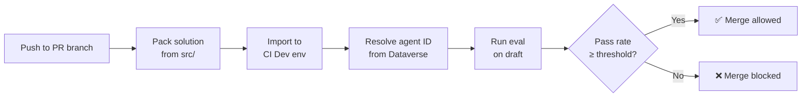

> **원문:** [Quality Gates for Copilot Studio: Automated Evaluations in Azure DevOps](https://microsoft.github.io/mcscatblog/posts/copilot-studio-eval-gate-azure-devops/)
> **게시일:** 2026-04-19 · **저자:** Adi Leibowitz

Copilot Studio 에이전트를 완성했어요. 질문에 답하고, 올바른 토픽을 트리거하고, 올바른 작업을 호출해요. 심지어 평가(Evaluate) 탭에는 잘 동작한다는 걸 증명하는 테스트 세트도 있어요. 이제 배포하면 되겠죠?

그런데 금요일 오후, 누군가 에이전트 지침을 업데이트하면서 아주 우아하게 **YOU MUST NEVER RESPOND IN CAPS**라고 지시해요. 토픽 이름이 바뀌어요. 지식 원본 URL이 낡아 버려요. 그리고 월요일 아침 고객이 환각(hallucination)<sup>1</sup> 응답을 받을 때까지 아무도 알아차리지 못해요.

평가 탭은 *수동* 검증에는 훌륭하지만, 수동은 확장되지 않아요. 정말 필요한 건 게이트예요. 누군가 변경 사항을 푸시할 때마다 실행되고, 에이전트 품질을 자동으로 확인하고, 숫자가 기준에 미치지 못하면 머지를 막는 것 말이에요. 모든 소프트웨어 팀이 단위 테스트와 CI 파이프라인으로 수십 년간 가져온 바로 그것인데, 어쩐 일인지 대화형 에이전트에는 없었어요. 지금까지는요.

## Evaluation API

Copilot Studio는 최근 평가 탭이 하는 모든 걸 프로그래밍 방식으로 제공하는 [Evaluation REST API](https://learn.microsoft.com/en-us/microsoft-copilot-studio/analytics-agent-evaluation-rest-api)를 출시했어요. 다음과 같은 일을 할 수 있어요.

- 에이전트에 연결된 **테스트 세트 나열**
- 초안(draft) 또는 게시된 에이전트에 대해 **평가 실행 트리거**
- **완료 여부 폴링** 및 테스트 케이스별 상세 결과 조회
- **메트릭별 세부 결과 확인**(일반 품질, 의미 비교, 정확 일치, 사용자 지정 채점기)

이 API는 Power Platform API 표면(`api.powerplatform.com`) 아래에 있고 위임된(delegated) 인증을 써요(앱 전용 경로는 없으므로 무인 시나리오에서는 캐시된 리프레시 토큰이나 비슷한 메커니즘이 필요해요). 엔드포인트 패턴은 다음과 같아요.

```
POST /copilotstudio/environments/{envId}/bots/{botId}/api/makerevaluation/testsets/{testSetId}/run
```

실행 요청을 보내면 실행 ID를 받고, 상태가 `Completed`로 바뀔 때까지 폴링해요. 결과의 각 테스트 케이스에는 메트릭 수준의 통과/실패 상태가 함께 제공돼요.

한 가지 중요한 세부 사항이 있어요. 이 API는 게시된 에이전트뿐 아니라 **초안 에이전트**에 대한 평가 실행도 지원해요. 바로 이게 CI/CD<sup>2</sup> 통합을 가능하게 하는 열쇠예요. 솔루션을 가져오고, 초안에 대해 평가를 실행하고, 누군가 게시하거나 머지하기 *전에* 결과를 받을 수 있어요.

> **참고:** [Copilot Studio Kit](https://microsoft.github.io/mcscatblog/posts/copilot-studio-kit/)도 자동화된 테스트를 위한 또 하나의 옵션이에요. 테스트 레코드를 Dataverse에 직접 밀어 넣어 무인으로 실행할 수 있고, 사용자 지정 루브릭에 따라 응답을 채점해요. Evaluation API는 다른 접근을 취해요. Copilot Studio의 기본 제공 채점기를 사용해 *초안* 에이전트에 대해 서버 측에서 실행되므로, 게시하기 전에 테스트할 수 있어요.

## 코드로서의 에이전트

Power Platform에는 자체 [배포 파이프라인](https://learn.microsoft.com/en-us/power-platform/alm/pipelines)이 있고, 환경 간에 솔루션을 옮기는 데는 잘 동작해요. 하지만 이건 소스가 아니라 솔루션 아티팩트를 대상으로 동작해요. 브랜치도 없고, PR 리뷰도 없고, 테스트 결과로 배포를 막을 방법도 없어요. 에이전트가 몇 개뿐일 때는 괜찮아요. 하지만 여러 기여자가 참여하는 수십 개의 에이전트가 있다면, 다른 모든 엔지니어링 팀이 이미 의존하고 있는 것과 같은 소스 제어와 CI/CD 규율이 필요할 거예요.

[Dataverse git 통합](https://learn.microsoft.com/en-us/power-platform/alm/git-integration/connecting-to-git)을 쓰면 에이전트가 곧 소스 코드가 *돼요*. 브랜치에 살고, 커밋되고, 풀 리퀘스트에서 리뷰돼요. 그리고 에이전트 소스가 리포지토리에 사는 순간, 수십 년간의 소프트웨어 엔지니어링에서 온 모든 본능이 소리치기 시작해요. *자동화된 테스트는 어디 있지?*

Azure DevOps는 그 질문에 답하기에 자연스러운 곳이에요(GitHub 지원은 어떻게 됐냐고요, Microsoft?!? 아 잠깐, 그게 우리네요...). Dataverse git 통합은 ADO 리포지토리에 직접 연결되므로, 에이전트의 YAML, 솔루션 메타데이터, 테스트 세트가 이미 그곳에 있어요. PR 트리거, 브랜치 정책, Tests 탭, 시크릿을 위한 Key Vault까지 모두 네이티브로 제공돼요.

우리는 이 조각들을 ADO 파이프라인으로 엮은 샘플 [EvalGateADO](https://github.com/microsoft/CopilotStudioSamples/tree/main/testing/evaluation/EvalGateADO)를 게시했어요. 소스에서 에이전트를 배포하고, 초안에 대해 평가를 실행하고, 구성 가능한 통과 임계값을 기준으로 PR 머지를 막아요. 이 글의 나머지 부분에서는 이게 어떻게 동작하는지 살펴볼게요.

## 파이프라인 동작 방식

이 파이프라인은 단순히 평가만 실행하지 않아요. *매번* 소스에서 에이전트를 전용 CI 환경으로 배포해요. 개발자가 PR 브랜치에 푸시하면 다음과 같은 일이 일어나요.



### 1단계: 소스에서 패킹

파이프라인은 `pac` CLI를 사용해 `src/` 폴더를 관리되지 않는(unmanaged) 솔루션 zip으로 패킹해요. 미리 빌드된 아티팩트도, 실행 중인 환경에서 내보낸 솔루션도 없어요. PR 브랜치의 소스가 곧 솔루션 *그 자체*예요.

```yaml
# Pack unmanaged solution from source
pac solution pack \
  --zipfile "$(Build.ArtifactStagingDirectory)/solution_unmanaged.zip" \
  --folder "$(Build.SourcesDirectory)/src"
```

이건 중요한 설계 결정이에요. CI 환경이 누군가 마지막으로 개발 환경에서 내보낸 것이 아니라, PR 브랜치에 있는 것을 항상 정확히 반영한다는 뜻이거든요. 개발자가 Copilot Studio에서 변경했지만 커밋을 잊었다면, 파이프라인은 그 샌드박스에서 실행 중인 게 아니라 소스에 있는 걸 테스트해요.

### 2단계: CI Dev로 가져오기

패킹된 솔루션은 서비스 주체(service principal)를 사용해 공유 CI Dev 환경으로 가져와요.

```yaml
pac solution import \
  --path "$(Build.ArtifactStagingDirectory)/solution_unmanaged.zip" \
  --environment "$(CI_DEV_ENV_URL)" \
  --async
```

이 환경은 파이프라인 실행 전용이에요. git에 바인딩되어 있지 않아요(그렇게 하면 개발자 각자의 git 연결 환경과 충돌이 생겨요). 순수하게 자동화된 테스트를 위한 런타임 대상으로만 존재해요.

### 3단계: 에이전트 ID 동적 확인

가져오기 후 파이프라인은 Dataverse에 쿼리해서 스키마 이름으로 에이전트의 GUID를 찾아요. 구성 파일에 하드코딩된 ID는 없어요. 에이전트 ID는 환경마다 다를 수 있고, (`bot.yml`의) 스키마 이름이 소스와 함께 이동하는 안정적인 식별자이기 때문에 이 방식이 중요해요.

```bash
# Query Dataverse OData for the bot
curl "${ENV_URL}api/data/v9.2/bots?\$filter=schemaname eq '${BOT_SCHEMA_NAME}'"
```

### 4단계: 초안에 대해 평가 실행

평가 스크립트는 `runOnPublishedBot: false`로 Evaluation API를 호출해 방금 가져온 초안 에이전트를 대상으로 해요. 실행이 완료될 때까지 폴링한 다음, 구성 가능한 통과 임계값과 결과를 비교해요.

```javascript
const passRate = passed / total;
if (passRate < config.passThreshold) {
  process.exit(1);  // Pipeline fails → merge blocked
}
```

스크립트는 ADO의 Tests 탭이 개별 테스트 케이스 결과를 표시할 수 있도록 JUnit XML<sup>3</sup>도 생성하고, 더 깊은 분석을 위해 원시 JSON을 파이프라인 아티팩트로 게시해요. Evaluation API는 위임된 인증을 요구하므로, 파이프라인은 Key Vault에서 MSAL 리프레시 토큰을 가져오고 실행 후 갱신된 토큰이 있으면 다시 기록해요. 리프레시 토큰은 90일 동안 사용하지 않으면 만료되므로, 파이프라인이 가끔이라도 실행되는 한 정상 상태를 유지해요.

ADO에서 파이프라인 실행이 어떻게 보이는지, 빌드 로그에서 각 단계를 확인할 수 있어요.

### 전체 그림

이 구성이 만족스러운 이유는 *모든 것*이 자동화되어 있고 *모든 것*이 소스에서 나온다는 점이에요. 개발자의 워크플로는 다음과 같아요.

1. Copilot Studio에서 에이전트를 편집해요
2. 솔루션 페이지에서 커밋하고 푸시해요
3. Azure DevOps에서 PR을 열어요
4. 초록색 체크 표시를 기다려요(또는 평가가 잡아낸 문제를 수정해요)
5. 머지해요

수동 내보내기도 없어요. "머지 전에 평가 실행하는 거 잊지 마세요"도 없어요. "내 환경에서는 됐는데요"도 없어요. 파이프라인이 PR 브랜치에서 패킹하고, 깨끗한 CI 환경으로 가져오고, 초안에 대해 평가를 실행하고, 머지를 막아요. 에이전트가 망가지면 프로덕션이 아니라 PR에서 알게 돼요.

평가가 통과하면 PR에 초록불이 켜져요.

통과하지 못하면 에이전트 품질이 개선될 때까지 머지가 막혀요.

개별 테스트 케이스 결과는 ADO Tests 탭에 표시되므로, 리뷰어는 어떤 시나리오가 통과했고 어떤 게 실패했는지 정확히 볼 수 있어요.

## 핵심 요약

- **Copilot Studio Evaluation API**를 쓰면 *초안* 에이전트를 포함해 프로그래밍 방식으로 평가를 트리거하고 결과를 가져올 수 있어요.
- Dataverse git 통합이 이미 ADO 리포지토리를 쓰기 때문에 **Azure DevOps**가 자연스러운 플랫폼이에요. PR 트리거, 브랜치 정책, 테스트 결과 게시가 모두 네이티브예요.
- 파이프라인은 매번 **소스에서 배포**해요. PR 브랜치를 솔루션으로 패킹하고 깨끗한 CI 환경으로 가져오므로, 항상 PR에 실제로 있는 것을 테스트해요.

## 시작하기

샘플을 클론해서 여러분의 에이전트 중 하나에 시도해 보세요.

**[GitHub의 EvalGateADO](https://github.com/microsoft/CopilotStudioSamples/tree/main/testing/evaluation/EvalGateADO)**

---

Copilot Studio 에이전트를 위한 CI/CD 파이프라인을 구축해 보셨나요? 품질 게이트로 Evaluation API를 쓰시나요, Kit을 쓰시나요, 아니면 전혀 다른 것을 쓰시나요? 여러분의 팀에서 잘 동작하는 방법을 댓글로 들려주세요.

---

## 어휘 주석

1. **환각(hallucination):** AI 모델이 실제로는 사실이 아닌 내용을 그럴듯하게 지어내서 답하는 현상.
2. **CI/CD:** 코드를 변경할 때마다 자동으로 빌드·테스트(지속적 통합, Continuous Integration)하고 배포(지속적 배포, Continuous Deployment)하는 개발 방식.
3. **JUnit XML:** 테스트 결과를 표준화된 형식으로 기록한 XML 파일로, 대부분의 CI 도구가 이 형식을 읽어 테스트 케이스별 통과/실패를 화면에 보여줌.
