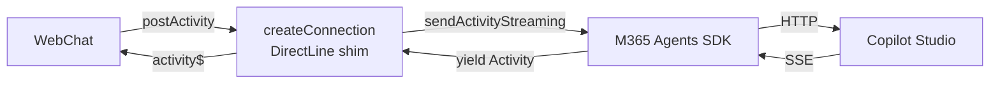

> **원문:** [The Conversation History Gap in the M365 Agents SDK (And How We Filled It)](https://microsoft.github.io/mcscatblog/posts/webchat-conversation-history-m365-sdk/)
> **게시일:** 2026-02-20 · **저자:** Adi Leibowitz

> **참고:** **업데이트 (2026년 3월):** 이 글이 게시된 이후, 공식 M365 Agents SDK 어댑터가 이제 대화를 재개하기 위한 `conversationId` 전달을 지원해요. 무하하, 결국 넣었어요. 다만 기반 API는 여전히 과거 액티비티 가져오기나 특정 대화 ID에 대한 대화 목록 조회를 지원하지 않으므로, 여기서 설명하는 액티비티 저장 패턴은 여전히 필요해요.

이 이야기는 현장에서 곧바로 가져온 것이에요. Teams와 Microsoft 365는 Copilot Studio 에이전트를 배포하는 사실상의 표준 표면이며, 그럴 만한 이유가 있어요. 하지만 모든 조직이 거기서 멈추고 싶어 하는 것은 아니에요. 어떤 조직은 자신만의 포털, 자신만의 UX, 자신만의 브랜딩을 그리고 싶어 해요. 전체 경험을 직접 제어하고 싶은 것이죠.

우리가 함께 일해 온 한 고객이 정확히 그렇게 하고 있어요. 이들은 부서마다 고유한 AI 기반 전문가가 있는 사용자 지정 직원 포털을 구축하고 있어요. HR 정책, IT 지원, 재무 승인, 법무 안내 — 이 모든 것을 하나의 앱에서 이용할 수 있고, 각 에이전트는 자신의 도메인 특화 지식에 그라운딩되어 있어요.

직원은 앱을 떠나지 않고 HR 에이전트에서 IT 헬프데스크로, 다시 반대로 전환할 수 있어요. 경험은 매끄럽고 완전히 브랜드화되어 있어요.

채팅 컴포넌트 자체에는 [BotFramework WebChat](https://github.com/microsoft/BotFramework-WebChat)을 사용하고 있어요. WebChat은 [메시지 파이프라인에 대한 완전한 제어권](https://microsoft.github.io/mcscatblog/posts/webchat-middlewares/)을 제공하면서, 처음부터 다시 만들고 싶지 않은 렌더링 복잡성을 모두 처리해 줘요. 그리고 백엔드 연결에는 Direct Line 대신 **M365 Agents SDK**(`@microsoft/agents-copilotstudio-client`)를 선택했어요. 왜일까요? 두 가지 큰 이유가 있어요.

- **스트리밍 지원.**<br>
  SDK는 SSE<sup>1</sup> 기반 스트리밍을 사용하므로, 폴링 없이 에이전트 응답이 청크 단위로 실시간 도착하여 기대하는 현대적인 채팅 경험을 제공해요. 응답이 도착할 때까지 몇 초씩 기다리고 싶은 사람이 어디 있겠어요?
- **테넌트 Graph 그라운딩.**<br>
  SDK는 [Authenticate with Microsoft](https://microsoft.github.io/mcscatblog/posts/you-dont-need-manual-auth/)와 함께 동작하여 테넌트 Graph 그라운딩을 활성화하고, 에이전트에게 SharePoint와 Copilot Connector 데이터에 대한 시맨틱 검색을 제공해요.

여기까지는 좋았어요. 그런데 벽에 부딪혔어요.

## 빠져 있는 조각

M365 Agents SDK에 대해 구현에 깊숙이 들어가기 전까지 아무도 말해 주지 않는 것이 있어요. **기반 API가 과거 액티비티 가져오기를 지원하지 않는다**는 점이에요.

Direct Line에는 `getActivities` 엔드포인트가 있어요. 대화에 다시 연결하여 전체 액티비티 기록을 가져오면, WebChat이 사용자가 자리를 떠난 적이 없는 것처럼 모든 것을 기꺼이 렌더링해 줘요. 사라지기 전까지는 당연하게 여기는 것들 중 하나죠.

SDK는요? 그런 행운은 없어요. 페이지가 다시 로드되면(또는 사용자가 다른 곳으로 이동했다가 돌아오면) 대화는 그냥... 사라져요. 서버에서 사라지는 것은 아니에요. 대화는 전체 컨텍스트와 함께 Copilot Studio 쪽에 여전히 존재해요. 하지만 SDK에게 "이 대화에서 지금까지 무슨 일이 있었지?"라고 물어볼 방법이 없어요.

> **주의:** 분명히 하자면, 이것은 ChatGPT식 "메모리" 이야기가 아니에요. 대화를 재개하면 에이전트는 여러분이 무엇을 이야기했는지 여전히 알고 있어요. 문제는 클라이언트에 과거 액티비티를 가져오거나 이전 대화를 나열할 API가 없다는 것이에요. 사용자가 돌아왔을 때 WebChat은 렌더링할 것이 아무것도 없고, 요청할 방법도 없어요.

무슨 일이죠, Microsoft? (네, 이 말을 저 자신에게 하고 있다는 걸 알아요. 우리는 같은 팀이니까요. 그래도 말은 해야죠.)

## 하나가 아닌 두 개의 문제

이 문제를 풀기 위해 자리에 앉았을 때, 사실 두 개의 별개 문제라는 것을 깨달았어요.

### 문제 1: 대화 재개 ✅

~~SDK의 공식 `CopilotStudioWebChat.createConnection()` 메서드는 `conversationId` 매개변수를 받지 않아요. 연결을 만들 때마다 완전히 새로운 대화가 시작돼요. "대화 `abc-123`에 다시 연결해 줘"라고 말할 방법이 없어요.~~

**이 문제는 해결되었어요.** 공식 어댑터가 이제 `conversationId` 매개변수를 받아요. 무하하. 이 글이 처음 작성될 당시에는 기반 SDK 클라이언트가 대화 ID 전달을 지원했지만 WebChat 어댑터가 이를 노출하지 않았어요. 이제는 노출해요. 우리의 사용자 지정 어댑터는 인사말(greeting) 발동 여부도 제어할 수 있게 해 줘요. 새 대화가 시작될 때마다 에이전트가 같은 환영 메시지를 보내길 원하는 앱만 있는 것은 아니니까요.

### 문제 2: 액티비티 기록

문제 1을 해결하더라도(우리는 해결했어요), 여전히 과거 액티비티를 가져오거나 이전 대화 목록을 조회할 수 없어요. "대화 `abc-123`의 액티비티를 줘"도 없고, "이 사용자의 대화 목록을 줘"도 없어요. 대화는 서버 측에서 재개되므로 에이전트에게는 컨텍스트가 있지만, WebChat은 빈 채팅 창을 렌더링해요. 사용자에게는 빈 화면이 보이고, 어디까지 이야기했는지 스스로 기억해야 해요.

## 해결책: 사용자 지정 WebChat 어댑터

두 문제를 모두 해결하기 위해, SDK에 이미 포함된 어댑터를 확장했어요. M365 Agents SDK에는 [`CopilotStudioWebChat.createConnection()`](https://github.com/microsoft/Agents-for-js/blob/main/packages/agents-copilotstudio-client/src/copilotStudioWebChat.ts)이 포함되어 있는데, 이는 [공식 webclient 샘플](https://github.com/microsoft/Agents/tree/main/samples/nodejs/copilotstudio-webclient)에서 볼 수 있듯이 `connectionStatus$`, `activity$`, `postActivity()`, `end()`를 구현하는 DirectLine 호환 심<sup>2</sup>이에요. 우리의 사용자 지정 어댑터는 같은 패턴 위에, 빠져 있던 대화 관리 기능을 추가한 것이에요.

이 어댑터는 오픈 소스이며 [github.com/adilei/copilot-webchat-adapter](https://github.com/adilei/copilot-webchat-adapter)에서 확인할 수 있어요.

> **주의:** 이 어댑터는 오픈 소스이며 있는 그대로(as-is) 제공돼요. Microsoft의 지원 대상이 아니에요. 사용한다면 코드에 대한 책임은 여러분에게 있어요.

아키텍처는 다음과 같아요.



어댑터는 실시간 스트리밍을 위해 SDK의 비동기 제너레이터<sup>3</sup> 메서드(`startConversationStreaming()`과 `sendActivityStreaming()`)를 사용해요.

### 대화 재개 해결하기

어댑터는 `conversationId` 옵션을 받아요. 이 옵션이 제공되면 어댑터는:

1. `startConversationStreaming()` 호출을 건너뛰어요 (인사말 중복 방지)
2. 모든 `sendActivityStreaming()` 호출에 `conversationId`를 전달해요
3. 연결이 살아 있는 동안 대화 ID를 추적해요

```typescript
import { createConnection } from 'copilot-webchat-adapter'

// New conversation (default behavior)
const directLine = createConnection(client, { showTyping: true })

// Resume existing conversation
const directLine = createConnection(client, {
  conversationId: savedConversationId,
  showTyping: true,
})
```

네, 변수 이름이 `directLine`이에요. 실수가 아니라 그게 핵심이에요. WebChat은 `connectionStatus$`, `activity$`, `postActivity()`, `end()`를 구현하는 `directLine` prop을 기대해요. 기반 전송 계층이 실제로 Direct Line이 아니라는 것을 알지도 못하고 신경 쓰지도 않아요. 어댑터가 같은 프로토콜을 사용하기 때문이에요.

### 액티비티 기록 해결하기

대화 재개는 이야기의 절반일 뿐이에요. 과거 메시지가 없으면 사용자는 빈 채팅 창만 바라보게 돼요. 그럼 어떻게 되돌려 놓을까요?

여기에는 두 가지 역할이 있어요. **어댑터**(우리의 DirectLine 심)와 **소비자**(어댑터를 사용하고 WebChat을 렌더링하는 여러분의 앱 코드)예요.

어댑터는 재개 시 기록을 **가져와** WebChat에 다시 재생하는 것을 담당해요. 어댑터는 선택적 `getHistoryFromExternalStorage` 콜백을 받는데, 이 콜백이 제공되면 연결 시 호출되어 과거 액티비티를 가져오고, 새 메시지가 스트리밍되기 전에 `activity$`를 통해 이를 내보내요. 어댑터가 시퀀스 번호를 처리하므로 WebChat은 모든 것을 올바른 순서로 렌더링해요.

소비자는 액티비티가 도착하는 대로 **저장**하고, 그 콜백을 통해 어댑터에 다시 제공하는 것을 담당해요. 어댑터는 액티비티를 어떻게, 어디에 저장하는지에 대해 완전히 무관심해요. 주어진 대화 ID에 대해 액티비티 배열을 반환하는 함수만 있으면 돼요.

> **참고:** `getHistoryFromExternalStorage`는 의도적으로 선택 사항이에요. SDK나 그 기반 API가 언젠가 액티비티 가져오기를 네이티브로 지원하게 되면, 어댑터가 기본적으로 이를 내부에서 호출할 수 있고, 이 콜백은 필수가 아니라 재정의(override) 수단이 돼요.

저장소를 어떻게 구현할지는 전적으로 여러분에게 달려 있어요. 우리 고객은 데이터베이스를 사용해요. [어댑터의 샘플](https://github.com/adilei/copilot-webchat-adapter)은 localStorage 기반의 단순한 저장소를 사용해요. IndexedDB든, 서버 측 API든, 필요에 맞는 무엇이든 사용할 수 있어요. 유일한 계약은 어댑터가 재개 시 호출할 수 있는 `getActivities(conversationId)` 함수예요.

```typescript
import { createConnection } from 'copilot-webchat-adapter'

const directLine = createConnection(client, {
  conversationId: savedConversationId,
  showTyping: true,
  getHistoryFromExternalStorage: (id) => activityStore.getActivities(id),
})
```

그런데 애초에 액티비티가 저장소에 어떻게 *들어갈까요*? 여기서 [WebChat의 Redux 미들웨어](https://microsoft.github.io/mcscatblog/posts/webchat-middlewares/)가 등장해요.

```javascript
const store = WebChat.createStore({}, () => next => action => {
  if (action.type === 'DIRECT_LINE/INCOMING_ACTIVITY') {
    const { activity } = action.payload
    if (activity.type === 'message' && directLine.conversationId) {
      activityStore.saveActivity(directLine.conversationId, activity)
    }
  }
  return next(action)
})

WebChat.renderWebChat({ directLine, store }, document.getElementById('webchat'))
```

들어오는 모든 메시지 액티비티가 도착하는 대로 저장돼요. 사용자가 돌아오면 어댑터가 `getActivities`를 호출하여 WebChat에 다시 재생하고, 대화는 중단된 지점에서 그대로 이어져요.

## 실제 동작 모습

어댑터의 테스트 페이지가 디자인상을 받을 일은 없겠지만, 중요한 것은 무엇을 보여 주느냐예요.

첫 번째 대화예요. 사용자가 연결하면 인사말이 스트리밍되어 들어오고, 회사 정책에 대해 질문해요. 상태 표시줄의 대화 ID에 주목하세요.

_새 대화_

이제 사용자가 페이지를 새로 고치고, 대화 ID를 붙여넣고, 다시 연결해요. 저장된 기록이 즉시 나타나고, 중단된 지점에서 바로 대화를 이어갈 수 있어요. 에이전트에게는 여전히 전체 컨텍스트가 있으므로, 후속 질문에 맥락에 맞는 답변이 돌아와요.

_새로 고침 후 재개된 대화_

인사말 재생도 없어요. 빈 화면도 없어요. 대화는 그저 중단된 지점에서 이어져요.

## 샘플이 (아직) 다루지 않는 것

샘플의 Redux 미들웨어는 `type === 'message'`인 액티비티만 저장해요. 이는 단순화한 것이에요. 프로덕션 앱에서는 더 많은 것을 저장하고 싶을 거예요. 예를 들어 어댑티브 카드 제출 내역을 저장하면, 기록이 복원될 때 이전에 클릭한 카드가 이미 제출된 상태로 표시되거나 비활성화될 수 있어요. 샘플은 아직 이를 처리하지 않지만 패턴은 동일해요. 미들웨어에서 관련 액티비티 타입을 가로채 저장소에 저장하면 돼요.

어댑터 자체는 여기서 무관심해요. `getHistoryFromExternalStorage` 함수가 반환하는 액티비티가 무엇이든 그대로 재생해요.

### 우아한 성능 저하 (Graceful Degradation)

`getHistoryFromExternalStorage`가 예외를 던지면(localStorage가 지워졌거나, 용량이 초과되었거나, 데이터가 손상된 경우), 어댑터는 오류를 삼키고 기록 없이 계속 진행해요. 애플리케이션이 죽는 대신, 여전히 동작하는 빈 채팅을 얻게 돼요.

## 제한 사항과 주의점

이 방법이 해결하지 못하는 것도 투명하게 짚고 넘어갈게요.

**대화 만료.** Copilot Studio 대화는 영원히 살아 있지 않아요. 만료된 대화를 재개하려 할 때 무슨 일이 일어나는지 — SDK가 예외를 던지는지, 오류 액티비티를 반환하는지, 조용히 새 대화를 시작하는지 — 아직 완전히 테스트하지 못했어요. 조사 목록에 올려 두었어요.

**기기 간 기록 공유 불가.** 기본 localStorage 구현에서는 대화 기록이 브라우저에 묶여 있어요. 다른 브라우저나 기기에서 열면 대화는 재개되지만(에이전트에게는 컨텍스트가 있음) 과거 메시지는 보이지 않아요. 이것이 필요하다면 서버 측 저장소를 구현하세요.

## 핵심 정리

- M365 Agents SDK는 Copilot Studio 에이전트를 위한 스트리밍과 테넌트 Graph 그라운딩을 제공해요. 공식 어댑터는 이제 `conversationId`를 통한 **대화 재개**를 지원하지만, 여전히 **과거 대화 액티비티를 가져올 API가 없어요**.
- 이는 에이전트가 서버에 컨텍스트를 유지하고 있음에도, 페이지 새로 고침 시 WebChat이 눈에 보이는 대화 기록을 모두 잃는다는 의미예요.
- [copilot-webchat-adapter](https://github.com/adilei/copilot-webchat-adapter)는 플러그형 액티비티 저장소를 갖춘 **DirectLine 호환 심**으로 동작하여 남은 공백을 채워요.
- 액티비티는 **WebChat Redux 미들웨어**를 통해 저장되고, 재연결 시 어댑터의 `getHistoryFromExternalStorage` 콜백을 통해 다시 재생돼요.
- `ActivityStore` 인터페이스는 추상적이므로, localStorage를 요구 사항에 맞는 어떤 영속성 계층으로도 교체할 수 있어요.

## 다음 단계

절반은 왔어요. 공식 어댑터가 이제 대화 재개(문제 1)를 지원하는 것은 훌륭해요. 하지만 기반 API에는 여전히 `getActivities()` 엔드포인트도, 사용자의 과거 대화를 나열할 방법도 없어요. 그것이 제공되기 전까지는, 여기서 설명한 액티비티 저장 패턴이 재연결 시 사용자에게 눈에 보이는 대화 기록을 제공하는 방법으로 남아요.

어댑터는 그 미래를 염두에 두고 설계되었어요. SDK가 기록 가져오기를 추가하면, `getHistoryFromExternalStorage`는 주요 메커니즘이 아니라 선택적 재정의 수단이 돼요.

여러분도 이 공백에 부딪힌 적이 있나요? WebChat과 함께 M365 Agents SDK를 사용하고 계신가요, 아니면 아직 Direct Line을 쓰고 계신가요? 댓글로 여러분의 경험을 들려주시면 좋겠어요.

## 더 읽어보기

- [영상: Copilot Studio 에이전트를 위한 WebChat 미들웨어 마스터하기](https://microsoft.github.io/mcscatblog/posts/webchat-middlewares/)
- [존재하지 않았던 환영 메시지: WebChat에서 에이전트 인사말 모킹하기](https://microsoft.github.io/mcscatblog/posts/mocked-webchat-welcome-message/)
- [수동 인증은 아마 필요 없습니다 (그리고 그 사실조차 몰랐을 겁니다)](https://microsoft.github.io/mcscatblog/posts/you-dont-need-manual-auth/)

---

## 어휘 주석

1. **SSE(Server-Sent Events):** 서버가 클라이언트와의 연결을 열어 둔 채로 데이터를 조금씩 계속 밀어 보내는 방식. 폴링(주기적으로 다시 물어보기)과 달리 응답이 준비되는 즉시 청크 단위로 전달돼요.
2. **심(shim):** 서로 다른 두 시스템 사이에 끼워 넣어, 한쪽이 원래 상대(Direct Line)와 이야기하고 있다고 착각하게 만들어 주는 얇은 호환 계층.
3. **비동기 제너레이터(async generator):** 값을 한 번에 다 반환하지 않고, 준비되는 대로 하나씩 순서대로 내어 주는 함수 형태. 스트리밍 응답을 순차적으로 처리할 때 써요.
