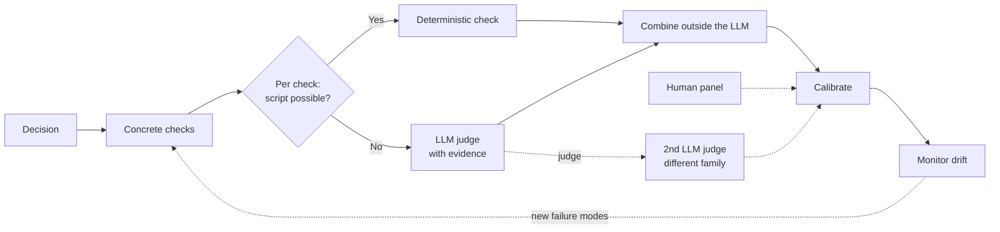

> **원문:** [Stop Asking an LLM to "Rate This 1-5": A Better Way to Score with LLMs](https://microsoft.github.io/mcscatblog/posts/better-llm-scoring/)
> **게시일:** 2026-06-26 · **저자:** Michael Guimet, Serena Xie

*전략은 단순했어요. 모델에게 모든 프로젝트 제안서를 1-5점으로 채점하게 하고, 4점 이상이 나온 것에는 전부 투자하는 것이었죠. 하룻밤 사이에 제안서 더미가 명확한 최종 후보 목록으로 바뀌었어요. 확실한 승자들은 위에, 나머지는 기준선 아래에 놓였죠. 성공이었어요! 그런데 한 해가 지나고 보니, 투자했던 4.2점짜리는 조용히 보류됐어요. 탈락시켰던 3.4점짜리는 투자했더라면 좋았을 바로 그 프로젝트가 됐고요. 점수는 실제 예산을 완벽한 확신으로 배분했고, 바로 그 확신이 문제였어요. (설명을 위해 단순화한 가상의 복합 시나리오예요.)*

LLM이나 [Copilot Studio 에이전트](https://learn.microsoft.com/en-us/microsoft-copilot-studio/)에게 무언가를(제안서, 답변, 문서, 고객 지원 답장, 요약문 등) "1-5점으로 평가해줘"라고 요청해 본 적이 있다면, 아마 그런 간극을 경험해 보셨을 거예요. 좋은 소식은 "LLM에게 채점을 맡긴다"와 "신뢰할 수 있는 숫자를 얻는다" 사이에서 하나를 선택할 필요가 없다는 거예요. 숫자를 직접 요구하는 것만 그만두면 돼요.

대신 이렇게 하세요.

1. 먼저 의사 결정을 정의하고
2. "품질"을 모델이 안정적으로 답할 수 있는 작은 점검 항목들로 쪼개고
3. 각 항목에 가장 단순한 채점 방법을 고르고
4. 답변을 모델 바깥에서 결합하고
5. 모든 판단에 근거를 붙이고
6. 참조 기준에 맞춰 보정하고
7. 드리프트를 관찰하면 돼요.

## 1-5점 채점이 실패하는 이유, 짧은 버전

두 가지 문제가 동시에 일어나요.

- **척도가 모호해요.** 3점과 4점을 가르는 기준을 일관되게 말할 수 있는 사람은 아무도 없고, 척도의 중간 구간이 모든 걸 흡수해요. *부분적으로 맞음*, *괜찮지만 불완전함*, *사소한 결함*, *좋지만 훌륭하진 않음*이 전부 같은 숫자에 떨어져요.
- **심판이 일관되지 않아요.** LLM의 점수는 프롬프트의 문구, 항목을 보는 순서, 답변의 길이, 실행 중인 모델 버전에 따라 흔들려요. 심지어 자기 모델 계열에서 나온 답변을 은근히 선호하기도 해요.

두 실패 유형 모두 LLM-as-judge 연구 문헌에 잘 기록돼 있어요. 각 주장이 어디에서 나왔는지 자세히 살펴보고 싶다면, 관련 인용과 근거를 정리해 둔 [LLM 1-5 Scoring 백서](https://microsoft.github.io/mcscatblog/assets/posts/better-llm-scoring/20260626_LLM1-5Scoring_WhitePaper.pdf)를 참고하세요.

해결책은 더 영리한 프롬프트가 아니에요. LLM에게는 작고 구체적인 것을 판단하게 하고, 최종 숫자는 여러분이 통제하는 규칙으로 직접 만드는 거예요. 이 글의 나머지 부분에서는 실제 작업 순서대로, 서두의 시나리오를 계속 예시로 삼아 그 과정을 살펴볼게요.

## 1. 점수가 아니라 의사 결정에서 시작하기

무언가를 측정하기 전에 한 가지 질문에 답하세요. **이 점수로 무엇을 할 것인가?** 출시할지 보류할지? 두 모델 중 하나를 고를지? 어떤 변경이 진짜 진전인지 판단할지? 어느 부분이 약한지 찾아낼지?

당연해 보이지만, 대부분의 사람들이 건너뛰는 단계예요. 이 단계가 중요한 이유는 의사 결정이 그 뒤의 거의 모든 것, 즉 무엇을 측정할지, 어떻게 채점할지, 어떻게 합산할지를 결정하기 때문이에요. 한 문장으로 적어 두세요.

프로젝트 투자 심사의 경우, 그 문장은 이래요. *각 제안서를 투자 최종 후보로 올릴지, 보완을 위해 돌려보낼지, 탈락시킬지 결정한다*. 숫자가 아니라 세 가지 결과예요. 이 글의 나머지 전부는 4.2라는 숫자가 아니라 바로 그 판정을 만들어 내는 데 초점을 맞춰요.

## 2. "품질"을 몇 가지 구체적인 점검 항목으로 쪼개기

먼저 실제로 중요한 소수의 차원을 명명한 다음, 각각을 막연한 품질 평가가 아니라 구체적이고 검증 가능한 조건으로 바꾸세요. "좋은가?"는 "모든 주장이 실제로 그 주장을 뒷받침하는 출처를 인용하고 있는가?"가 돼요. 점검 항목은 실제로 겪어 본 실패에서 도출하고, 적고 서로 겹치지 않게 유지하며, 어떤 것이 결정적 결격 사유(dealbreaker)인지 표시하세요.

프로젝트 제안서의 경우, "품질"은 독자가 실제로 검증할 수 있는 몇 가지로 나뉘어요.

- **문제 명확성**: 구체적인 사용자, 상황, 현재 발생 중인 비용과 함께 문제가 서술되어 있는가?
- **근거**: 주장이 실제로 존재하는 데이터, 참고 문헌, 선행 작업으로 뒷받침되는가?
- **실행 가능성**: 계획, 팀, 현실적인 일정이 있는가?
- **예산 타당성**: 항목별 금액이 합산이 맞고 계획과 일치하는가?
- **전략적 적합성**: 제안서가 이번 투자 사이클의 명시된 우선순위와 연결되는가?
- **결격 사유**: 필수 섹션이 누락되었거나, 검증 불가능한 주장이 있거나, 이해 충돌이 있는가?

여섯 개의 점검 항목, 서로 겹치지 않고, 각각은 제안서를 앞에 두고 사람이 답할 수 있는 구체적인 질문이며, 그중 하나는 즉시 탈락 조건으로 표시돼 있어요.

## 3. 각 점검 항목을 통하는 가장 단순한 방법으로 채점하기

유일하게 올바른 방법은 없어요. 아래 사다리를 따라 내려가면서 해당 점검 항목에 맞는 첫 번째 방법에서 멈추세요.

- **스크립트로 확인할 수 있나요?** 
  그렇다면 LLM을 아예 쓰지 마세요. 형식 유효성, 필수 필드, 인용 존재 여부, 올바른 도구 호출 같은 것들은 가장 저렴하고 가장 신뢰할 수 있는 신호이니 먼저 실행하세요.
- **그렇지 않다면, 심판에게 근거와 함께 예/아니오 질문을 던지세요.** 
  이게 기본값이에요. 모호한 판단을 몇 개의 이진 질문으로 쪼개는 것이 얻을 수 있는 가장 큰 신뢰성 향상이에요.
- ***pass / minor / major / fail* 등급 라벨은 단계적 판단이 최종 의사 결정에 정말로 중요하고**, 중간 상태가 명확히 정의된 경우에만 사용하세요. 
  뉘앙스를 얻는 대신 3점-대-4점의 모호함이 일부 되살아나니 아껴서 써야 해요.
- **두 시스템이나 버전을 비교하는 중인가요?** 
  각각을 따로 채점하지 말고, 심판에게 *A와 B 중 어느 쪽이 더 나은지* 물어보세요. 일대일 비교 판정은 절대 점수보다 눈에 띄게 안정적이에요.
- **모델이 선택지 전반에 걸친 확신도를 보고할 수 있다면**, 그 확신도를 점수의 가중치로 쓸 수 있어요. 
  모든 결과가 상위권에 몰릴 때 도움이 돼요.

같은 제안서 예시에서, [여섯 개의 점검 항목](#2-품질을-몇-가지-구체적인-점검-항목으로-쪼개기) 각각이 이 사다리에서 어디에 놓이는지 볼게요.

- **문제 명확성**은 근거 인용문이 붙는 하나의 예/아니오 질문이 돼요. 이 제안서는 실제 상황 속의 실제 사용자를, 현재 비용과 함께 서술하는가? 더 자세한 내용이 필요하면 이 항목을 더 세분화할 수도 있어요.
- **근거**는 인용된 각 출처(데이터셋, 참고 문헌, 선행 작업)마다 개별 예/아니오로 확인해요. 그 출처가 제안서의 주장을 실제로 말하고 있는가? 인용을 하나씩 처리하면 막연한 "근거가 탄탄한가?"가 감에 의한 판정으로 흐르는 걸 막을 수 있어요.
- **실행 가능성**은 등급 답변이 제값을 하는 유일한 항목이라 pass, minor, major, fail로 돌아와요. "계획 완비, 팀 명시, 일정 현실적"은 "팀 없음, 일정 없음"과 정말로 다르고, 그 중간 지대는 이름을 붙일 가치가 있어요.
- **예산 타당성**은 LLM이 전혀 필요 없어요. 스프레드시트가 산수를 해 줄 수 있으니까요.
- **전략적 적합성**은 척도가 아니라 비교로 채점해요. 이 제안서는 투자 사이클의 명시된 우선순위 중 어느 것과 가장 잘 맞는가?
- **결격 사유**는 혼합형이에요. 필수 섹션 누락 같은 명백한 실패는 스크립트가 잡아내고, 검증 불가능한 주장이나 신고된 이해 충돌처럼 부드러운 것들은 예/아니오 LLM 호출이 잡아내요.

모델 선택이 채점 동작에 영향을 주는 건 사실이지만, 만능의 최고 심판은 없어요. 추론(reasoning) 모델은 다단계 근거 대조가 필요한 판단에 도움이 될 수 있지만, 여전히 보정이 필요해요. 모델 선택을 평가 설계의 일부로 다루세요. 후보 심판들을 동일한 사람 검토 벤치마크에 대해 테스트하고, 일치와 불일치 패턴을 측정한 뒤, 여러분의 루브릭에 가장 신뢰할 만한 심판을 고르세요.

> **팁:** 가장 큰 신뢰성 향상은 더 나은 1-5점 프롬프트가 아니에요. 하나의 모호한 점수를 여러 개의 이진, 근거 기반 점검으로 교체하는 거예요.

## 4. 결과를 직접 적어 둔 규칙으로 결합하기

이 단계에서 실제로 중요한 설계 결정 대부분이 이뤄지며, 첫 번째 규칙은 이거예요. **라벨을 평균 내지 마세요.** *pass/fail* 결과를 통과율로 평균 내는 건 괜찮아요. 진짜 연속적인 점수를 평균 내는 것도 괜찮고요. 하지만 *minor/major/fail* 스타일의 라벨을 평균 내서 3.7을 만드는 건 정확히 이 글 서두의 함정이에요. 대신 의사 결정에 맞는 결합 규칙을 고르세요.

| 결정하려는 것 | 채점 방법 | 결합 방법 |
| --- | --- | --- |
| 출시 또는 보류 (릴리스 게이트) | pass/fail 점검, 결격 사유 표시 | **게이팅**: 치명적 실패 하나가 있으면 나머지가 아무리 좋아도 릴리스 차단 |
| 변경이 상황을 악화시켰는가? | pass/fail 점검, 또는 마지막 정상 버전과의 A 비교 | **임계값**(통과가 너무 적으면) 또는 베이스라인과의 일대일 비교 |
| 어느 시스템이 더 나은가? | 둘 중 어느 쪽이 더 나은지 여러 번 질문 | **승률 / 순위** |
| 어디가 약한가? | 항목별 결과 | **따로 유지**, 단일 숫자 없음 |
| 라이브 품질이 유지되는가? | pass/fail 점검 | **통과율을 추적**하고 드리프트 관찰 |

어떤 규칙을 고르든, 적어 두고, 버전을 관리하고, 모델 *바깥*에 두세요. 그래야 같은 입력이 항상 같은, 검사 가능한 결과를 만들어 내요.

투자 심사의 경우, 그 규칙은 결국 이런 모습이 돼요. 결격 사유가 하나라도 있으면 나머지와 무관하게 그 자체로 제안서를 탈락시켜요. 결격 사유가 아닌 다섯 개 점검 중 통과가 네 개 미만이거나 실행 가능성이 *fail*로 표시되면 보완 대상으로 보내요. 그 외 모든 것은 최종 후보 목록에 올라가요.

작동하는 규칙이 생기면, 매번 다시 작성하는 대신 같은 채점 계약을 프로젝트 간에 재사용할 수 있도록 패키징하세요. Copilot Studio에서는 재사용 가능한 [스킬](https://microsoft.github.io/mcscatblog/posts/modern-mcs-agent-skills/)(정적 스크립트 포함 여부는 선택), [연결된 에이전트](https://learn.microsoft.com/en-us/microsoft-copilot-studio/authoring-connected-agents), 또는 워크플로 등 나머지 설정에 맞는 형태로 담을 수 있어요.

## 5. 모델이 근거를 제시하게 만들기

모든 판단은 그 뒤에 있는 근거, 즉 인용문, 필드, 그 판정을 정당화한 문장과 함께 도착해야 해요. 이게 점수를 감사 가능하게 만들어요. 숫자가 이상해 보일 때 왜 그 자리에 떨어졌는지 정확히 볼 수 있고, 정체불명의 숫자를 두고 논쟁할 필요가 없어져요.

제안서 파이프라인에서는 문제를 서술한 문장, 검증 대상이 된 인용, 합산이 맞지 않았던 예산 행, 전략적 적합성 판정이 근거한 우선순위가 그 근거예요. 6개월 뒤 누군가 탈락 결정에 이의를 제기해도 아무도 모델을 다시 돌리지 않아요. 보고서를 열어 보면 되니까요.

예를 들어 보류된 4.2점 제안서의 근거(Evidence) 점검에서, `pass` 하나만으로는 나중에 방어할 수 있는 게 아무것도 없어요. 중요한 건 기록이 검증한 주장("평균 처리 시간을 32% 단축"), 인용된 출처의 실제 문구, 한 줄짜리 판단 이유를 담고 있어서 다시 읽어도 결정이 유지된다는 점이에요. 에이전트에게 점검 항목마다 작은 JSON 블롭으로 그것을 반환하게 하면 전체 감사 추적이 기계 판독 가능해지고, 저장하기 쉽고, 실행 간 비교(diff)도 쉬워져요.

## 6. 두 개의 참조 기준에 대해 확인하기

**두 개의 독립적인 기준**에 맞춰 보정하세요. 사람이 검토한 예시 세트, 그리고 **다른 모델 계열의 두 번째 LLM 심판**이에요. 계열이 다르다는 점이 중요해요. 모델은 자기 계열을 선호하는 경향이 있으니, 친척을 채점하게 두지 마세요. 사람 라벨 자체가 흔들리는 부분에서는 여러 명의 검토자를 쓰고 서로 얼마나 자주 일치하는지 추적하세요. 두 번째 심판의 목적은 더 매끄러운 평균이 아니라 신호로서의 불일치예요. 의견이 갈린 사례는 사람에게 가고, 그 불일치를 일으킨 루브릭 항목이 다음에 다듬을 대상이 돼요.

투자 심사의 경우, 사람 검토 세트는 결과(투자, 보완, 탈락)가 알려진 과거 제안서 소량이고, 파이프라인을 주기적으로 그에 대해 실행해요. 파이프라인과 심사단의 판단이 다르면 누군가 어느 쪽이 틀렸는지 파악해 고치고, 그다음 두 번째 계열의 심판이 같은 세트를 실행해요. 두 심판의 불일치가 크다면 점검 항목이 아직 너무 모호한 거예요.

> **팁:** 보정은 일회성 단계가 아니에요. 매 제안서 사이클마다 새로운 엣지 케이스가 나오고, 그게 바로 참조 세트가 커지면서 포괄해야 할 대상이에요.

솔직하게 유념할 만한 한 가지 주의점이 있어요. 이 모든 것은 점수를 **반복 가능하고 감사 가능하게** 만들 뿐, **자동으로 올바르게** 만들지는 않아요. 재현 가능한 숫자도 여전히 엉뚱한 것을 측정하고 있을 수 있어요. 보정이 그것을 현실에 계속 겨냥하게 하는 장치이며, 그래서 보정은 결코 완전히 끝나지 않아요.

## 7. 시간에 따라 관찰하고, 모든 변경을 증명하기

모델과 사용 패턴이 바뀌면서 점수도 드리프트하니, 통과율과 분포의 형태, 그리고 두 번째 심판이 주기적인 사람 표본 점검과 여전히 얼마나 일치하는지 추적하세요. 그 일치도가 떨어지면 다시 보정하세요. 그리고 채점 시스템을 손볼 때마다 **변경을 고정 벤치마크에 대해 검증하고**, 이미 잘 맞히고 있던 항목을 깨뜨리지 않으면서 신뢰하는 참조 기준과의 일치도를 높였는지 확인한 뒤, 새로운 불일치 사례를 추가해 벤치마크가 계속 사각지대를 포괄하게 하세요.

아키텍처를 처음으로 교체할 때(예: 이 파이프라인을 위해 1-5점 프롬프트를 은퇴시킬 때)는 둘 다 같은 벤치마크에 대해 실행하고 각각을 사람 라벨과 비교하세요. 서로 비교하면 안 돼요. 오류를 거짓 통과(false pass)와 거짓 차단(false block)으로 나누세요. 이 두 실패는 대개 매우 다른 비용을 치르게 해요.

이게 채점을 [자동화된 에이전트 개선 루프](https://microsoft.github.io/mcscatblog/posts/agentic-improvement-loop/) 안에서 쓸 수 있게 만드는 요소이기도 해요. 심판이 안정적이고 벤치마크가 고정돼 있으면, 에이전트에 대한 매 반복이 실행마다 새로 나오는 1-5점 추측이 아니라 진짜 전후 비교를 제공해요.

## 결론

LLM이 채점을 *할 수 있는가*는 애초에 문제가 아니었어요. 문제는 그 점수가 무언가를 의미하는가이고, 단일 1-5점 평가는 모호한 척도와 불안정한 심판을 하나로 묶어 버려요. 해결책은 순서대로 밟는 몇 개의 단계예요. 첫째 의사 결정, 둘째 몇 개의 구체적인 점검, 셋째 직접 적어 둔 결합 규칙, 그리고 전 과정에 걸친 보정. 어느 단계도 그 자체로 영리하지 않지만, 합쳐지면 정체불명의 숫자 하나를 누군가 가리키며 방어할 수 있는 의사 결정으로 바꿔 놓아요. LLM을 **측정 방식의 한 부분으로 다루세요. 줄자 그 자체가 아니라요.**

제안서 점수를 그렇게 만들면, 4.2와 3.4는 더 이상 정체불명의 숫자가 아니에요. 각각이 어떤 점검을 통과하고 실패했는지 보이고, "4점 이상이면 전부 투자"가 마침내 누군가 방어할 수 있는 결정이 돼요.

여러분의 팀이 너무 늦을 때까지 신뢰했던 점수는 무엇이었나요? 댓글로 그 교훈을 공유해 주세요.

---

*측정 이론, 방법론 전체, 각 논점의 근거 연구까지 포함한 심화 버전을 원하시나요? [LLM 1-5 Scoring 백서](https://microsoft.github.io/mcscatblog/assets/posts/better-llm-scoring/20260626_LLM1-5Scoring_WhitePaper.pdf)에 모두 정리해 두었어요.*
