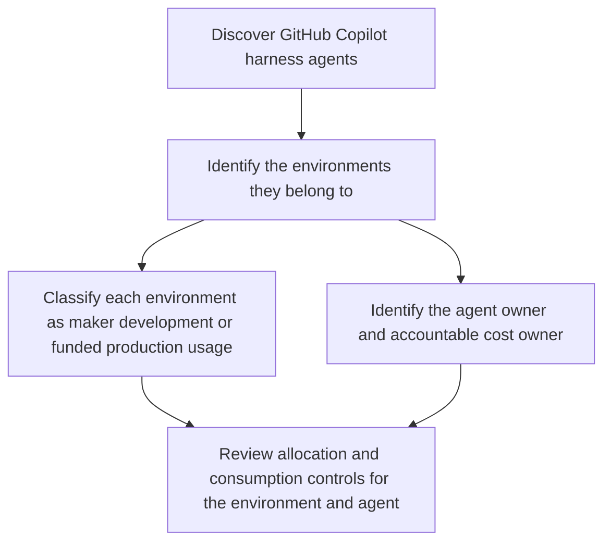
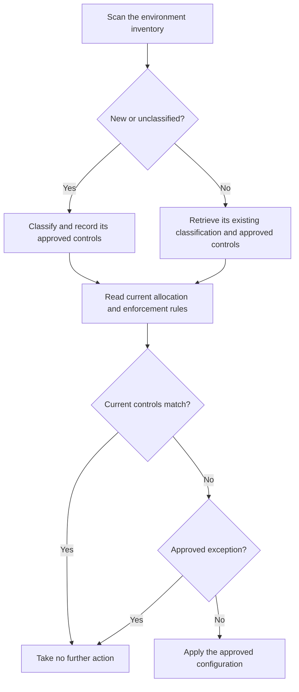
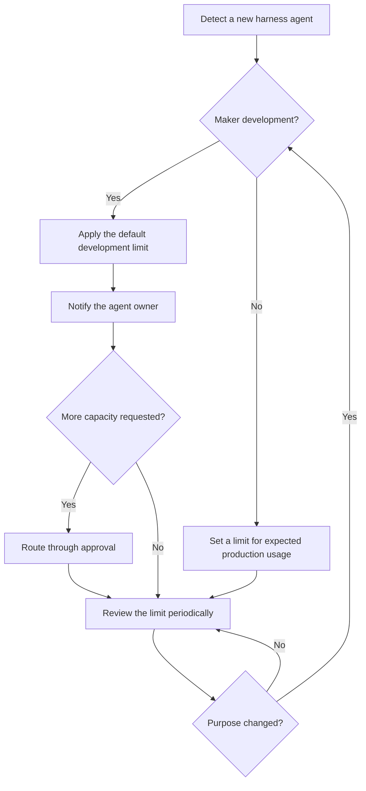

> **원문:** [Adopting the GitHub Copilot Harness: Cost Control and Governance in Copilot Studio](https://microsoft.github.io/mcscatblog/posts/copilot-harness-cost-governance/)
> **게시일:** 2026-08-07 · **저자:** Lewis Baybutt

AI 에이전트가 점점 유능해지면서, 소비량(consumption)은 조직이 사용을 계획하고 관리하는 데서 더 중요한 부분이 되고 있어요. [Copilot Studio의 GitHub Copilot 하네스](https://microsoft.github.io/mcscatblog/posts/new-orchestrator-resources/)를 쓰는 메이커는 에이전트가 정식 프로덕션 수명 주기에 들어가기 전, 그러니까 빌드하고 미리 보고 평가하는 동안에도 Copilot Credit을 소비할 수 있어요. 그래서 관리자가 소비 통제를 적용해야 하는 시점 자체가 달라져요.

메이커가 탐색 용도로 쓰는 환경이, 그 안의 에이전트가 프로덕션용으로 게시되지 않았더라도 이제 소비를 일으킬 수 있어요. 메이커 개발과 예산이 배정된 프로덕션 사용은, 이를 지원하는 환경 유형과 무관하게 용량·소유권·연속성에 대해 서로 다른 접근이 필요해요.

노출을 줄이기 위한 실용적인 기본 절차는 이래요.

1. GitHub Copilot 하네스 에이전트와 그것을 포함한 환경을 찾아요.
2. 해당 환경을 메이커 개발용인지, 예산이 배정된 프로덕션용인지 분류해요.
3. 할당량, 테넌트 풀 접근, 종량제(pay-as-you-go) 과금, 적용(enforcement) 규칙을 검토해요.
4. 개별 소비에 더 엄격한 경계가 필요한 곳에는 에이전트 수준 제한을 적용해요.
5. 검토를 주기적으로 반복하거나, 새로 생성된 환경과 에이전트의 감지를 자동화해요.

이 글에서는 Copilot Credit 소비를 통제할 반복 가능한 거버넌스<sup>1</sup> 프로세스를 제안하고, 이걸 Power Platform 관리 센터(PPAC)에서, 그리고 규모가 커지면 Power Platform API로 구현하는 방법을 보여드릴게요.

## 환경의 목적에 따라 통제를 선택하기

메이커가 에이전트를 탐색하고, 빌드하고, 미리 보고, 평가하는 환경에는 명확한 개발 경계가 필요해요. 예산이 배정된 프로덕션 사용을 지원하는 환경에는 자금 조달, 소유권, 예상 사용량, 중요도에 맞춘 통제가 필요하고요. 두 시나리오에서 쓸 수 있는 통제 수단 자체는 같지만, 어떻게 적용할지는 그 환경이 무엇을 지원하려고 존재하는지를 반영해야 해요.

> **주의:** 메이커 개발은 이제 에이전트가 정식 프로덕션 수명 주기에 들어가기 전에도 Copilot Credit 소비를 일으킬 수 있어요.

환경의 목적을 기준으로 어디서 시작할지 결정하세요.

### 메이커 개발

메이커가 에이전트를 탐색하고, 빌드하고, 미리 보고, 평가하는 환경에는 그 에이전트들이 정식 프로덕션 수명 주기에 들어가기 전부터 통제가 필요해요.

- GitHub Copilot 하네스 에이전트를 감지하세요.
- 기본 에이전트 제한을 적용하세요.
- 테넌트 풀 또는 종량제 접근이 적절한지 결정하세요.
- 에이전트 소유자에게 경계를 알리세요.
- 추가 용량을 요청하는 방법을 정의하세요.

### 예산이 배정된 프로덕션 사용

승인된 부서나 조직 전체 프로세스를 지원하는 환경에는 책임 있는 소유권과 의도적인 자금 배정이 필요해요.

- 비용 소유자와 자금 조달 모델을 확인하세요.
- 용량을 할당하거나 과금을 의도적으로 구성하세요.
- 예상 사용량과 서비스 중요도를 바탕으로 제한을 설정하세요.
- 프로덕션 서비스를 중단시킬 수 있는 소비를 모니터링하세요.

먼저 영향을 받는 에이전트와 환경을 찾은 다음, 의도한 목적에 맞는 통제를 적용하세요.

## 영향받는 에이전트와 환경 발견 및 분류

이제 두 가지 시나리오가 생겼으니, 각각에 맞는 프로세스와 통제로 다뤄볼게요. 거버넌스와 통제는 지금 구축 중인 솔루션을 고려하지 않는 획일적인 접근으로는 절대 잘 되지 않거든요.

각 GitHub Copilot 하네스 에이전트에 대해 먼저 다음을 확인하세요.
- 에이전트를 포함하는 환경
- 그 환경이 메이커 개발을 지원하는지, 예산이 배정된 프로덕션 사용을 지원하는지
- 에이전트 소유자와 그 소비에 책임을 지는 사람
- 현재 할당량, 초과 사용 설정, 소비가 그 목적에 맞는지



이를 위해 [Power Platform Inventory](https://learn.microsoft.com/en-us/power-platform/admin/power-platform-inventory)로 시작해서 Copilot Studio 에이전트와 그걸 포함한 환경을 찾으세요. 규모가 작다면 PPAC의 인벤토리만으로 충분할 수 있어요. 규모가 크다면 [Azure Resource Graph](https://learn.microsoft.com/en-us/power-platform/admin/inventory-sample-queries)나 [Power Platform Inventory API](https://learn.microsoft.com/en-us/power-platform/admin/inventory-api)를 써서 검토를 반복 가능하게 만드세요.

`isCLIAgent` 속성이 GitHub Copilot 하네스를 쓰는 에이전트를 가려내요. 이 에이전트들은 디자인 타임에 메이커 경험에서 Copilot Credit을 소비할 수 있어요. 다음 요청은 해당 에이전트들을 환경 및 소유자 ID와 함께 반환해요.

**Inventory API 요청 보기**

```http
POST https://api.powerplatform.com/resourcequery/resources/query?api-version=2024-10-01
Content-Type: application/json

{
  "TableName": "PowerPlatformResources",
  "Clauses": [
    {
      "$type": "where",
      "FieldName": "type",
      "Operator": "==",
      "Values": ["'microsoft.copilotstudio/agents'"]
    },
    {
      "$type": "where",
      "FieldName": "properties.isCLIAgent",
      "Operator": "==",
      "Values": ["true"]
    },
    {
      "$type": "project",
      "FieldList": [
        "name",
        "properties.displayName",
        "properties.environmentId",
        "properties.ownerId",
        "properties.isCLIAgent"
      ]
    }
  ]
}
```

인벤토리는 에이전트, 소유자, 환경 사이의 기술적 관계를 돌려줘요. 분류에 필요한 비즈니스 맥락은 여러분의 환경 명명 규칙, 환경 그룹, 거버넌스 메타데이터, 승인 기록에서 나올 수 있어요. 이미 [Copilot Agent Kit](https://microsoft.github.io/mcscatblog/posts/copilot-studio-kit/)이나 [Compliance Hub](https://learn.microsoft.com/en-us/microsoft-copilot-studio/guidance/kit-compliance-hub)를 쓰고 있다면, 그 인벤토리를 여러분의 프로세스가 쓰는 시나리오와 비용 소유권 정보로 확장할 수 있어요.

## 환경 통제 적용하기

환경을 분류한 다음에는, 그 환경이 Copilot Credit에 어떻게 접근할 수 있는지, 가용 용량이 소진되면 어떻게 돼야 하는지를 검토하세요.

| 결정 사항 | 사용 가능한 통제 |
|---|---|
| 환경에 선불 용량을 예약해야 하는가? | 환경에 Copilot Credit 할당 |
| 환경이 테넌트 풀의 미할당 용량을 쓸 수 있는가? | 테넌트 풀 사용(draw) 활성화 또는 비활성화 |
| 승인된 Azure 구독으로 소비를 계속할 수 있는가? | 종량제 과금 활성화 또는 비활성화 |
| 용량이 임계치에 다다르거나 소진되면 어떻게 되는가? | 알림 구성 또는 추가 소비 거부 |

메이커 개발 환경에는 대개, 탐색이 다른 작업에 배정된 용량을 갉아먹지 않도록 의도적인 경계가 필요해요. 예산이 배정된 프로덕션 사용에서는 오히려 테넌트 풀이나 종량제 접근이, 에이전트에 자금을 대는 팀이 직접 소유하는 의도적인 연속성 결정일 수 있고요.

적절한 통제를 골랐다면, PPAC 또는 Power Platform API로 구현하세요.

### PPAC에서 할당 및 적용 규칙 구성하기

선불 크레딧을 환경에 할당(예약)하려면 PPAC에서 **라이선스(Licensing)** > **Copilot Studio**로 이동해 **Manage Copilot Credits**를 선택하세요. 환경을 선택하고, 필요한 곳에 선불 용량을 할당하고, 그 용량이 소진되면 어떻게 될지 구성하세요.

_관리자는 선택한 환경에 선불 Copilot Credit을 예약할 수 있어요._

테넌트의 [추가 기능 용량 할당 설정](https://learn.microsoft.com/en-us/power-platform/admin/tenant-settings)이 누가 크레딧을 할당할 수 있는지를 통제해요. 환경 관리자에게 할당 관리를 허용하면, 그 사람이 관리하는 환경으로만 국한되는 게 아니라 테넌트의 모든 환경에 대한 할당 통제권까지 넘어가요. 그렇게 넓은 테넌트 전체 접근을 의도한 게 아니라면, 할당 권한은 테넌트 관리자로 제한하세요.

### API를 통해 할당 및 적용 규칙 구성하기

규모가 크다면 [Update Allocations By Environment](https://learn.microsoft.com/en-us/rest/api/power-platform/licensing/allocations-by-environment/update-allocations-by-environment)를 써서 환경의 할당과 적용 규칙을 한 요청으로 구성하세요.

다음 요청은 10,000 Copilot Credit을 할당하고, 관리자 알림을 켜고, 테넌트 풀 사용은 막고, 종량제 초과 사용은 켜고, 추가 소비 거부는 꺼둔 상태로 두는 예시예요. 이 요청은 할당된 크레딧을 포함해 현재 구성을 패치해요. 먼저 현재 할당을 읽고, 유지해야 할 기존 값을 그대로 보존한 다음, 의도한 전체 구성을 제출하세요.

**할당 및 적용 규칙 요청 보기**

```http
PATCH https://api.powerplatform.com/licensing/allocationsByEnvironment?api-version=2024-10-01
Content-Type: application/json

{
  "environmentId": "<environment-id>",
  "currencyAllocations": [
    {
      "currencyType": "MCSMessages",
      "allocated": 10000,
      "enforcementRules": [
        {
          "ruleType": "Alert",
          "enabled": true
        },
        {
          "ruleType": "TenantPool",
          "enabled": false
        },
        {
          "ruleType": "PayGo",
          "enabled": true
        },
        {
          "ruleType": "Deny",
          "enabled": false
        }
      ]
    }
  ]
}
```

> **참고:** 이 예제는 API를 프로그래밍 방식으로 제어하는 방법을 보여주려고 raw HTTP 호출을 썼어요. C# 및 Python SDK, 그리고 raw HTTP 호출을 쓰는 PowerShell 예제는 [크레딧 할당을 프로그래밍 방식으로 관리하는 Learn 자습서](https://learn.microsoft.com/en-us/power-platform/admin/programmability-tutorial-manage-copilot-credit-allocations)를 참고하세요. [Power Platform for Admins V2 커넥터](https://learn.microsoft.com/en-us/connectors/powerplatformadminv2)용 작업도 곧 제공될 예정이에요.

### 신규 및 기존 환경의 통제 검토하기

새 환경은 테넌트 풀 사용이 켜진 채로 나타날 수 있고, 기존 환경의 구성은 시간이 지나며 승인된 통제에서 벗어날(drift) 수 있어요. 반복적인 검토·시정 프로세스로 다음을 할 수 있어요.

1. Power Platform Inventory에서 `microsoft.powerplatform/environments`를 조회해요. 앞서 본 Inventory API 요청에서 리소스 유형 필터만 바꾸면 돼요.
2. 결과를 여러분의 거버넌스 대상 환경 대장과 비교해요.
3. 새 환경이나 미분류 환경은 분류하고 승인된 통제를 기록해요. 기존 환경은 기록된 분류와 승인된 통제를 조회해요.
4. [Get Allocations By Environment](https://learn.microsoft.com/en-us/rest/api/power-platform/licensing/allocations-by-environment/get-allocations-by-environment)로 환경의 현재 할당과 적용 규칙을 읽어요.
5. 현재 구성을 승인된 통제와 비교해요.
6. 승인된 예외는 그대로 두고, 그렇지 않은 불일치는 시정해요.



4단계는 아래 읽기 엔드포인트로, 시정이 필요한지 결정하기 전에 환경의 현재 할당과 적용 규칙을 가져와요.

```http
GET https://api.powerplatform.com/licensing/allocationsByEnvironment/<environment-id>?api-version=2024-10-01
```

## 에이전트 수준 제한 적용하기

환경 통제는 공유 용량의 경계를 정해요. 에이전트 수준 제한은 그 환경이 선불 용량을 쓰든 종량제 과금을 쓰든 상관없이, 사용 사례 하나에 월별 경계를 추가로 씌워줘요.

메이커 개발 에이전트에는, 얼마나 소비할 수 있는지 정해둔 기본값이 과잉 소비를 막는 핵심 통제예요. 반복 가능한 프로세스로 다음을 할 수 있어요.

1. 새로 생성된 GitHub Copilot 하네스 에이전트를 감지해요.
2. 메이커 개발 환경에 있는지 확인해요.
3. 조직의 기본 개발 제한을 적용해요.
4. 에이전트 소유자에게 제한과, 임계치에 접근하거나 도달했을 때 무슨 일이 일어나는지 알려요.
5. 추가 용량 요청은 적절한 승인 프로세스로 라우팅해요.
6. 에이전트가 예산이 배정된 프로덕션 사용으로 넘어가면 개발 제한을 검토하거나 교체해요.



이렇게 하면 소비를 무한정 방치하지 않으면서도 메이커에게 탐색할 여지를 줄 수 있어요. 제한은 사용자가 아니라 에이전트에 적용되니까, 기본값과 에스컬레이션 프로세스를 정할 때 메이커 한 명이 에이전트를 몇 개나 만들 수 있는지도 고려하세요.

프로덕션 에이전트에도 공유 용량을 지키려고 제한을 걸 수 있지만, 그 값은 메이커 개발 기본값을 그대로 물려받기보다 예상 사용량과 서비스 중요도를 반영해야 해요.

> **참고:** 에이전트 수준 제한은 환경 전체의 총 소비를 제한하지는 않아요. [사용량을 검토하고 과금 정책 연결을 해제해 추가적인 환경 수준 소비를 방지](https://microsoft.github.io/mcscatblog/posts/managing-spend-pay-as-you-go/)하면 총량 제한과 유사한 효과를 얻을 수 있어요.

### PPAC에서 에이전트 제한 구성하기

PPAC에서 **라이선스(Licensing)** > **Copilot Studio** > **Manage Agents**로 이동하세요. 에이전트를 선택하고, 월별 Copilot Credit 제한을 설정하고, 소비가 제한에 다가갈 때 관리자에게 알릴지, 제한에 도달하면 추가 사용을 멈출지 선택하세요.

_관리자는 에이전트 수준 크레딧 제한을 설정하고, 소비가 접근하거나 도달할 때의 동작을 선택할 수 있어요._

> **주의:** 기본 제공 제한 알림은 테넌트 및 환경 관리자에게 전송되고, 에이전트 소유자에게 꼭 가는 건 아니에요. 누가 그 알림을 검토하는지, 맥락이 필요할 때 누가 소유자에게 연락하는지, 누가 제한 증가를 승인하거나 에이전트 중지를 허용할 수 있는지 정해두세요.

제한 대비 소비율에 대한 제품 내 알림 대신, 관리자가 직접 소비 검토와 알림 프로세스를 만들 수도 있어요. [Get Many Environment Entitlements](https://learn.microsoft.com/en-us/rest/api/power-platform/licensing/entitlement/get-many-environment-entitlements)는 환경의 권한(entitlement)<sup>2</sup> 소비 데이터를 돌려주니까, 여러분의 모니터링 프로세스가 이 데이터로 누구에게, 무엇을, 언제 알릴지 결정할 수 있어요.

```http
GET https://api.powerplatform.com/licensing/environments/<environment-id>/entitlements?api-version=2024-10-01
```

### API를 통해 에이전트 제한 구성하기

규모가 크다면 [Update Resource Threshold](https://learn.microsoft.com/en-us/rest/api/power-platform/licensing/resource-threshold/upsert-resource-threshold)를 써서 승인된 제한, 알림 임계치, 중지 동작을 적용하세요. 다음 요청은 제한을 1,000크레딧으로 설정하고, 80%에서 관리자에게 알리고, 제한에 도달하면 추가 소비를 막는 예시예요.

```http
PUT https://api.powerplatform.com/licensing/environments/<environment-id>/entitlements/MCSMessages/resources/<agent-resource-id>/threshold?api-version=2024-10-01
Content-Type: application/json

{
  "stopResource": false,
  "limit": 1000,
  "stopIfOverCapacity": true,
  "notifyIfOverCapacity": true,
  "notificationThreshold": 80
}
```

> **주의:** 에이전트가 즉시 사용 중지되지 않게 하려면 `stopResource`를 반드시 `false`로 설정하세요. 이 값은 요청 시점에 제한과 무관하게 사용을 중지시킬 때 쓰이는데, PPAC의 **Manage Agents**에 있는 에이전트 중지 작업과 같은 방식으로 동작해요.

## 요약

GitHub Copilot 하네스로 만든 에이전트는 크레딧 소비를 관리해야 할 새로운 시나리오를 만들어내요. 메이커 개발 시나리오에는 어느 정도 탐색을 허용하는 에이전트 제한을 설정하고, 예산이 배정된 프로덕션 사용에는 사용 사례에 맞는 통제와 제한을 적용하는, 통제와 자유 사이의 신중한 균형을 잡아보세요. 이 프로세스 중 어떤 부분을 PPAC에서 관리하고, 어떤 부분을 Power Platform API로 자동화하시겠어요?

---

## 어휘 주석

1. **거버넌스(governance):** 조직이 정책과 규칙을 통해 시스템 사용과 리소스를 관리·통제하는 체계.
2. **엔타이틀먼트(entitlement):** 특정 리소스를 정해진 만큼 쓸 수 있도록 부여된 할당량이나 권한.
