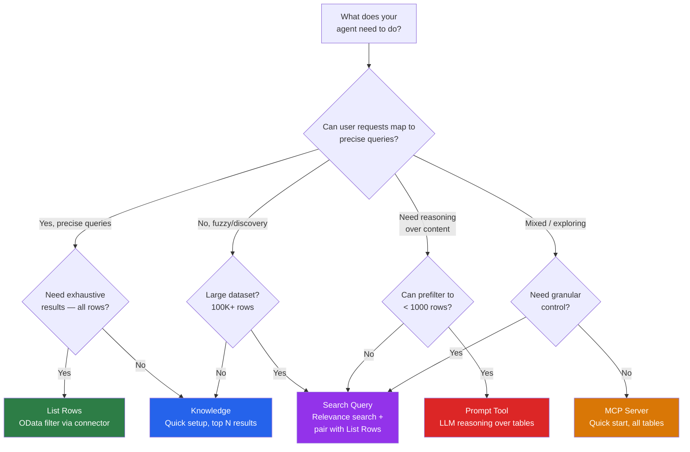
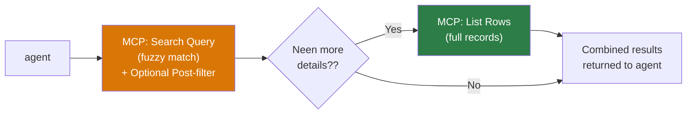
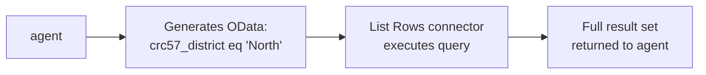
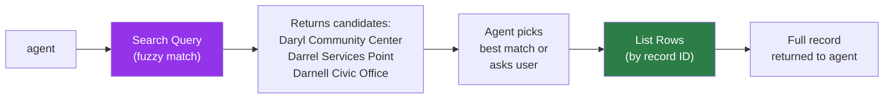
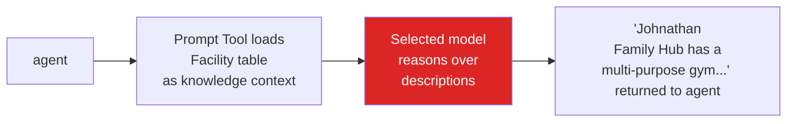

> **원문:** [Dataverse Retrieval Patterns for Structured Data in Copilot Studio Agents](https://microsoft.github.io/mcscatblog/posts/dataverse-retrieval-patterns-copilot-studio/)
> **게시일:** 2026-04-10 · **저자:** Karima Kanji-Tajdin, Roel Schenk

지금 기준으로 Dataverse 데이터 검색에는 서로 다른 방법이 다섯 가지 있고, 각각 성능, 보안, 확장성 면에서 고유한 트레이드오프를 가지고 있어요.

> **주의:** 한 가지 유의할 점이 있어요. 이 가이드는 Copilot Studio의 비정형 파일 업로드 지식(Knowledge)은 다루지 않아요(이건 다른 Dataverse 메커니즘을 써요). 대신 테이블 형식 데이터(즉, 행과 열이 있는 정형 Dataverse 테이블)에 초점을 맞춰요.

사실 대부분의 사람들은 동작하는 방법 하나를 찾으면 다른 방법은 쳐다보지도 않아요. 처음 눈에 띄는 게 Knowledge라서 연결했다가, 결과가 잘리는 문제에 부딪히고("knowledge" 버튼으로 Dataverse를 Knowledge로 쓸 때의 트레이드오프 중 하나예요), 그다음 일주일 동안 대신 무엇을 썼어야 했는지 알아내느라 시간을 보내요. 아니면 강력해 보인다는 이유로 바로 MCP로 갔다가, 환경의 모든 테이블에 에이전트 접근 권한을 줬다는 걸 뒤늦게 깨닫기도 해요(Dataverse MCP가 실제로 그렇게 동작해요).

이 가이드는 **정형 Dataverse 테이블 데이터**를 위한 다섯 가지 주요 검색 패턴과, 각각이 빛나는 상황, 사용 방법을 다뤄요. 아키텍처 의사 결정 가이드가 먼저고, 사용법 참조는 그다음이에요. 특정 방법을 이미 심층적으로 다룬 글이 있다면, 반복하는 대신 링크로 안내할게요.

> **주의:** 한 가지 더 있어요. 이 글은 **검색(retrieval)** — Dataverse에서 데이터를 읽는 것 — 에 관한 글이에요. 생성, 업데이트, 삭제 작업은 여기서 다루지 않아요. CRUD가 언급된다면 그건 비활성화하는 맥락에서만이에요.

## 시나리오: Greenfield 공원 및 레크리에이션 부서

이 글 전체에서 다섯 가지 방법 모두에 하나의 시나리오를 써서 같은 조건으로 비교할 수 있게 할게요.

따라 해 보려면 이 글에 쓴 샘플 데이터셋을 다운로드해서 Dataverse 테이블에 가져오세요: [fictional_facilities_table_import_to_DV.csv](https://microsoft.github.io/mcscatblog/assets/posts/dataverse-retrieval-patterns-copilot-studio/fictional_facilities_table_import_to_DV.csv)

_샘플 CSV를 Dataverse로 가져온 후의 Facility 테이블_

**설정:** 가상의 Greenfield 공원 및 레크리에이션 부서(Greenfield Parks & Recreation Department)를 위한 Copilot Studio 에이전트를 만든다고 해봐요. 이 부서에는 **Facility**라는 Dataverse 테이블(논리적 이름: `crc57_facility1`)이 있고, 6개 지구와 5개 시설 유형에 걸쳐 가상 시설 100개가 있어요.

데이터는 일부러 다양하게 구성했어요. 시설 이름은 서로 겹쳐요. 유형에는 Community Hub, Library Branch, Recreation Centre, Civic Office, Access Point가 있어요. 지구는 North, South, East, West, Central, Downtown에 걸쳐 있고요. 설명은 편의 시설과 프로그램 세부 정보가 담긴 풍부한 여러 줄 텍스트라서, 퍼지 검색을 흥미롭게 만드는 자유 형식 콘텐츠예요. 검색하지는 않지만 조회하고 싶은 열도 있어요. 이미지 URL, 운영 시간, 웹사이트, 수용 인원, GPS 좌표, 접근성 플래그 같은 것들요.

_지구, 유형, 설명이 있는 시설 레코드 샘플_

또한 다대다 관계로 Facility와 연결된 **Service Offerings** 테이블(요가 클래스, 수영 강습, 방과후 프로그램)도 있어요.

주민들은 이런 질문을 할 거예요.
- "West 지구에는 어떤 시설이 있나요?" (정밀 필터)
- "Darol center 같은 곳은 어디서 찾을 수 있나요?" (오타가 포함된 퍼지 탐색)
- "커뮤니티 허브는 몇 개나 있나요?" (집계)
- "농구는 어디서 할 수 있나요?" (LLM 의미 기반 검색)
- "Johnathan Family Hub는 어떤 프로그램을 제공하나요?" (테이블 간 조회)

각 검색 방법은 이 질문들을 서로 다르게 처리해요. 어떻게 다른지 살펴볼게요.

## 방법 선택하기

각 방법을 자세히 보기 전에, 단순화된 의사 결정 흐름을 소개할게요. 시작점은 에이전트가 해야 할 일과 사용자에게 필요한 게 뭔지에 따라 달라져요.



상세 섹션을 읽기 전에 아래 인터랙티브 위젯을 살펴보세요. 샘플 질문에 대해 각 방법이 정확히 어떤 행과 열을 검색하는지, 메이커로서 무엇을 제어하는지, 오케스트레이터가 무엇을 처리하는지 보여줘요.

<iframe src="https://microsoft.github.io/mcscatblog/assets/posts/dataverse-retrieval-patterns-copilot-studio/DataverseRetrievalWidget.html" width="100%" height="560" frameborder="0" style="border-radius: 12px; border: 1px solid #e2e8f0;"></iframe>

하나의 에이전트에서 여러 방법을 결합할 수 있고, 실제로 그래야 하는 경우도 많아요. 이 글의 나머지 부분에서는 각 방법을 하나씩 살펴볼게요. 가장 빠르게 설정할 수 있는 두 가지(Knowledge와 MCP)부터 시작해서, 더 많은 제어를 주는 방법들(List Rows, Search Query, Prompt Tool)로 넘어갈게요.

## 시작하기 전에: 기본 사항

어떤 방법을 쓰든 다음이 준비되어 있어야 해요. 먼저 정리해 두지 않으면 디버깅에 시간을 낭비하게 돼요.

**Dataverse가 있는 Copilot Studio 환경.** 모든 Copilot Studio 환경에는 Dataverse 데이터베이스가 함께 딸려 와요. Power Platform을 쓰고 있다면 이미 가지고 있는 거예요. 아니라면 라이선스가 있는 환경(Developer, Sandbox, Production)이 필요해요.

**데이터가 있고 열 이름이 명확한 테이블.** 열 이름이 `cr_col1`, `cr_col2`라면 모든 AI 서비스가 해석하기 힘들어해요. 가능하면 의미 있는 이름으로 바꾸세요. **논리적 필드 이름**(표시 이름이 아니라)을 기록해 두세요 — Dataverse → 열 열기 → 설정(Settings) → 논리적 필드 이름(Logical field name)에서 찾을 수 있어요. `crc57_district`, `crc57_facilitytype` 같은 형태예요. OData 필터와 도구 구성에 필요해요.

**인증 방식 결정.** 이게 쓸 수 있는 방법을 제약해요.

| 인증 모드 | Knowledge | List Rows | MCP Server | Search Query | Prompt Tool |
|---|---|---|---|---|---|
| 사용자 인증 (로그인) | 가능 | 가능 | 가능 | 가능 | 가능 |
| 서비스 계정 / 앱 인증 | 불가 | 가능 | 가능 (커스텀 커넥터 사용) | 가능 | 가능 |
| 익명 (로그인 없음) | 불가 | 가능 | 가능 (커스텀 커넥터 사용) | 가능 | 가능 |

> **참고:** 익명의 공개 대상 에이전트가 필요하다면 Dataverse 기반 Knowledge는 선택지에서 빠져요. List Rows, Search Query, 또는 서비스 연결을 쓰는 Prompt Tool이 필요해요.

**AI 서비스 활성화.** 환경에는 오케스트레이션(항상 켜짐), Knowledge(소스별 활성화), Prompt Tool(도구 아래에서 사용 가능)이 필요해요. 이들은 Copilot Studio 라이선스에 포함되어 있지만, 관리자가 Power Platform 관리 센터에서 [생성형 AI 기능을 켜야](https://learn.microsoft.com/en-us/power-platform/admin/geographical-availability-copilot) 할 수 있어요.

## 1. Knowledge: 답변으로 가는 가장 빠른 길

### 무엇인가

Knowledge는 데이터 소스에 근거한(grounded) 답변을 주는 Copilot Studio의 기본 제공 AI 서비스예요. [Dataverse 테이블 Knowledge](https://learn.microsoft.com/en-us/microsoft-copilot-studio/knowledge-add-dataverse)를 참고하세요. 테이블을 지정하고 용어집(glossary)을 구성하면 에이전트가 데이터에 대한 질문에 답할 수 있어요. 내부적으로 Copilot Studio의 Knowledge 계층은 용어집 용어, 동의어, 열 메타데이터로 사용자 질문을 스키마에 대한 구조화된 쿼리로 재작성한 다음, 추론된 답변을 줘요. 쿼리로 바꿀 수 있고, 범위가 제한된 결과 집합으로 답할 수 있는 질문에 잘 맞아요.

### 언제 사용하나

- 최소한의 구성으로 **가장 빠른 설정**을 원할 때
- 사용 사례가 **테이블 데이터에 대한 일반적인 Q&A**일 때 (조회, 기본 필터링)
- **상위 N개 결과**로 충분할 때 (모든 일치 항목이 아니라 가장 관련성 높은 항목을 반환)
- 사용자가 **인증**할 때 (Dataverse 기반 Knowledge는 사용자 인증 필요)
- **테이블 간 관계 인식**이 필요할 때 (다대다 관계를 자동으로 따라갈 수 있음)

### 언제 다른 방법으로 넘어가나

- **전체 결과**가 필요할 때 (상위 몇 개가 아니라 필터에 일치하는 모든 행)
- 로그인이 없는 **익명/공개 대상** 에이전트가 필요할 때
- 생성되는 **쿼리를 완전히 제어**해야 할 때
- **후속 질문 처리**가 기본적으로 필요할 때 (도구가 이걸 더 잘 처리함)

### 설정 방법

1. **Copilot Studio**에서 에이전트 열기
2. **Knowledge**로 가서 새 지식 소스 추가
3. **Dataverse**를 선택하고 원하는 테이블 선택
4. **용어집 구성** — 이 단계가 결과의 성패를 좌우해요

_Copilot Studio에서 복잡한 열 이름에 대한 동의어로 Knowledge 용어집 구성_

**실무에서 용어집은 선택 사항이 아니에요.** Dataverse 테이블을 지식 소스로 추가하면 Copilot Studio는 용어 정의와 동의어 필드가 있는 모든 열을 보여줘요. 열 이름이 잘 지어져 있다면 용어집 작업을 가볍게 넘어갈 수 있어요. 열 이름이 암호 같다면, 용어집은 LLM이 스키마를 이해할 수 있는 유일한 방법이에요.

시작하기 전에 매핑을 준비하세요.

| 논리적 필드 이름 | 용어 정의 | 동의어 |
|---|---|---|
| `crc57_district` | 시설이 위치한 지리적 지구 (north, south, east, west, central 등) | area, zone, region |
| `crc57_facilitytype` | 시설 유형 (civic office, access point 등) | center type, building type, Hub Type |
| `crc57_facilitydescription` | 시설과 편의 시설에 대한 전체 텍스트 설명 | about, details, info, what's there |

> **팁:** 테이블을 Knowledge에 추가하면 Dataverse가 곧바로 해당 테이블의 인덱싱을 시작해요. Dataverse 검색 인덱스 설정(Search Query와 MCP에 필요)이 느리게 느껴진다면, 먼저 테이블을 Knowledge에 추가하는 게 인덱싱을 시작시키는 지름길이에요.

5. **테스트 패널**에서 테스트하고 [활동(Activity) 탭](https://learn.microsoft.com/en-us/microsoft-copilot-studio/authoring-review-activity)에서 사고 과정(chain-of-thought) 추론 확인
6. 활동 로그에서 **재작성된 쿼리** 확인 — 사용자의 정리되지 않은 입력이 Dataverse에 도달하기 전에 어떻게 정리되는지 보여줘요

_활동 탭은 Knowledge가 Dataverse를 쿼리하기 전에 사용자 질문을 어떻게 재작성하는지 보여줘요_

### Greenfield 예시

주민이 물어요: *"West 지구에 어떤 커뮤니티 허브가 있나요?"*

Knowledge는 이 질문을 Facility 테이블에 대한 구조화된 쿼리로 재작성하고, `crc57_district = West`와 `crc57_facilitytype = Community Hub`로 필터링한 다음, 상위 일치 항목과 세부 정보를 반환해요. 주민이 *"그곳은 어떤 프로그램을 제공하나요?"* 같은 후속 질문을 하면 Service Offerings와의 관계도 따라가요.

### 핵심 세부 사항

- **멀티턴 대화** 지원 — 에이전트가 질문 간 컨텍스트 유지
- **테이블 관계** 탐색 가능 (시설에 대한 후속 질문으로 서비스 제공 항목 조회)
- **관련성 점수** 기반 결과 반환, 전체 필터링 아님
- 용어집 품질이 답변 품질을 직접 결정

### 한계에 부딪히는 순간

Knowledge는 모든 일치 항목이 아니라 상위 N개 결과를 반환해요. 주민이 *"North 지구의 모든 시설을 보여주세요"*라고 물었을 때 일치 항목이 47개라면, 5개나 10개만 받게 돼요. 사용자에게 전체 결과가 필요하다면 그 시나리오에는 List Rows가 더 맞아요.

## 2. MCP Server: 올인원 지름길

### 무엇인가

Dataverse [MCP(Model Context Protocol) 서버](https://learn.microsoft.com/en-us/microsoft-copilot-studio/mcp-add-components-to-agent)는 여러 Dataverse 작업을 하나의 엔드포인트 뒤에 묶어서 줘요. 행 나열(list rows), 검색 쿼리(search query), CRUD 작업 등을 도구 집합으로 노출해요. 한 번 연결하면 에이전트가 환경의 모든 테이블과 통신할 수 있어요.

> **참고:** MCP로 환경 간 Dataverse 접근(예: 데이터가 에이전트와 다른 환경에 있는 경우)이 필요하면 Ricardo의 가이드 [환경 간 Copilot Studio를 Dataverse MCP 엔드포인트에 연결하기](https://microsoft.github.io/mcscatblog/posts/connecting-copilot-studio-dataverse-mcp-endpoint-across-environments/)를 참고하세요. MCP와 Power Platform 커넥터의 상세 비교는 [Copilot Studio에서 MCP 서버냐 커넥터냐? 메이커 가이드](https://microsoft.github.io/mcscatblog/posts/compare-mcp-servers-pp-connectors/)를 확인하세요.

### 언제 사용하나

- 환경의 모든 테이블과 통신하는 **빠른 시작**을 원할 때
- **탐색이나 프로토타이핑** 중이고 아직 세밀한 제어가 필요 없을 때
- 각각 따로 구성하지 않고 **여러 작업을 사용**하고 싶을 때
- MCP 서버의 기본 제공 테이블 설명이 시나리오에 충분할 때

### 언제 다른 방법으로 넘어가나

- 어떤 쿼리가 어떻게 실행되는지 **세밀하게 제어**해야 할 때
- 에이전트가 접근할 수 있는 **테이블을 제한**해야 할 때 (MCP는 list rows로 모든 테이블을 노출)
- **DLP<sup>1</sup> 정책**에 작업별 제어가 필요할 때
- **예측 가능한 도구 호출 횟수**가 필요할 때 (MCP는 질문 하나에 여러 호출을 연쇄할 수 있음)

### 설정 방법

**사전 요구 사항:** Dataverse 검색이 켜져 있어야 하고 열이 인덱싱되어 있어야 해요(Search Query와 동일). MCP 서버는 내부적으로 같은 관련성 검색 인덱스를 써요.

1. Copilot Studio에서 **도구(Tools)**로 가서 새 도구 추가
2. 도구 유형으로 **MCP** 선택
3. **Dataverse MCP 서버** 연결
4. 사용 가능한 모든 작업이 표시돼요. **필요 없는 건 비활성화하세요**:
   - 검색 전용이라면: `create_table`, `update_table`, `delete_table`, `create_record`, `update_record`, `delete_record`, `list_apps` 비활성화
   - 유지: `list_tables`, `describe_table`, `read_query`, `search`, `fetch`
5. MCP 서버는 Dataverse 테이블 정의에서 **테이블과 열 이름**을 자동으로 가져와 기본 용어집으로 써요
6. 테스트 후 **활동 탭**에서 MCP가 어떤 작업들을 연쇄하는지 확인

> **주의:** 전체 MCP 서버는 DLP 관점에서 커넥터 하나로 취급돼요. 전체를 허용하거나 차단하는 것만 가능해요 — DLP 수준에서 "MCP를 통한 list rows"는 허용하고 "MCP를 통한 delete rows"는 차단할 수 없어요. 대신 MCP 도구 구성에서 원하지 않는 작업을 비활성화하세요.

### 오케스트레이터가 MCP를 사용하는 방식

오케스트레이터는 어떤 도구든 연쇄할 수 있어요 — 이건 MCP만의 동작이 아니에요. MCP가 다른 점은 관련 작업들이 **번들로 묶여 있고 컨텍스트를 인식**한다는 거예요. 같은 엔드포인트, 같은 테이블 메타데이터, 같은 연결을 공유하고, 언제 서로를 호출해야 하는지 알아요. 각 작업을 별도의 도구로 구성할 필요가 없어요.



### Greenfield 예시

주민이 물어요: *"Darol Civics 같은 곳을 찾아주세요."*

MCP 서버는 퍼지 검색을 실행해 가장 가까운 일치 항목인 "Daryl Community Center"를 찾고, 자동으로 list rows 호출을 이어서 전체 레코드를 가져와요. 도구 호출 두 번, 사용자 질문 하나, 작업별 수동 구성은 제로예요.

### 핵심 세부 사항

- MCP에서는 **사용자 질문 하나당 여러 도구 호출이 정상**이에요 — 의도된 설계예요
- 생성되는 정확한 OData 필터에 대한 제어는 잃어요
- MCP는 용어집으로 테이블과 열 이름을 가져오니까, **Dataverse에서 좋은 테이블/열 이름을 짓고** 필요에 따라 Copilot Studio 에이전트 컨텍스트에 세부 정보와 설명을 추가하세요
- Dynamics 365 테이블은 Dataverse 위에 있으니 이 MCP 패턴은 D365 CE 모듈에도 똑같이 적용돼요
- MCP 인증은 커스텀 커넥터로 서비스 주체(service principal)를 쓸 수 있어서 익명 에이전트 시나리오가 가능해요

### 한계에 부딪히는 순간

MCP는 탐색과 프로토타이핑에 훌륭해요. 중요한 비즈니스 프로세스를 다루는 프로덕션 에이전트에서는 어떤 쿼리가 실행되는지 정확히 제어할 수 있는 전용 List Rows나 Search Query 도구가 필요할 거예요. MCP가 호출을 너무 많이 일으키나요? 전용 도구를 만드세요. 작업별 DLP가 필요한가요? 개별 커넥터 도구로 바꾸세요. 같은 도구의 인스턴스가 여러 개 필요한가요? 개별적으로 구성된 커넥터 도구를 쓰세요.

## 3. List Rows: 정밀하고 완전한 검색

### 무엇인가

Dataverse 커넥터의 ["List rows" 작업](https://learn.microsoft.com/en-us/microsoft-copilot-studio/advanced-flow-list-of-results)을 [Copilot Studio의 도구](https://learn.microsoft.com/en-us/microsoft-copilot-studio/add-tools-custom-agent)로 추가한 거예요. 도구 입력 설명 안에 [OData 필터 구문](https://learn.microsoft.com/en-us/power-apps/developer/data-platform/webapi/query/filter-rows)을 자연어로 적어두면, 오케스트레이터가 사용자 질문에서 실제 OData 쿼리를 만들어요. 이걸로 결정론적이고 필터링된 검색이 가능해요 — 일치하는 모든 행이 반환돼요.

> **참고:** 조인이 포함된 복잡한 쿼리에는 List Rows 안에서 [FetchXML 쿼리](https://learn.microsoft.com/en-us/power-apps/developer/data-platform/fetchxml/overview)를 쓰세요.

### 언제 사용하나

- **정밀하고 완전한 결과**가 필요할 때 (특정 조건에 일치하는 모든 행)
- **어떤 열이 필터링되고 반환되는지 완전히 제어**하고 싶을 때
- **테이블 간 관계** 인식이 필요할 때
- 익명을 포함한 **모든 인증 모드**에서 작동해야 할 때
- Knowledge의 **결과 잘림이 문제**가 되는 사용 사례일 때

### 언제 다른 방법으로 넘어가나

- 사용자가 필터링할 정확한 값을 모를 때 (먼저 퍼지 탐색 필요)
- 매우 큰 데이터셋에 '검색' 동작을 원할 때

### 설정 방법

**사전 요구 사항:** Copilot Studio에서 Dataverse 커넥터를 구성하세요 (도구 → Dataverse 커넥터 추가 → 연결 구성). 특별한 인덱싱은 필요 없어요 — List Rows는 테이블에 대해 바로 OData 필터링이나 fetchXML 쿼리를 써요.

1. Copilot Studio에서 **도구(Tools)**로 가서 새 도구 추가
2. **Dataverse 커넥터** → **List rows** 작업 선택
3. **대상 테이블** 선택 (예: Facilities)
4. **도구 입력** 구성:
   - 커넥터 입력(실제 OData 필드)은 내부적으로 숨겨져요
   - **도구 입력**이 오케스트레이터가 보는 지능형 인터페이스가 돼요

_도구 입력 설명이 오케스트레이터에게 OData 필터 생성 방법을 가르쳐요_

5. 입력 설명을 의사 코드처럼 쓰세요.

```
OData filter for the Facilities table.
- If the user mentions a district (north, south, east, west, central, downtown), filter on: crc57_district eq '{value}'
- If the user mentions a facility type (community hub, library branch, recreation centre, civic office, access point), filter on: crc57_facilitytype eq '{value}'
- If the user mentions a city name, filter on: crc57_city eq '{value}'
- Always return columns: crc57_facility, crc57_district, crc57_city, crc57_phonenumber, crc57_facilitytype
- Use logical field names only
- DO NOT invent filter values that the user did not mention
```

> **팁:** "DO NOT invent filter values" 지침은 값이 닫힌 집합일 때 중요해요. 목록이 완전하지 않다면 필터에 키워드, 변형, 동의어를 추가할 수 있게 허용해서 검색 동작을 흉내 낼 수 있어요.

6. 비즈니스 기능을 설명하는 **도구 설명** 추가 (예: "지구, 유형, 도시로 필터링된 시설 레코드를 조회해요")
7. 선택적으로 결과 처리를 위한 **최상위 에이전트 지침** 추가 (예: "결과가 5개를 넘으면 사용자에게 지구로 좁혀 달라고 요청")

> **팁:** 커넥터 이름은 기술적 이름이 아니라 비즈니스 기능으로 바꾸세요. 오케스트레이터는 그게 "Dataverse List Rows"라는 걸 알 필요가 없어요. "Facility Directory Lookup"이나 "Parks & Rec Search"라고 부르세요. 도구가 여러 개일 때 중요해요 — 명확한 이름은 오케스트레이터가 올바른 도구로 라우팅하는 데 도움이 돼요.

### 오케스트레이터가 OData를 생성하는 방식



명확하고 교육적인 입력 설명과 유효 값의 명시적 용어집을 작성하면 오케스트레이터의 OData 생성은 믿을 만해요. `eq`, `ne`, `and`, `or`, `contains()`는 잘 처리해요. 어려움을 겪는 지점은 설명이 모호하거나 해석의 여지를 남길 때예요 — 그럴 때 환각된(hallucinated) 필터 값이나 불필요한 후속 질문이 나와요.

### Greenfield 예시

주민이 물어요: *"North 지구의 모든 시설을 보여주세요."*

오케스트레이터는 도구 입력 설명을 읽고 `crc57_district eq 'North'`를 생성하고, List Rows는 일치하는 모든 시설을 반환해요 — 상위 5개가 아니라 전부요. 에이전트는 결과를 목록으로 정리해요.

하지만 다른 주민이 이렇게 입력해요: *"Darol center는 어디 있나요?"* — 결과가 0개예요. 실제 가장 가까운 이름이 "Daren Jonny Recreation Centre"라서 `crc57_facility eq 'Darol center'`는 아무것도 매칭하지 못해요. List Rows는 정확히 일치하는 것만 찾아요. 퍼지 탐색에는 Search Query가 필요해요.

### 핵심 세부 사항

- 오케스트레이터가 자연어를 OData 구문으로 자동 변환
- Dataverse 열 정의의 **논리적 필드 이름** 사용 (표시 이름 아님)
- 표준 OData 연산자 지원: `eq`, `ne`, `and`, `or`, `contains()` 등
- 익명을 포함한 **모든 인증 모드**에서 작동
- 특별한 인덱싱 불필요 — 쿼리가 테이블에 직접 실행됨

### 한계에 부딪히는 순간

사용자는 철자를 틀려요. "Daryl"을 의미하면서 "Darol"이라고 입력해요. 값이 "Community Hub"인데 "community center"라고 입력하기도 하고요. List Rows는 이걸 처리할 수 없어요 — 정확히 일치하는 것만 찾아요. 사용자에게 퍼지 탐색이 필요하다면, Search Query가 바로 그걸 위해 설계됐어요.

## 4. Search Query: 지저분한 입력을 위한 퍼지 탐색

### 무엇인가

`searchquery` 작업 이름을 쓰는 Dataverse ["Perform unbound action"](https://learn.microsoft.com/en-us/microsoft-copilot-studio/authoring-create-search-query) 커넥터예요. 이건 Dataverse의 [관련성 검색 인덱스(relevance search index)](https://learn.microsoft.com/en-us/power-platform/admin/configure-relevance-search-organization)를 써요 — 모델 기반 앱의 검색 창을 구동하는 것과 같은 엔진이에요. 오타, 어간(stemming), 유사 용어에 대한 지능형 확장이 있는 키워드 기반 검색이에요. 벡터 검색도, 임베딩 기반도 아니에요. 얼마나 잘 일치하는지에 따라 결과 순위를 매기고, 실제 사람의 지저분한 입력을 처리해요.

> **참고:** Karima가 단계별 설정, YAML, 점진적 개선을 다룬 searchQuery 심층 분석 글을 썼어요. 이 방법을 본격적으로 쓰려면 [사용자 인증 없는 정형 데이터](https://microsoft.github.io/mcscatblog/posts/dataverse-search-in-copilot-studio-unauthenticated-structured-data/)를 읽어 보세요 — 인덱싱부터 동작하는 에이전트까지 다 다뤄요.

### 언제 사용하나

- 사용자가 **정확한 값을 모를 때** (레코드에는 "Daryl"인데 "Darol"이라고 입력)
- **대규모 데이터셋**이 있을 때 (수십만~수백만 행)
- **탐색 스타일 검색**이 필요할 때 — "X와 관련된 것을 찾아줘"
- **List Rows와 짝지어** 2단계 패턴을 쓰고 싶을 때: 퍼지 검색으로 레코드를 식별한 다음, 결정론적 검색으로 전체 세부 정보 조회
- 검색이 필요한 **텍스트 중심 열**(설명, 메모, 첨부 파일)이 있을 때

### 언제 다른 방법으로 넘어가나

- **완전한 필터링 결과**가 필요할 때 (Search Query는 상위 점수 일치 항목만 반환)
- 인덱싱되지 않은 열의 결과가 필요할 때 (인덱싱된 텍스트 열만 검색)
- 단순한 단일 단계 검색을 원할 때

### 설정 방법

**사전 요구 사항:** Dataverse 검색이 켜져 있어야 하고 열이 인덱싱되어 있어야 해요. 사람들이 가장 자주 놓치는 사전 요구 사항이에요.

> **주의:** 텍스트 유형 열만 인덱싱할 수 있어요(한 줄 텍스트, 여러 줄 텍스트). 불리언, 숫자, 조회(lookup)는 퍼지 검색용으로 인덱싱할 수 없어요. 선별적으로 하세요 — 인덱싱은 스토리지를 소비해요.

**Copilot Studio에서 도구 구성:**

1. 새 도구 추가 → **Dataverse 커넥터** → **Perform unbound action**
2. **작업 이름**을 `searchquery`로 설정
3. 입력 **구성**

프로덕션에 바로 쓸 수 있는 완전한 `searchquery` 구성 패턴은 [사용자 인증 없는 정형 데이터](https://microsoft.github.io/mcscatblog/posts/dataverse-search-in-copilot-studio-unauthenticated-structured-data/)를 참고하세요.

### 2단계 패턴: Search Query + List Rows

가장 흔한 엔터프라이즈 패턴이에요. 퍼지 검색으로 후보를 찾은 다음, List Rows로 전체 세부 정보를 조회해요.



이걸 설정하려면 에이전트에 도구 두 개가 구성되어 있어야 해요.

1. **Search Query 도구** — 위에서 설명한 대로 구성, ID와 인덱싱된 열이 포함된 후보 레코드 반환
2. **List Rows 도구** — 레코드 ID를 받아 모든 열이 포함된 전체 행을 반환하도록 구성

오케스트레이터가 이 둘을 연쇄해요. Search Query가 오타 "Darol"에서 "Daryl Community Center"를 찾고, List Rows가 검색 인덱스에 없던 전화번호, 주소, 서비스 제공 항목 등 전체 레코드를 가져와요.

> **주의:** searchQuery API의 `filter` 매개변수는 **사후 필터(post-filter)**예요 — 전체 테이블이 아니라 상위 N개 순위 결과를 좁혀요. 이건 오케스트레이터의 동작이 아니라 Dataverse API의 기본 기능이에요. 같은 OData 필터를 List Rows에 넣는 것과 Search Query의 사후 필터로 넣는 걸 비교하면, List Rows가 전체 테이블을 필터링하니까 결과가 더 많이 나와요.

### Greenfield 예시

주민이 입력해요: *"Darol center는 어디 있나요?"*

Search Query는 오타에도 불구하고 "Daryl Community Center"를 찾아 가장 높은 점수를 매기고 관련성 점수와 함께 반환해요. 에이전트는 이걸 바로 제시하거나, 비슷한 일치 항목이 여러 개라면 주민에게 어느 걸 의미했는지 확인을 요청해요. 그런 다음 List Rows가 전화번호, 주소, 진행 중인 프로그램이 포함된 전체 레코드를 가져와요.

### 핵심 세부 사항

- **결정론적이 아니라 확률적** — 정확한 일치가 아니라 관련성 점수가 매겨진 결과 반환
- 첨부 파일에서 **처음 1-2MB의 텍스트**를 인덱싱하니까 문서 검색 시나리오가 가능
- 가벼운 **관련성 검색은 빠르고** 가장 큰 데이터셋에 이상적
- **순위 매기기**와 모호성 해소에 쓸 수 있는 관련성 매개변수와 점수 반환
- 페이지네이션과 패싯(Facet) 집계, 중요 키워드 하이라이팅 등 **고유한 제어 기능** 제공
- 서비스 주체 자격 증명을 쓰면 **모든 인증 모드**에서 작동

### 한계에 부딪히는 순간

Search Query는 텍스트 콘텐츠를 "의미로" 검색하지 않아요 — 인덱스는 키워드 기반이지, 벡터 임베딩을 쓰는 시맨틱 인덱스가 아니에요. "농구는 어디서 할 수 있나요?"라고 묻는 사용자는 설명에 "multi-purpose gym"이나 "youth sports programs"라고 적힌 시설을 못 찾아요. 자유 텍스트 데이터에 대한 그런 종류의 의도 매칭에는 Prompt Tool이 필요해요.

## 5. Prompt Tool: 데이터에 대한 LLM 추론

### 무엇인가

Copilot Studio의 [프롬프트 도구](https://learn.microsoft.com/en-us/microsoft-copilot-studio/create-custom-prompt): Dataverse 테이블을 지식 소스로 지정할 수 있는 구성 가능한 단일 호출(single-shot) LLM 호출이에요. 자연어로 지침을 쓰고, 모델을 선택하고, 입력과 출력을 정의한 다음, 에이전트에서 재사용 가능한 도구로 써요. 테이블 데이터에 바로 접근할 수 있는 커스텀 AI 함수라고 생각하면 돼요.

### 언제 사용하나

- 데이터에 대한 **시맨틱 추론**이 필요할 때 — 설명 해석, 의도와 편의 시설 매칭, "어디서 ~할 수 있나요" 질문에 답하기
- 제한된 테이블 데이터(최대 1000행)에 대한 **집계, 요약, 계산**이 필요할 때
- **모델을 바꿔 보고** 싶을 때 — [AI Builder 모델 선택](https://learn.microsoft.com/en-us/ai-builder/prebuilt-azure-openai)으로 환경에서 사용 가능한 GPT, Anthropic 및 기타 채팅 지원 모델을 테스트
- 정의된 입력과 출력을 가진 **재사용 가능한 도구 형태의** LLM 호출을 원할 때
- 하나의 프롬프트 안에서 **여러 Dataverse 테이블**을 지식 컨텍스트로 결합하고 싶을 때

### 언제 다른 방법으로 넘어가나

- List Rows나 Knowledge로 충분하고 에이전트의 오케스트레이터가 나머지 추론을 처리할 수 있는 단순 조회 (못 하나 박는 데 대포를 쓰지 마세요)
- 실시간, 고처리량 검색이 필요할 때 (Prompt Tool은 LLM 처리 시간이 더해져요)
- 필터링된 데이터가 프롬프트 컨텍스트 윈도우에 넣기에 너무 클 때

### 설정 방법

**사전 요구 사항:** 환경에서 채팅 지원 모델에 접근할 수 있어야 해요. 많은 기본 LLM 모델이 SaaS 서비스로 기본 제공되고, 직접 추가할 수도 있어요. 특정 모델이 정책으로 제한되어 있는지 관리자에게 확인하세요.

1. Copilot Studio에서 새 **프롬프트(Prompt)** 생성 (도구 또는 프롬프트 섹션 아래)
2. 프롬프트가 해야 할 일, 사용자 질문 해석 방법, 결과 반환 형식을 설명하는 **지침**을 자연어로 작성
3. **Dataverse 테이블을 지식으로 추가** — 지식 선택기를 클릭하고 테이블, 열, 필터 값 선택. 모든 열이 LLM에서 쓸 수 있게 돼요
4. **입력** 정의 (예: 사용자 질문과 필터 값)
5. **출력** 정의 (예: 텍스트 요약, 개수, 형식화된 목록)
6. 드롭다운에서 **모델 선택**
7. 에이전트에 연결하기 전에 프롬프트 편집기에서 직접 테스트
8. 오케스트레이터가 관련될 때 호출할 수 있도록 프롬프트를 에이전트의 **도구**로 추가

_동적 입력(User Question, City), City로 필터링된 지식으로서의 Facility 테이블, 선택된 열이 있는 Prompt Tool. 모델이 설명을 추론하여 Hillcrest의 스포츠 활동을 찾아요._

### Prompt Tool의 작동 방식



### Greenfield 예시

주민이 물어요: *"Hillcrest에서 농구는 어디서 할 수 있나요?"*

다른 어떤 방법도 이 질문에 직접 답할 수 없어요. "농구(Basketball)"는 어디에도 열 값으로 안 나타나요 — "multi-purpose gym"과 "youth programs" 같은 자유 텍스트 설명 안에 묻혀 있죠. Knowledge와 Search Query는 키워드를 매칭하지만, "multi-purpose gym"이 농구를 뜻하는지는 추론하지 못해요. List Rows는 설명을 아예 검색할 수 없고요.

Prompt Tool은 도시로 필터링된 Facility 테이블의 열을 로드하고, 모든 행의 설명을 읽고, "농구"를 Hillcrest에서 체육관과 스포츠 편의 시설이 있는 시설과 연결해요. 그리고 이렇게 반환해요: "Hillcrest의 Johnathan Family Hub에는 다목적 체육관과 청소년 프로그램이 있어요. Birchwood의 Jonty Access Point에도 체육관 시설이 있어요."

여기가 Prompt Tool이 제값을 하는 지점이에요: **자유 텍스트 데이터에 대한 시맨틱 추론**. LLM이 설명을 읽고 의도를 해석해서, 사용자가 묻는 것과 데이터가 실제로 쓰인 방식 사이의 간극을 메워요.

> **주의:** Prompt Tool은 테이블의 텍스트와 값에 대해 잘 추론해요. 다만 데이터 크기, 추론 복잡도, 모델 선택이 지연 시간에 영향을 주니까, 수용 가능한 트레이드오프를 따져서 설계해야 해요.

### 핵심 세부 사항

- **시맨틱 추론**이 핵심 차별화 요소 — LLM이 설명을 해석하고 사용자 의도를 데이터에 매칭
- 코드 생성으로 **집계와 계산**(개수, 합계, 비교)도 가능
- 모델 선택이 중요해요 — 쿼리 유형에 따라 다른 모델이 더 잘 맞을 수 있어요
- 프롬프트는 매번 단일 LLM 호출로 실행되니까 데이터 컨텍스트를 관리 가능한 수준으로 유지해요
- 행간을 읽어야 하는 **"어디서 ~할 수 있나요"**, **"~가 있는 곳은"** 질문에 강해요

### 한계에 부딪히는 순간

- Prompt Tool이 데이터에 없는 편의 시설이나 기능을 가정한다면 → 자유 텍스트 해석에 기대지 말고 중요한 속성에 대해 **명시적인 열을 추가**하세요
- 코드 생성을 쓰지 않으면 계산 작업에 환각이 섞일 수 있어요
- 응답 시간이 시나리오에 비해 너무 느리다면 → **적극적으로 필터링**해서 더 작은 데이터셋에 대해 추론하게 하세요

## 의사 결정 매트릭스

| 기준 | Knowledge | List Rows | MCP Server | Search Query | Prompt Tool |
|---|---|---|---|---|---|
| **설정 노력** | 낮음 | 중간 | 낮음 | 중상 | 중간 |
| **쿼리 제어** | 없음 (자동) | 전체 (OData를 직접 기술) | 없음 (MCP가 결정) | 높음 (열, 사후 필터, 패싯, 페이지네이션 선택) | 지침을 통해 |
| **결과 완전성** | 상위 N개만 | 일치하는 모든 행 | 다양 | 상위 관련 항목만 | 컨텍스트 크기에 따라 |
| **퍼지 매칭** | 용어집/동의어로 부분 지원 | 부분 지원 (필터 값 제어) | 부분 지원 | 지원 (핵심 강점) | 지원 (LLM 추론) |
| **인증 요구 사항** | 사용자 인증 필수 | 모두 (익명 포함) | 모두 (커스텀 커넥터 사용) | 모두 | 모두 |
| **테이블 간 조인** | 지원 (관계 따라감) | 지원 (fetchXML 쿼리) | 지원 (자동 연쇄) | 부분 지원 (호출당 여러 테이블) | 부분 지원 (지식으로 여러 테이블) |
| **집계/계산** | 불가 | 불가 | 가능 | 가능 | 가능 |
| **DLP 세분성** | 지식 소스별 | 커넥터별 | 커넥터 하나 (전부 아니면 전무) | 커넥터별 | LLM 모델별 |
| **최적 용도** | 빠른 Q&A, 일반 조회 | 완전한 필터링 검색 | 개인 생산성, 탐색, 프로토타이핑 | 탐색, 퍼지 검색 | 시맨틱 추론, 요약 |

## 일반 팁

**커넥터 이름을 바꾸세요.** 기술적 이름이 아니라 비즈니스 기능으로요. 오케스트레이터가 어떤 도구를 호출할지 정할 때 "Emergency Services Lookup"이 "Dataverse List Rows"보다 훨씬 많은 걸 알려줘요.

**용어집 품질이 전부예요.** Knowledge를 구성하든, List Rows 입력 설명을 작성하든, MCP의 자동 발견 테이블 설명에 기대든 — 필드 정의와 동의어의 품질이 답변 품질을 직접 결정해요.

**논리적 필드 이름을 쓰세요.** OData 필터 설명을 작성하거나 검색 필드를 구성할 때는 표시 이름이 아니라 Dataverse 열 정의의 논리적 필드 이름을 쓰세요.

**테스트 패널의 활동 탭을 확인하세요.** 사고 과정 추론은 에이전트가 정확히 뭘 하는지, 어떤 쿼리를 만들고 있는지, 어디서 잘못되는지 보여줘요. 여러분의 디버깅 초능력이에요.

_활동 탭은 오케스트레이터가 어떤 도구를 왜 선택했는지 보여줘요_

**하나의 방법만 고집하지 마세요.** 잘 만들어진 에이전트는 종종 두세 가지 검색 방법을 쓰거나, 같은 에이전트 안에서 서로 다른 시나리오와 구성을 위해 특정 방법의 인스턴스를 여러 개 써요. 하나로 시작하고, 범위가 넓어지거나 한계에 부딪히면 추가하세요.

**Dataverse에서 좋은 테이블과 열 이름을 지으세요.** MCP와 Knowledge는 이 이름과 유형을 자동으로 가져와요. Dataverse의 좋은 메타데이터는 Copilot Studio에서 구성 작업이 줄어든다는 뜻이에요.

**출시 전에 DLP를 확인하세요.** 이 패턴들을 프로덕션에 배포하기 전에 DLP 정책을 점검하세요.
- **커넥터** (List Rows, Search Query, Prompt Tool): DLP 정책별 제어 가능
- **MCP**: DLP 수준에서는 전부 아니면 전무 — 도구 구성에서 원하지 않는 작업 비활성화
- **Knowledge**: Copilot Studio 설정에서 지식 소스별 제어
- **조건부 액세스**: 사용자 인증이 필요한 경우, 정책이 Copilot Studio가 사용자를 대신해 Dataverse에 접근하도록 허용하는지 확인

## 마무리

Dataverse로 작업하는 모든 Copilot Studio 빌더는 언젠가 "어떤 방법을 써야 하지?"라는 질문에 부딪히고, 답은 거의 항상 하나의 방법만이 아니에요.

단순하게 시작하세요. 한계에 부딪히세요. 다른 방법을 추가하세요. 그게 패턴이에요.

여러분의 에이전트에서는 어떤 방법 조합을 쓰고 계신가요? 어떤 부분에서 어려움을 겪으셨나요? 아래에 댓글로 들려주세요.

---

## 어휘 주석

1. **DLP(Data Loss Prevention, 데이터 손실 방지):** 조직의 민감한 데이터가 승인되지 않은 커넥터나 서비스를 통해 밖으로 새어 나가지 않도록 관리자가 통제하는 정책.
