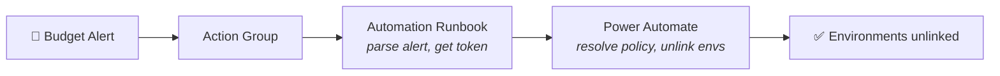

> **원문:** [Herding Clouds: Taming Pay-As-You-Go Billing Policies in Power Platform at Scale](https://microsoft.github.io/mcscatblog/posts/managing-spend-pay-as-you-go/)
> **게시일:** 2026-05-13 · **저자:** Rahul Ranjit Kannathusseril, Zeki Tekin

*(예산의) 고통은 가르침을 다 마치면 떠날 거예요... 조금만 버텨보세요, 이번이 마지막 수업일지도 몰라요....*

---

자, 여러분은 Power Platform과 Copilot Studio에 종량제(Pay-As-You-Go, PAYG)를 도입했어요. 축하해요. 이제 소비 기반 청구의 아름다운 자유를 누리고 있어요. 조직의 모든 메이커가 세 개의 위원회와 공증인의 승인을 거친 라이선스 구매 요청서 없이도 AI 기반 플로우와 에이전트를 만들어낼 수 있는 세상 말이에요.

그리고 청구서가 도착했어요.

꼭 *재앙적인* 청구서는 아닐 수도 있어요. 하지만 자세를 고쳐 앉고, Azure Cost Management 대시보드를 째려보며, 차마 활자화할 수 없는 무언가를 중얼거리게 만들기에는 충분한 금액이죠....

그렇다면 이 포스트가 바로 여러분을 위한 글이에요.

여기서는 매우 실용적인 두 가지를 다뤄요.

1. **이름으로 환경을 청구 정책에 일괄 할당하기** — 47개 환경을 위해 Power Platform 관리 센터에서 클릭을 반복하는 것은 커리어 전략이 아니기 때문이에요.
2. **예산 임계값을 초과하면 환경을 청구 정책에서 자동으로 연결 해제하기** — 누군가 주말 전에 알림 이메일을 확인하기를 바라는 것보다 자동화된 가드레일이 더 믿을 만하기 때문이에요.

시작해 봐요.

---

## 짧은 복습: 청구 정책이란?

청구 정책(billing policy)을 Power Platform 환경의 금융 여권이라고 생각해 보세요. 환경을 Azure 구독에 연결해 주며, 이것이 PAYG 소비량 — Copilot Studio 메시지 팩, AI Builder 크레딧 등 — 이 청구되는 방식이에요. 청구 정책이 연결되지 않은 환경은 기본 제공(seeded) 용량에 의존하거나 프리미엄 기능에 아예 접근할 수 없어요.

환경이 세 개라면 수동으로 관리해도 괜찮아요. 서른 개라면? 삼백 개라면? 그때부터 밤 11시에 PowerShell을 쓰면서 커리어 선택을 후회하게 돼요.

---

## 1부: 청구 정책 일괄 할당하기 (제정신을 유지하면서)

### 문제

청구 정책은 PAYG 소비를 위해 환경을 Azure 구독에 연결해요. 관리 센터 UI는 환경 세 개까지는 아무 문제가 없어요. 하지만 엔터프라이즈 관리자가 — 어쩌면 *서로 다른* 청구 정책에 — 할당해야 할 50개 이상의 환경이 담긴 CSV를 마주하고 있다면, 수동 방식은 관리 업무라기보다 형벌처럼 느껴지기 시작해요.

### 필요한 것

- 설치 및 인증된 **Azure CLI** (`az login`)
- **Power Platform Admin**, **Global Admin**, 또는 **Dynamics 365 Admin** 역할을 가진 사용자 계정
- CSV 파일로 정리된 환경 목록
- 이 멋진 스크립트: [bulk-assign-billing-policy.ps1](https://github.com/microsoft/CopilotStudioSamples/blob/main/infrastructure/manage-paygo/scripts/bulk-assign-billing-policy.ps1)

### CSV 형식

스크립트는 간단한 4열 CSV를 기대해요.

```text
EnvironmentName,EnvironmentID,BillingPolicyName,Status
Sales-Production,,ProductionBillingPolicy,
Marketing-Sandbox,a1b2c3d4-...,DevBillingPolicy,
HR-Production,,ProductionBillingPolicy,
Finance-Sandbox,,Finance-BillingPolicy,
Legal-Production,b2c3d4e5-...,Sales-BillingPolicy,
```

몇 가지 주목할 점이 있어요.

- **EnvironmentID는 선택 사항이에요.**<br>
  비워두면 스크립트가 테넌트를 조회해 표시 이름으로 자동으로 ID를 찾아줘요. GUID가 아닌 표시 이름 목록으로 작업할 때 특히 유용해요.
- **BillingPolicyName은 테넌트에 보이는 이름과 정확히 일치해야 해요.**<br>
  스크립트는 모든 정책 이름을 사전에 검증하며, 존재하지 않는 이름이 있으면 아무것도 건드리기 전에 요란하게 실패해요.
- **Status 열은 비어 있는 상태로 시작해요.**<br>
  실행 후 스크립트가 `Succeeded` 또는 `Failed: <reason>`으로 채워줘요.

### 스크립트 실행하기

**먼저 미리 보기 (혈압을 위해 강력 추천):**

```powershell
.\bulk-assign-billing-policy.ps1 -InputFile ".\environments.csv" -DryRun
```

`-DryRun` 플래그는 단 하나의 API 호출도 없이 무슨 일이 일어날지 정확히 보여줘요.

```
Row 1 [Sales-Production]: Would link abc123... -> ProductionBillingPolicy (def456...)
Row 2 [Marketing-Sandbox]: Would link xyz789... -> DevBillingPolicy (ghi012...)
```

**그다음 실제 실행:**

```powershell
.\bulk-assign-billing-policy.ps1 -InputFile ".\environments.csv"
```

### 스크립트가 실제로 하는 일

스크립트는 여섯 단계로 실행되며, 어디서 실패했는지 아무도 추측하고 싶어 하지 않기 때문에 콘솔에 친절하게 번호와 색상으로 표시돼요.

- **1단계 — Azure CLI 로그인 확인.**<br>
  어떤 계정으로 로그인되어 있는지 알려주므로, 실수로 다른 계정으로 실행하는 일을 방지해요. 다들 한 번쯤 겪어봤죠.
- **2단계 — CSV 로드 및 검증.**<br>
  필수 4개 열이 모두 있는지 확인해요. 열이 빠졌다면 명확한 오류와 함께 빠르게 실패해요. 조용한 실패는 없어요.
- **3단계 — 청구 정책 확인.**<br>
  `https://api.powerplatform.com/licensing/billingPolicies`에서 전체 목록을 *한 번만* 가져와 이름-ID 조회 테이블을 만들어요. CSV에서는 사람이 읽을 수 있는 이름으로 정책을 참조하므로 GUID를 복사-붙여넣기할 필요가 없어요. 참조된 정책이 `Enabled` 상태가 아니면 경고도 해줘요.

  ```
  Found: ProductionBillingPolicy -> b1234567-... (Enabled)
  Found: DevBillingPolicy        -> c2345678-... (Enabled)
  ```
- **4단계 — 환경 ID 확인.**<br>
  `EnvironmentID`가 없는 행에 대해서는 대규모 테넌트를 위한 적절한 페이지네이션과 함께 테넌트의 모든 환경을 가져온 뒤 표시 이름으로 매칭해요. ID가 이미 채워진 행은 최대 20개까지 개별 검증하며, 그 이상은 연결 단계에서 오류가 자연스럽게 잡히도록 둬요. 속도 제한은 실재하니까요.
- **5단계 — 환경을 청구 정책에 연결.**<br>
  유효한 각 행에 대해 Power Platform API에 POST하여 환경을 해당 청구 정책과 연결해요. 각 행에는 `Succeeded` 또는 `Failed: <reason>` 상태가 즉시 기록돼요.
- **6단계 — 결과를 CSV에 다시 기록.**<br>
  이제 CSV에는 확인된 ID와 모든 행의 결과까지 담긴 `Status` 열이 채워져요. 감사 추적이 생긴 거예요. 미래의 여러분이 고마워할 거예요.

최종 요약이 상황을 정확히 알려줘요.

```
════════════════════════════════════════════════════
  SUMMARY
════════════════════════════════════════════════════
  Total rows:   5
  Succeeded:    4
  Failed:       1
  Skipped:      0
```

> **주의:** **Production**과 **Sandbox** 환경만 PAYG 청구 정책에 연결할 수 있어요. Developer, Trial, Default 환경은 대상이 아니에요. 이는 스크립트의 제약이 아니라 플랫폼의 제약이에요. 스크립트가 부적격 환경 유형을 만나면 해당 행을 `Failed: EnvironmentType <type> not supported`로 표시하고 전체 실행을 멈추지 않은 채 넘어가요. CSV를 이에 맞게 계획하세요.

---

## 2부: 예산 도달 시 환경 자동 연결 해제하기

### 문제 (이번에는 실존적 공포를 곁들여)

환경을 청구 정책에 할당하는 것은 쉬운 방향이에요. 더 어려운 질문은 이것이에요. **지출이 예산을 초과하면 어떻게 되나요?** 월 한도를 훌쩍 넘긴 뒤에도 Copilot Studio 대화가 계속 흘러가기를 원하나요?

자동화 없이는, 솔직한 답은 이래요. 누군가 이메일을 받아요. 그 이메일은 월요일 전에 읽힐 수도, 안 읽힐 수도 있어요.

이를 처리하는 효과적인 방법 중 하나는 **자동 연결 해제**를 구성하는 것이에요. 예산 임계값이 초과되면 시스템이 자동으로 환경을 청구 정책에서 제거해 추가 PAYG 소비를 차단해요. 사람의 반응 시간이 필요 없어요.

정확히 이 일을 하는 [바로 사용 가능한 샘플](https://github.com/microsoft/CopilotStudioSamples/tree/main/infrastructure/manage-paygo#unlinkbillingpolicyrunbookps1)을 만들어 두었어요. Azure Budgets를 감지선(tripwire)으로, Azure Automation Account<sup>1</sup>를 다리로 사용하고, Power Automate가 실제 Power Platform 쪽 무거운 작업을 담당해요. 이 섹션의 나머지 부분에서는 샘플의 작동 방식과 설정 방법을 살펴봐요.

---

### 아키텍처

등장인물은 다음과 같아요.

| 구성 요소 | 역할 | 링크 |
|---|---|---|
| **Azure Budget** | 지출을 감시하다가 임계값을 넘으면 알림을 발동해요 | [Azure Budget이란?](https://learn.microsoft.com/en-us/azure/cost-management-billing/costs/tutorial-acm-create-budgets?tabs=psbudget) |
| **Azure Action Group**<sup>2</sup> | 알림을 웹훅 페이로드로 Automation Account에 라우팅해요 | [Azure Action Group이란?](https://learn.microsoft.com/en-us/shows/azure-friday/azure-monitor-action-groups) |
| **Azure Automation Account** | 런북을 호스팅해요. Azure 알림 세계와 Power Platform 세계를 잇는 다리예요 | [Azure Automation Account란?](https://learn.microsoft.com/en-us/azure/automation/automation-security-overview) |
| **Azure Automation Runbook** | 알림 페이로드를 파싱하고, 토큰을 획득하고, Power Automate를 호출해요 | [UnlinkBillingPolicyRunbook.ps1](https://github.com/microsoft/CopilotStudioSamples/blob/main/infrastructure/manage-paygo/scripts/UnlinkBillingPolicyRunbook.ps1) |
| **Power Automate HTTP 플로우** | 런북의 호출을 받아 자식 플로우에 위임해요 | [솔루션 다운로드](https://github.com/microsoft/CopilotStudioSamples/blob/main/infrastructure/manage-paygo/solution/BillingPolicyManagement_1_0_0_3.zip) |
| **Power Automate 자식 플로우** | 이름으로 청구 정책을 찾고 모든 환경의 연결을 해제해요 | [솔루션 다운로드](https://github.com/microsoft/CopilotStudioSamples/blob/main/infrastructure/manage-paygo/solution/BillingPolicyManagement_1_0_0_3.zip) |

각 구성 요소는 정확히 한 가지 일만 해요. 전체 체인은 이벤트 기반이에요. 폴링도, 예약 작업도, 요행을 바라는 일도 없어요.

---

### 1단계: Azure Budget 알림

Azure Cost Management에서 청구 정책과 연결된 구독 및 리소스 그룹을 범위로 하는 Budget을 생성해요. 임계값 — 예를 들어 월 예산의 80% — 을 설정하고, 그 임계값에서 트리거되는 **Action Group**을 구성해요. Action Group은 "임계값을 넘었다"를 "실제로 무언가 일어난다"로 바꿔주는 존재예요. Azure Automation 런북의 웹훅 URL을 가리키는 **웹훅 액션**으로 구성하세요.

예산 알림이 발동되면 Azure는 **Azure Monitor Common Alert Schema** 형식의 웹훅 페이로드를 보내요.

```json
{
  "schemaId": "azureMonitorCommonAlertSchema",
  "data": {
    "essentials": {
      "monitoringService": "CostAlerts",
      "alertId": "/subscriptions/8be5abeb-.../resourceGroups/MyResourceGroup/...",
      "firedDateTime": "2026-04-24T15:44:27Z",
      "description": "Your spend for budget prodbilling is now $4.00 exceeding your specified threshold $1.60."
    },
    "alertContext": {
      "AlertData": {
        "BudgetName": "prodbilling",
        "BudgetThreshold": "$2.00",
        "NotificationThresholdAmount": "$1.60",
        "SpentAmount": "$4.00"
      }
    }
  }
}
```

`alertId` 필드는 경로에 구독 ID와 리소스 그룹을 인코딩하고 있어요. 런북은 약간의 문자열 수술로 이 디테일을 활용해요.

---

### 2단계: Azure Automation 런북

Azure Automation Account는 PowerShell 런북<sup>3</sup>을 호스팅해요. 런북은 네 가지 일을 해요.

**1. 웹훅 페이로드 파싱**

```powershell
$alertId           = $WebhookData.data.essentials.alertId
$subscriptionId    = ($alertId -split '/')[2]
$resourceGroupName = ($alertId -split '/')[4]
```

알림 ID 경로에서 구독 ID와 리소스 그룹을 직접 추출해요. 분할된 문자열에 대한 배열 인덱싱이면 충분하고, 정규식은 필요 없어요.

**2. 관리 ID(Managed Identity)로 인증**

```powershell
Connect-AzAccount -Identity
```

여기가 우아한 부분이에요. Automation Account에는 Power Platform Admin 권한을 가진 **시스템 할당 관리 ID**가 있어요. 비밀번호도 없고, 구성 파일에 담긴 서비스 주체 시크릿도 없고, 보안팀과의 어색한 대화도 없어요. 이 ID는 Azure가 관리하고, 자동으로 교체되며, 필요한 것에만 정확히 범위가 지정돼요.

**3. Power Automate용 Entra 토큰 획득**

```powershell
$aud = "https://service.flow.microsoft.com/"
$EntraToken = Get-AzAccessToken -ResourceUrl $aud
$Token = $EntraToken.Token | ConvertTo-SecureString -AsPlainText
```

**4. Power Automate HTTP 플로우 호출**

```powershell
$payload = [pscustomobject]@{
    resourceGroupName = $resourceGroupName
    subscriptionid    = $subscriptionId
} | ConvertTo-Json -Compress

Invoke-RestMethod -Method Post -Authentication Bearer -Token $Token `
    -Uri $FlowHttpUrl -Body $payload -ContentType 'application/json'
```

HTTP 트리거 뒤에 있는 Power Automate 플로우에 리소스 그룹과 구독 컨텍스트를 POST해요. 그다음은 플로우가 이어받아요.

---

### 3단계: Power Automate 솔루션

여기서부터 정말 흥미로워져요. Power Automate 쪽은 환경에 바로 넣을 수 있는 **가져오기 가능한 솔루션** — `BillingPolicyManagement.zip` — 으로 패키징되어 있어요. 다음이 포함돼요.

- Power Platform Licensing API용 **커스텀 커넥터** (이름으로 청구 정책을 나열하기 위한 것으로, Admin V2 커넥터에는 기본으로 없어요)
- 런북에서 진입점 역할을 하는 **HTTP 엔드포인트 플로우**
- 실제 연결 해제 작업을 수행하는 **자식 플로우**

#### HTTP 엔드포인트 플로우

이 플로우는 런북에서 리소스 그룹 이름과 구독 ID를 받은 뒤 즉시 자식 플로우에 위임해요. 자식 플로우를 별도로 둔 것이 중요해요. 수동으로도 트리거할 수 있어, 테스트나 전체 Azure 알림 경로 없이 정책 연결을 해제하고 싶은 시나리오에 유용해요.

#### UnlinkAllEnvironmentsFromBillingPolicy 플로우

이것이 일꾼이에요. 정확히 하는 일은 다음과 같아요.

1. 커스텀 커넥터로 **모든 청구 정책을 나열**해요 (`GET /licensing/billingPolicies`)
2. 입력으로 전달된 이름과 **일치하는 정책을 찾아요** — GUID가 아닌 친숙한 이름으로
3. Power Platform Admin V2 커넥터로 **해당 정책에 연결된 모든 환경을 가져와요**
4. **각 환경에 대해 `RemoveBillingPolicyEnvironment`를 호출**해 연결을 해제해요
5. 모든 작업을 기록한 **감사 로그 문자열을 만들어요**
6. 전체 감사 로그를 응답 본문으로 담아 **HTTP 200을 반환해요**

결과는 다음과 같은 모습이에요.

```
Found Policy with name: prodbilling (Guid: abc-123...).
Retrieving list of linked environments.
Unlinked Environment: env-abc-123 from prodbilling (GUID: abc-123...)
Unlinked Environment: env-def-456 from prodbilling (GUID: abc-123...)
```

예산 임계값 초과부터 모든 환경 연결 해제까지 — 플로우 실행 기록에 완전한 감사 추적을 남기며 전부 자동화돼요.

---

### 전체 흐름 한눈에 보기



알림부터 연결 해제까지 전체 체인은 1분이 채 걸리지 않아요.

---

### 실제 예산 초과 없이 테스트하기

이걸 테스트하려고 실제 예산을 날려버릴 필요는 없어요. 리포지토리에는 [Webhooktestdata.json](https://github.com/microsoft/CopilotStudioSamples/blob/main/infrastructure/manage-paygo/samples/Webhooktestdata.json) 파일이 포함되어 있어요. 시뮬레이션된 초과 시나리오(예산: $2.00, 임계값: $1.60, 지출: $4.00)가 미리 담긴 현실적인 Azure Monitor Common Alert Schema 페이로드와, 알림을 트리거하는 [스크립트](https://github.com/microsoft/CopilotStudioSamples/blob/main/infrastructure/manage-paygo/scripts/TestRunbook.ps1)예요.

이를 이용해 런북을 수동으로 트리거하세요.

```powershell
az automation runbook start `
    --name UnlinkBillingPolicies `
    --resource-group Azurevnetforpowerplatform `
    --automation-account-name RRANJITBillingPolicy `
    --parameters webhookData='@./Webhooktestdata.json'
```

이렇게 하면 실제 예산을 초과하지 않고도 전체 체인 — 런북이 페이로드를 파싱하고, Power Automate를 호출하고, 플로우가 환경 연결을 해제 — 을 엔드투엔드로 검증할 수 있어요. 재무팀이 고마워할 거예요.

---

## 이 접근법의 장단점

무엇을 감수해야 하는지 솔직하게 이야기해 봐요.

### 장점

- **저장된 자격 증명이 없어요.**<br>
  관리 ID 덕분에 관리하거나 교체하거나 실수로 git에 커밋할 시크릿이 전혀 없어요.
- **이벤트 기반이에요.**<br>
  아무것도 폴링하지 않아요. 예산 알림이 발동되고, 체인이 실행되고, 끝이에요.
- **관심사의 분리.**<br>
  Azure는 예산 감시를 담당하고, Power Platform은 환경 관리를 담당해요.
- **GUID가 아닌 이름 기반.**<br>
  할당 스크립트와 연결 해제 플로우 모두 사람이 읽을 수 있는 정책 이름으로 작동해요.
- **모든 계층에서 감사 가능.**<br>
  CSV는 연결 영수증이고, Power Automate 실행 기록은 연결 해제 영수증이에요.
- **실제 위험 없이 테스트 가능.**<br>
  일괄 할당에는 `-DryRun`, 알림 체인에는 `Webhooktestdata.json`.
- **검증된 인프라.**<br>
  Azure Budgets, Automation Account, Action Group은 SLA<sup>4</sup>와 모니터링이 내장된 성숙한 서비스예요.

### 단점

- **Azure 전문 지식이 필요해요.**<br>
  Automation Account, 관리 ID, Action Group — 어렵지는 않지만 Azure 포털이 편한 사람이 필요해요.
- **관리할 서비스가 여러 개예요.**<br>
  Automation Account, 런북, Action Group, Budget 알림, Power Automate 솔루션이 각자의 수명 주기를 가져요.
- **두 개의 권한 경계.**<br>
  Azure 쪽 인증은 관리 ID가, Power Platform 쪽은 Power Automate 연결 자격 증명이 담당해요. 직관적이지 않을 수 있어요.
- **Azure 비용.**<br>
  Automation Account 작업 실행은 규모가 커지면 공짜가 아니에요. 저빈도 알림이라면 무시할 수준이지만, 어쨌든 또 하나의 비용 항목이에요.
- **일괄 할당에는 PowerShell이 필요해요.**<br>
  1부는 로컬에서 스크립트를 실행해야 해요. 모든 Power Platform 관리자가 터미널에 익숙한 것은 아니에요.
- **셀프서비스가 아니에요.**<br>
  메이커와 환경 소유자가 직접 구성할 수 없어요. 관리자 전용 설정이에요.

> **주의:** **예산 알림은 실시간이 아닙니다.** Azure Cost Management 데이터에는 8~24시간의 지연이 있고, 예산 알림 평가는 연속적이 아닌 주기적이에요. Copilot Studio 메시지나 AI Builder 크레딧을 빠르게 소진하는 폭주 플로우는 심각한 피해가 발생하기 전에 잡히지 않아요. 이는 버그가 아니라 이 접근법의 알려진 한계이며, 그 한계가 어디에 있는지 알아둘 가치가 있어요.

---

## 이제 갖게 된 것

정리해 봐요.

- **PowerShell 스크립트.**<br>
  임의의 수의 환경을 한 번의 실행으로 청구 정책에 일괄 할당해요. GUID 대신 친숙한 이름을 사용하고, 드라이런 미리 보기와 CSV 감사 출력을 제공해요.
- **Azure Budget + Automation Account + Power Automate 파이프라인.**<br>
  예산 임계값을 넘는 순간 자동으로 환경 연결을 해제해요. 사람의 개입도, 월요일 아침의 깜짝 소식도 없어요.

이것은 Power Platform PAYG 청구를 위한 탄탄하고 프로덕션에 바로 쓸 수 있는 거버넌스 설정이에요. 가장 큰 두 가지 운영상 골칫거리 — 환경을 효율적으로 정책에 *올리는* 것과 지출이 과열될 때 자동으로 *내리는* 것 — 를 모두 해결해요.

---

## 다음 예고

저 단점 목록의 거의 모든 항목은 같은 근본 원인에서 나와요. **Power Platform 문제에 Azure 인프라를 끌어들였다는 것.** 다음 포스트에서는 같은 파이프라인을 전적으로 Power Platform 안에서 구축해요. Automation Account도, 런북도, PowerShell도 없어요. 운영 복잡성에 대한 시민 개발자의 복수라고 생각해 주세요. 기대해 주시길.

---

## 어휘 주석

1. **Automation Account:** Azure에서 PowerShell 스크립트(런북)를 저장해 두고, 이벤트나 예약에 따라 실행시키는 자동화 전용 리소스.
2. **Action Group:** Azure Monitor 알림이 발동됐을 때 웹훅 호출, 이메일 발송 등 실제 동작을 실행하도록 묶어둔 설정.
3. **런북(runbook):** 특정 작업을 자동으로 수행하도록 미리 작성해 둔 스크립트. 여기서는 알림을 받아 처리하는 PowerShell 코드를 말해요.
4. **SLA(Service Level Agreement):** 서비스 제공자가 가용성, 응답 속도 등을 얼마나 보장할지 약속한 기준.
