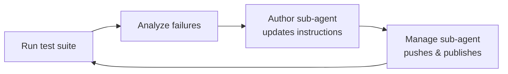

> **원문:** [Closing the Loop: Automated Agent Improvement with Publish and Test](https://microsoft.github.io/mcscatblog/posts/agentic-improvement-loop/)
> **게시일:** 2026-03-29 · **저자:** Adi Leibowitz

[이전 게시물](https://microsoft.github.io/mcscatblog/posts/claude-copilot-skills-copilot-studio-plugin-demo/)에서 YAML로 Copilot Studio 에이전트를 작성할 수 있는 AI 코딩 플러그인을 소개했어요. 이제 [플러그인](https://github.com/microsoft/skills-for-copilot-studio)에 `publish` 명령을 추가했어요. AI 코딩 에이전트가 사람 손을 거치지 않고도 전체 루프를 수행할 수 있게 됐다는 뜻이에요. Copilot Studio 에이전트의 YAML을 편집하고, 변경 사항을 푸시하고, 초안을 게시해 라이브로 전환하고, 게시된 Copilot Studio 에이전트를 대상으로 테스트를 실행하고, 실패를 분석하고, 다시 반복하는 과정 전부요.

이 글에서는 우리가 무엇을 만들었는지와, 실제 Copilot Studio 에이전트를 대상으로 한 루프의 시험 실행을 살펴볼게요. 다음은 실제 동작 모습이에요.

[데모 영상: Copilot Studio의 D&D 5e 규칙 에이전트를 대상으로 실행되는 에이전틱 개선 루프 (MP4)](https://github.com/adilei/videos/releases/download/mcs-loop-v1/mcs-loop.mp4)

## 무엇이 바뀌었나

플러그인의 [manage 서브 에이전트](https://github.com/microsoft/skills-for-copilot-studio/blob/main/agents/copilot-studio-manage.md)는 이미 pull, push, clone, validate를 지원했어요. 여기에 Dataverse의 `PvaPublish` 바운드 액션<sup>1</sup>을 호출하고, `publishedon` 타임스탬프가 바뀔 때까지 폴링해 초안이 라이브 상태가 됐는지 확인하는 **`publish`** 명령을 추가했어요. manage 서브 에이전트의 프롬프트는 올바른 순서(pull, push, publish)를 강제하고, 게시 전에 보류 중인 변경 사항을 확인해요.

이 기능이 갖춰지면서, AI 코딩 에이전트의 서브 에이전트들이 완전한 개선 사이클을 오케스트레이션할 수 있게 됐어요. author 서브 에이전트가 Copilot Studio 에이전트의 지침을 편집하고, manage 서브 에이전트가 푸시하고 게시하며, 테스트 스위트가 게시된 Copilot Studio 에이전트의 응답을 평가해요.

## 시험 실행

D&D 5판(5th Edition) 규칙 어시스턴트를 Copilot Studio 에이전트로 구성했어요(D&D 마다할 이유가 없죠?). 지식 소스로는 문서 형태의 [Systems Reference Document 5.1](https://media.wizards.com/2023/downloads/dnd/SRD_CC_v5.1.pdf)(403페이지, Creative Commons CC-BY-4.0)을 썼어요. 이 Copilot Studio 에이전트는 `useModelKnowledge: false`로 구성해서, 모든 답변이 업로드된 PDF에서 나오도록 했어요.

Copilot Studio 에이전트는 처음부터 기본은 잘 해냈어요. SRD에서 정보를 찾고 대체로 올바른 답을 내놓을 수 있었죠. 하지만 실패는 두 가지가 뒤섞여 있었어요. **스타일**(직접적인 답이 기대되는 상황에서 장황한 단계별 풀이, 요청하지 않은 단서 조항)과 **신뢰성**(간혹 산술 계산을 틀리거나 핵심 규칙의 결과를 빠뜨림)이에요. 스타일 문제가 더 자주 나왔지만, 정확성 결함이 더 치명적이었어요. 한 답변의 잘못된 숫자가 같은 대화의 이후 후속 질문들을 통째로 흔들 수 있었거든요. 놀라운 일은 아니에요. LLM은 계산기가 아니라 패턴 매처고, 다단계 산술은 LLM이 가장 신뢰하기 어려운 영역이에요.

우리는 두 가지를 모두 압박하도록 테스트 케이스를 설계했어요. 각 질문은 특정한 간결한 응답 스타일과 함께, 문서의 서로 멀리 떨어진 여러 섹션에서 온 정보를 요구했어요.

| # | 질문 | 기대 답변 |
|---|----------|-----------------|
| 1 | 5레벨 하플링 바바리안(힘 16, 건강 14), 격노 중, 갑옷 없음. AC는? 격노 피해는? 하루 격노 횟수는? 1이 나오면? | Unarmored Defense AC는 10 + 민첩 수정치 + 건강 수정치(+2), 최소 12. 격노 피해 +2. 긴 휴식당 3회 격노. 하플링 Lucky 특성: 1이 나오면 다시 굴림. |
| 2 | 판금 갑옷을 입은 드워프 파이터. AC는? 이동 속도는? 은신 불리? 힘 요구치는? 중장 갑옷 속도 규칙은? | AC 18, 힘 15 필요, 은신 굴림에 불리. 이동 속도 25피트 -- 드워프 특성으로 중장 갑옷에 의해 속도가 감소하지 않음. |
| 3 | 어려운 지형에서 넘어진 상태, 일어나서 10피트 이동, 기본 속도 30. 이동 비용은? | 일어서기 = 15피트. 어려운 지형에서 10피트 이동 = 20피트. 총 35피트 > 속도 30피트. 불가능, 5피트 부족. |
| 4 | 9레벨 바바리안(힘 18), 격노 중, 그레이트액스로 치명타. 총 피해 주사위는? | 그레이트액스 1d12, 치명타 = 2d12, Brutal Critical +1d12 = 3d12. 여기에 힘(+4) + 격노(+3). 최종: 3d12 + 7. |
| 5 | Reckless Attack 대 Dodge. 유리/불리의 상호작용은? | Reckless = 유리. Dodge = 불리. 둘이 상쇄. d20 하나를 그대로 굴림. |

평가에는 CopilotStudioSamples 리포지토리의 [PytestAgentsSDK 샘플](https://github.com/microsoft/CopilotStudioSamples/tree/main/testing/functional/PytestAgentsSDK)을 썼어요. 이 테스트 하네스는 [M365 Agents SDK](https://github.com/microsoft/Agents-for-python)를 통해 게시된 Copilot Studio 에이전트에 연결하고, 각 테스트 케이스를 대화 턴으로 전송한 뒤, [DeepEval](https://github.com/confident-ai/deepeval)의 GEval 지표를 0.75 임계값으로 써서 응답을 평가해요.

## 루프

Copilot Studio 에이전트의 빈 지침에서 시작해 7회 반복을 실행했어요. AI 코딩 에이전트는 기대 답변이나 SRD 문서를 직접 본 적이 한 번도 없어요. 어떤 질문이 실패했는지, 점수는 얼마였는지, DeepEval이 실패에 대해 어떤 근거를 제시했는지 등 테스트 결과만 봤어요. 오직 그 신호만으로 Copilot Studio 에이전트의 지침을 만들고 다듬었어요.

각 반복은 같은 패턴을 따랐어요.



진행 과정은 다음과 같아요.

| 반복 | 지침 | 통과율 | 비고 |
|-----------|-------------|-----------|-------|
| 0 | 빈 상태 | 2/5 (40%) | 답은 맞지만 구체적인 숫자를 누락 |
| 1 | 완전성 규칙 추가 | 3/5 (60%) | 테스트 1과 4 수정됨(이제 수정치 포함) |
| 2 | 간결성 규칙 추가 | 3/5 (60%) | 테스트 5 수정됐지만 테스트 3은 여전히 장황 |
| 3 | 종족 접두어 + 대안 제시 추가 | 3/5 (60%) | 테스트 1 다시 수정, 테스트 3 개선 중(0.73) |
| 4 | 규칙 7개 추가(총 14개) | 1/5 (20%) | 회귀 발생. 너무 많은 규칙이 주의를 두고 경쟁 |
| 5 | 규칙 7개로 단순화 | 3/5 (60%) | 회복. 규칙 7개가 최적점 |
| 6 | 유리/불리 규칙 추가 | 2/5 (40%) | 멀티턴 연쇄: 하나의 오답이 이후 턴을 오염 |

이 지침을 작성한 사람은 아무도 없어요. AI 코딩 에이전트의 author 서브 에이전트가 5회의 반복에 걸쳐 테스트 실패 피드백(점수와 평가자의 근거)만으로 전부 구성한 거예요. 최종적으로 수렴한 결과는 다음과 같아요.

```
You are a D&D 5e rules expert grounded in the SRD 5.1.
Answer concisely and accurately.

- Name specific mechanics (e.g., "Unarmored Defense",
  "Halfling Lucky trait").
- Always compute final numbers. Include all modifiers
  and state the total.
- When a value is unknown, state the minimum.
- Keep calculations brief. State the result, not the
  step-by-step.
- When something is impossible, say what the character
  CAN do instead.
- When explaining a feature, state both its benefit
  and its cost.
- Do not add caveats or extra scenarios beyond what
  was asked.
```

## 배운 점

**지침만으로는 한계가 있어요.** 루프 메커니즘 자체를 스트레스 테스트하려고, 이 실험을 일부러 시스템 지침에만 국한했어요. 대화 플로우도, 코드 인터프리터도, 추가 지식 소스도 없었죠. 그 결과 40%에서 안정적인 60%까지 도달했어요. 남은 두 테스트는 0.75 임계값 바로 아래인 0.65~0.73 점수를 꾸준히 기록했어요. 실전에서는 더 강력한 도구를 쓰게 될 거예요. 결정론적 산술을 위한 코드 인터프리터 액션, 특정 응답 공식을 강제하는 구조화된 토픽, 지침에 넣은 퓨샷(few-shot) 예시 같은 것들요. 요점은 완벽한 점수를 내는 게 아니라 루프 자체가 동작하는지 확인하는 거였어요.

**지침 규칙은 적고 집중적으로 유지하세요.** 규칙을 7개에서 14개로 늘리자 3/5에서 1/5로 회귀가 났어요. 여느 프롬프트 엔지니어링과 마찬가지로 최적점이 있어요. 규칙이 너무 많으면 주의를 두고 경쟁하며 서로 충돌하기 시작해요. 이 에이전트에서는 간결하고 겹치지 않는 규칙 7개가 안정적인 최대치였어요. Copilot Studio 에이전트 지침에 대한 좋은 일반 원칙이기도 해요. 방대한 규칙집보다 소수의 명확한 지시를 선호하세요.

**테스트 케이스는 별도의 대화로 격리하세요.** 이 테스트 하네스는 질문 5개를 모두 하나의 대화에서 실행해요. 질문 3이 잘못된 계산을 내놓자, 대화 컨텍스트가 그 혼란을 질문 4와 5로 옮겨 둘 다 0.00점을 받았어요. 각 테스트를 자체 세션에서 실행하면 질문별 점수가 더 정확해지고 이런 연쇄 효과를 피할 수 있어요.

**루프는 동작해요.** 메커니즘은 견고해요. author 서브 에이전트가 편집하고, manage 서브 에이전트가 푸시하고 게시하며, 테스트 하네스가 실행하고 채점하고, 결과가 근거와 함께 돌아오고, 다음 반복이 특정 실패를 겨냥해요. 각 단계는 자기 도메인을 아는 전문화된 서브 에이전트가 처리해요.

## 직접 해보기

플러그인은 [github.com/microsoft/skills-for-copilot-studio](https://github.com/microsoft/skills-for-copilot-studio)에 오픈 소스로 공개돼 있고, 테스트 하네스는 [github.com/microsoft/CopilotStudioSamples](https://github.com/microsoft/CopilotStudioSamples/tree/main/testing/functional/PytestAgentsSDK)에 있어요. 여러분의 에이전트에 이 루프를 시도해 보셨다면 결과가 어땠는지 꼭 듣고 싶어요. 에이전트가 개선됐는지, 어디서 막혔는지, 어떤 점이 달라지길 원하는지 말이죠. 플러그인 리포지토리에 [버그 리포트](https://github.com/microsoft/skills-for-copilot-studio/issues/new?template=bug_report.yml)나 [기능 요청](https://github.com/microsoft/skills-for-copilot-studio/issues/new?template=feature_request.yml)을 남겨 주세요.

---

## 어휘 주석

1. **바운드 액션(bound action):** 특정 엔터티(레코드)에 종속되어, 그 레코드를 대상으로만 실행할 수 있는 Dataverse의 특수 작업. 여기서는 에이전트 초안을 게시 상태로 전환하는 `PvaPublish` 작업을 가리켜요.
