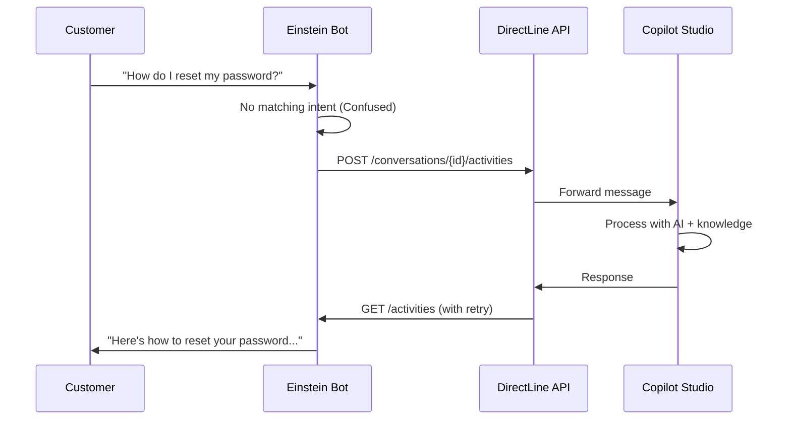

> **원문:** [Salesforce Handoff to Copilot Studio: From Bare Docs to One-Click Deploy](https://microsoft.github.io/mcscatblog/posts/salesforce-copilot-studio-handoff/)
> **게시일:** 2026-03-13 · **저자:** Adi Leibowitz

일부 조직은 고객 서비스 운영 전체를 Salesforce 위에서 돌려요. 케이스, 큐, Omni-Channel 라우팅<sup>1</sup>, 상담원 핸드오프까지 모두 플랫폼 네이티브 기능이에요. 이들은 그것을 걷어내고 싶어 하지 않아요. 하지만 동시에 AI 기반 대화는 AI 생성 응답을 갖춘 Copilot Studio가 처리하길 원해요. 요구 사항은 단순해요. Salesforce는 Salesforce가 가장 잘하는 일을 하게 하고, AI 생성 응답은 Copilot Studio에 위임하자는 거예요.

[이 통합에 대한 문서](https://learn.microsoft.com/en-us/microsoft-copilot-studio/customer-copilot-salesforce-handoff)는 꽤 오래전부터 있었지만, 아키텍처와 전반적인 개념만 다루고 있었어요. 실제로 구축하려면 Salesforce 쪽 코드는 알아서 해결해야 했어요. Apex<sup>2</sup> 샘플도, 배포 자동화도, 자격 증명을 안전하게 다루는 방법에 대한 가이드도 없었어요. 인증, 원격 콜아웃<sup>3</sup>, 권한 집합<sup>4</sup>을 건드리는 플랫폼 통합치고는 스스로 메워야 할 공백이 너무 많았어요.

그래서 우리가 고쳤어요.

## 무엇이 바뀌었나

이제 문서 페이지에는 제로에서 동작하는 통합까지 가는 데 필요한 모든 것이 담겨 있어요.

- **완전한 Apex 클래스.**<br>
  인라인 문서가 달린 `DL_GetConversation`, `DL_PostActivity`, `DL_GetActivity` — Salesforce 조직(org)에 바로 복사해 넣을 수 있어요.
- **Named Credentials 구성.**<br>
  안전한 인증을 위한 설정이에요. 더 이상 Apex 코드에 Direct Line 시크릿을 하드코딩하지 않아도 돼요.
- **단계별 Einstein Bot 다이얼로그 설정.**<br>
  Welcome과 Confused 다이얼로그를 정확히 어떻게 연결하는지 스크린샷으로 보여 줘요.
- **배포 스크립트(Bash 및 PowerShell).**<br>
  모든 것을 한 번에 처리해요.

모든 코드는 [CopilotStudioSamples 리포지토리](https://microsoft.github.io/CopilotStudioSamples/contact-center/servicenow/Salesforce)에 있으므로, 클론하고 검토하고 필요에 맞게 수정할 수 있어요.

## 통합의 동작 방식

이 패턴이 처음이시라면, 간단히 설명하면 이래요. Einstein Bot이 Salesforce Service Cloud의 프런트엔드 역할을 해요. 고객이 채팅을 시작하면 봇이 처리할 수 있는 것은 직접 처리해요. 이해하지 못하는 것을 만나면(Einstein의 "Confused" 토픽 — 그래요, *아인슈타인*이 혼란스러워한다는 아이러니를 우리도 모르지 않아요. 다만 공정하게 말하면, 원조 아인슈타인도 입자의 위치와 운동량을 동시에 관측할 수는 없었죠) [Direct Line API](https://learn.microsoft.com/en-us/azure/bot-service/rest-api/bot-framework-rest-direct-line-3-0-api-reference)를 통해 메시지를 Copilot Studio로 전달해요. Copilot Studio는 지식 소스와 생성형 AI로 질의를 처리해 응답을 돌려보내요. Einstein Bot이 이를 고객에게 표시해요.



Einstein Bot은 대화의 전체 통제권을 유지하며, 상담원 에스컬레이션은 Salesforce 자체의 Omni-Channel 라우팅으로 처리해요. 사람이 필요하면 Einstein이 Copilot Studio가 아니라 Salesforce 큐로 라우팅해요. 이는 의도된 설계 결정이에요. 두 시스템이 핸드오프 라우팅을 두고 경쟁하는 상황은 원하지 않으니까요.

## 배포 경험

제가 가장 신나는 부분이에요. [Salesforce CLI](https://developer.salesforce.com/tools/salesforcecli)가 설치되어 있다면, 배포 스크립트가 문서의 2~5단계를 대신 처리해 줘요.

```bash
# Log in to your Salesforce org
sf org login web

# Clone the sample and run the deployment
git clone https://github.com/microsoft/CopilotStudioSamples.git
cd CopilotStudioSamples/contact-center/servicenow/Salesforce
./scripts/deploy.sh
```

스크립트는 다음을 수행해요.
1. 세 개의 Apex 클래스를 조직에 배포
2. `directline.botframework.com`으로의 콜아웃을 허용하는 Remote Site Setting 생성
3. Custom 인증 프로토콜을 사용하는 External Credential 설정
4. Direct Line 엔드포인트를 가리키는 Named Credential 생성
5. 세 Apex 클래스 모두를 Chatbot 권한 집합에 부여
6. Einstein Bot이 사용할 수 있도록 자격 증명 주체(principal) 접근 권한 추가

스크립트가 완료된 후에는 Direct Line 시크릿을 External Credential에 추가하고(보안상의 이유로 수동 단계예요. 스크립트에 시크릿을 넣고 싶지 않으니까요) Einstein Bot 다이얼로그를 구성하기만 하면 돼요.

> **참고:** Windows 사용자를 위한 PowerShell 버전(`deploy.ps1`)도 있어요. 두 스크립트는 동일한 작업을 수행해요.

## Named Credentials: 시크릿을 하드코딩하지 마세요

짚고 넘어갈 만한 부분이 하나 있어요. 이 통합은 Direct Line 시크릿을 Apex 코드에 직접 넣는 대신 Salesforce [Named Credentials](https://developer.salesforce.com/docs/atlas.en-us.apexcode.meta/apexcode/apex_callouts_named_credentials.htm)를 사용해요. 일단 뭔가 돌아가게 만드는 데 급급할 때는 건너뛰기 쉬운 베스트 프랙티스지만, 중요해요.

Named Credentials가 제공하는 것은 다음과 같아요.

- **중앙화된 시크릿 관리.**<br>
  토큰을 여러 클래스가 아니라 한 곳에서 교체해요.
- **코드에 시크릿이 없어요.**<br>
  Authorization 헤더는 수식(`{!'Bearer ' & $Credential.Directline.Token}`)으로 구성되므로 실제 시크릿이 소스에 절대 나타나지 않아요.
- **권한이 격리돼요.**<br>
  Chatbot 권한 집합만 자격 증명 주체에 접근할 수 있어요.

누군가 API 키를 클래스 파일에 커밋해 놓고 2년 동안 잊어버린 통합을 만들어 본 적이 있다면, 이것이 왜 중요한지 아실 거예요.

## 재시도 문제(그리고 우리의 해결 방법)

Copilot Studio는 메시지를 비동기적으로 처리해요. Einstein Bot이 Direct Line으로 메시지를 게시해도, 다음 API 호출에서 응답이 바로 준비되어 있지 않아요. 폴링이 필요해요.

`DL_GetActivity` 클래스는 설정 가능한 지연 및 재시도 로직으로 이를 처리해요.

```java
// Default: wait 5 seconds before first attempt, retry up to 5 times
Integer initialDelay = (input.delaySeconds != null && input.delaySeconds > 0)
    ? input.delaySeconds : 5;
Integer retries = (input.maxRetries != null && input.maxRetries > 0)
    ? input.maxRetries : 5;
```

첫 번째 폴링 전에 초기 지연(기본 5초)만큼 기다린 다음, 봇 메시지를 찾거나 재시도 한도에 도달할 때까지 매초 재시도해요. 이 클래스는 사용자 메시지도 걸러내고(봇의 응답만 필요하니까요), Copilot Studio가 에스컬레이션을 요청할 경우를 대비해 `handoff.initiate` 이벤트도 감지해요.

지연 시간과 재시도 횟수는 코드 변경 없이 Einstein Bot 다이얼로그에서 조정할 수 있어요.

## 다음에는 어디에 투자해야 할까요?

여기서부터는 여러분의 의견이 필요해요. 우리의 여력은 한정되어 있고, Salesforce 통합 영역에는 몇 가지 가능한 방향이 있어요. 현재 검토 중인 선택지는 다음과 같아요.

### 옵션 1: 인증된 에이전트

Copilot Studio 에이전트가 사용자 인증을 요구하는 경우에도 이 통합이 동작하게 만들 수 있을까요? 예를 들어 SharePoint 지식에 접근하거나 위임된 권한이 필요한 커넥터를 호출하는 경우 말이에요. 솔직히 전망이 밝아 보이지는 않아요. Einstein Bot ↔ Direct Line ↔ Copilot Studio 체인에서는 사용자 신원을 흘려보내기가 어렵고, 이 맥락에서 Salesforce와 Entra ID 사이에 명쾌한 토큰 교환 패턴이 없어요. 하지만 충분히 많은 분들이 필요로 한다면 더 깊이 파 볼게요.

### 옵션 2: 직접 임베드(Salesforce 내 WebChat 위젯)

Einstein Bot을 거치는 대신, [ServiceNow 위젯 접근 방식](https://microsoft.github.io/mcscatblog/posts/servicenow-copilot-studio-widget/)과 유사하게 Copilot Studio 에이전트를 Salesforce 채팅 캔버스에 직접 임베드하는 방법이에요. 이렇게 하면 스트리밍, 리치 메시지 렌더링, 미들웨어 기능을 사용할 수 있어요. 트레이드오프는? Einstein Bot의 네이티브 Omni-Channel 핸드오프 라우팅을 잃게 돼요. 임베드 모델에서 핸드오프가 동작하려면 위젯, Copilot Studio의 핸드오프 이벤트, Salesforce의 케이스/큐 시스템 사이에 상당히 복잡한 백엔드 통합이 필요해요. 불가능하진 않지만 간단하지도 않아요.

### 옵션 3: Einstein Bots 대신 Agentforce

Salesforce는 차세대 에이전트 플랫폼으로 [Agentforce](https://www.salesforce.com/agentforce/)에 투자해 왔어요. Einstein Bots 대신 Agentforce 위에 통합을 구축해야 할까요? API와 기능이 달라서 아키텍처를 다시 고민해야 하지만, 이미 Agentforce를 도입 중인 조직에는 더 잘 맞을 수도 있어요.

## 핵심 요약

- **Salesforce ↔ Copilot Studio 통합 문서**가 완전한 Apex 코드, Named Credentials, 배포 스크립트를 갖추도록 대대적으로 개편되었어요
- **배포 스크립트**가 Apex 클래스부터 권한 부여까지 모든 것을 명령 한 번으로 처리해요
- Einstein Bot이 **프런트엔드** 역할을 하며, 인식하지 못한 질의를 Direct Line을 통해 Copilot Studio로 전달해요
- **Named Credentials**로 시크릿을 코드에서 분리하고 교체를 수월하게 해요
- 이 통합은 현재 요청/응답 모델의 **비인증 에이전트만** 지원해요

## 어떻게 생각하시나요?

여러분에게 가장 중요한 것이 무엇인지 듣고 싶어요. 지금 Einstein Bot 통합을 사용하고 계신가요? 도입할 계획이 있으신가요? 인증된 에이전트, 직접 WebChat 임베드, Agentforce 지원 중 어느 방향이 가장 가치 있을까요?

Copilot Studio가 여러분의 Salesforce 스택에 어떻게 들어맞을지 평가 중이라면(혹은 애초에 어떤 통합 API를 써야 할지 고민 중이라면), [API 결정 가이드](https://microsoft.github.io/mcscatblog/posts/copilot-studio-api-decision-guide/)가 선택지를 정리하는 데 도움이 될 거예요.

아래에 댓글을 남기시거나 [샘플 리포지토리에 이슈를 열어 주세요](https://github.com/microsoft/CopilotStudioSamples/issues). 여러분의 피드백이 우리가 다음에 어디에 힘을 쏟을지를 직접적으로 결정해요.

---

## 어휘 주석

1. **Omni-Channel 라우팅:** Salesforce Service Cloud에서 여러 채널(채팅, 이메일, 전화 등)로 들어오는 문의를 상담원의 가용 상태와 역량에 맞춰 자동으로 배분해 주는 기능.
2. **Apex:** Salesforce 플랫폼 전용 프로그래밍 언어. Salesforce 데이터와 로직을 다루는 서버 측 코드를 이 언어로 작성해요.
3. **콜아웃(callout):** Apex 코드가 Salesforce 밖의 외부 서비스로 보내는 HTTP 요청.
4. **권한 집합(permission set):** 특정 기능이나 데이터에 접근할 권한들을 묶어, 필요한 사용자나 애플리케이션에만 부여하는 Salesforce의 권한 관리 단위.
