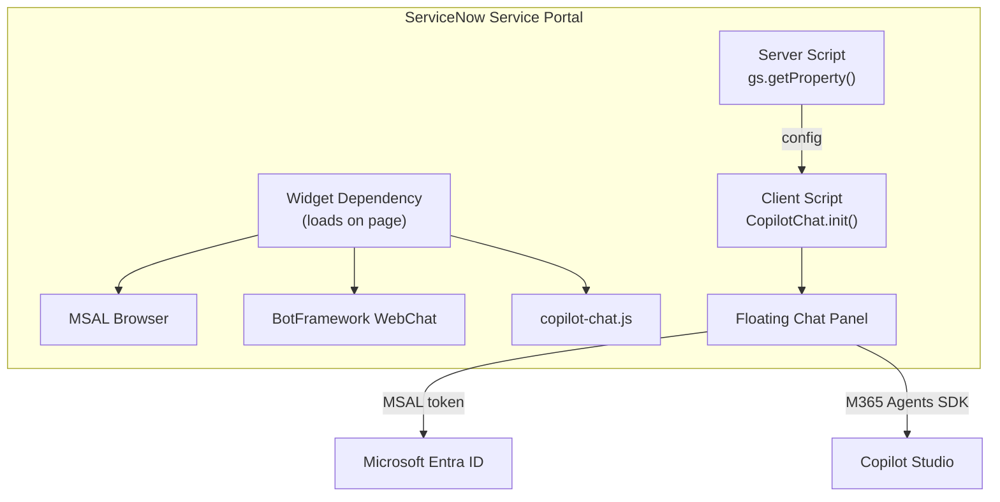

> **원문:** [Embedding Copilot Studio Directly in ServiceNow (And Why Auth Was the Easy Part)](https://microsoft.github.io/mcscatblog/posts/servicenow-copilot-studio-widget/)
> **게시일:** 2026-02-24 · **저자:** Adi Leibowitz

또 하나의 현장 리포트예요! [대화 기록에 관한 지난 글](https://microsoft.github.io/mcscatblog/posts/webchat-conversation-history-m365-sdk/)이 마음에 드셨다면, 이번 글도 비슷한 패턴을 따라요. 고객이 벽에 부딪히고, 우리가 함께 해결하고, 배운 것을 공유하는 것이죠.

이번에는 고객이 Copilot Studio로 IT 지원 에이전트를 만들었어요. ServiceNow 지식 베이스에 그라운딩되어 있고, Power Platform 커넥터를 통해 티켓 생성이나 인시던트 상태 확인 같은 자동화 작업도 수행할 수 있어요. Teams와 M365 Copilot에서는 훌륭하게 동작했어요. 하지만 이들의 헬프 데스크 포털은 ServiceNow이고, 무언가 고장 났을 때 직원들이 실제로 찾아가는 곳도 바로 거기예요. 고객은 같은 에이전트를 그곳에서도 쓸 수 있기를 원했어요.

문제는? 이들의 ServiceNow 인스턴스는 SSO에 **PingFederate**를 사용한다는 점이었어요. Microsoft Entra ID로 인증하는 Copilot Studio 에이전트를 임베드하는 것을 검토했을 때, 첫 반응은 이랬어요. "PingFederate와 Entra 사이에 페더레이션을 구성해야겠네요. 몇 달이 걸리고 세 개의 팀이 관여해야 할 거예요."

스포일러: 그렇지 않았어요. 하지만 먼저 우리가 권장한 접근 방식과 그 이유부터 시작할게요.

## ServiceNow Virtual Agent 통합을 쓰지 않는 이유는?

타당한 질문이에요. ServiceNow에는 **Virtual Agent**라는 자체 대화형 AI 플랫폼이 있어요. 토픽 설계, 엔터티 추출, 대화 흐름이 포털에 내장된 완전한 NLU 엔진이에요. Virtual Agent가 프런트엔드 역할을 하고 Copilot Studio를 백엔드 스킬로 호출하는 [공식 통합 패턴](https://learn.microsoft.com/en-us/microsoft-copilot-studio/customer-copilot-servicenow)도 있어요. 이미 Virtual Agent를 배포해 두었고 여기에 생성형 AI를 보강하고 싶다면 이는 견고한 접근 방식이에요.

하지만 그 말은 모든 메시지가 Copilot Studio에 도달하기 전에 ServiceNow의 NLU를 먼저 거친다는 뜻이에요. 에이전트가 이미 의도 인식, 지식 검색, 오케스트레이션을 처리하고 있다면, 그것은 별다른 가치를 더하지 않는 AI 계층 하나가 추가되는 것이고, 지연 시간과 유지 관리할 시스템만 늘어나요. 이 고객의 Copilot Studio 에이전트는 이미 완전한 역량을 갖추고 있었어요. 중개자가 필요한 게 아니라, 메시지가 에이전트에게 곧바로 전달되는 것이 필요했어요.

## iframe은 왜 안 될까요?

Azure Static Web Apps에 WebChat 페이지를 호스팅하고(정적 웹앱을 지원하는 다른 클라우드 제공업체가 또 있던가요? 잘 모르겠네요 😉) 이를 ServiceNow에 iframe으로 넣을 수도 있어요. 스트리밍, 커스터마이징, 미들웨어까지 다 얻을 수 있죠. 하지만 그러면 그저... 프레임 안에 들어앉아 있을 뿐인 호스팅 페이지를 위해 추가 인프라를 유지하게 돼요.

더 중요한 것은 iframe이 격리되어 있다는 점이에요. 자체 오리진, 자체 브라우징 컨텍스트에서 실행되므로 ServiceNow 페이지의 어떤 것에도 접근할 수 없어요.

네이티브 Service Portal 위젯은 접근할 수 있어요. **SharePoint의 SPFx**<sup>1</sup>처럼 생각하면 돼요. 플랫폼 *옆에* 무언가를 임베드하는 것이 아니라, 플랫폼 *안에서* 확장하는 것이에요. 위젯은 ServiceNow의 AngularJS 프레임워크 안에서 실행되고, 서버 스크립트는 **GlideSystem API**에 완전한 접근 권한을 가져요. 우리 위젯도 이미 이를 사용해요. 서버 스크립트가 `gs.getProperty()`를 호출해 시스템 속성에서 에이전트 구성을 읽고 `data` 객체를 통해 클라이언트에 전달해요. 같은 서버 스크립트에서 `gs.getUserName()`이나 `gs.hasRole()`을 호출해 사용자 신원과 역할 정보를 채팅에 전달하는 것도 그만큼 쉽게 할 수 있어요.

우리도 아직 이 부분을 완전히 탐구하지는 못했지만, 흥미로운 가능성이 열려요. 사용자가 인시던트 페이지를 보다가 채팅 위젯을 연다고 상상해 보세요. 서버 스크립트가 현재 페이지 컨텍스트를 읽어 인시던트 번호를 대화 시작 문구로 에이전트에 전달할 수 있어요. *"INC0012345를 보고 계시는군요. 이 건에 대해 어떻게 도와드릴까요?"* 복사-붙여넣기도 없고, "인시던트 번호를 알려 주세요"도 없어요. 에이전트는 이미 알고 있어요.

iframe과 URL 매개변수로 비슷한 것을 억지로 만들 수 있을까요? 물론이에요. 하지만 그것은 플랫폼과 협력하는 것이 아니라 플랫폼과 싸우는 일이 될 거예요.

## 아키텍처

그래서 우리는 네이티브 위젯을 만들었어요. 이렇게 생겼어요.

_ServiceNow Service Portal에서 플로팅 채팅 위젯으로 실행 중인 IT 지원 에이전트_

이 위젯은 자체 완결형 IIFE<sup>2</sup> 번들(~147 KB)로, ServiceNow의 위젯 종속성(Widget Dependencies) 시스템을 통해 MSAL, WebChat과 함께 로드돼요. iframe도, 외부 서비스도, ServiceNow Virtual Agent도 없어요.



1. **위젯 종속성**이 페이지 로드 시 세 개의 스크립트를 로드해요: MSAL, WebChat, 번들
2. **서버 스크립트**가 `gs.getProperty()`를 통해 ServiceNow 시스템 속성에서 에이전트 구성을 읽어, 구성을 코드에서 분리해요
3. **클라이언트 스크립트**가 `CopilotChat.init()`을 호출하면 오른쪽 하단에 플로팅 버블이 렌더링돼요
4. 처음 클릭하면 번들이 MSAL 토큰을 획득하고, M365 Agents SDK를 통해 Copilot Studio와 스트리밍 연결을 생성하고, 슬라이드업 패널에 WebChat을 렌더링해요

> **참고:** **왜 IIFE 번들일까요?** ServiceNow의 Service Portal은 위젯 종속성 시스템을 통해 일반 `<script>` 태그로 위젯 스크립트를 로드해요. 이 컨텍스트에서는 ES 모듈이 지원되지 않아요. 번들은 전역 범위에서 실행되며 API를 `window`에 연결해야 해요. 이는 WebChat(`window.WebChat`)과 MSAL(`window.msal`)이 사용하는 것과 같은 패턴이에요.

## 인증 이야기 (또는: PingFederate가 문제되지 않았던 이유)

서두에서 언급한 고객의 우려를 기억하시나요? 이들은 몇 달간의 페더레이션 작업을 예상했어요. 그것이 필요 없었던 이유는 다음과 같아요.

위젯은 ServiceNow의 인증 컨텍스트를 "공유"하지 않아요. 그럴 필요가 없어요. 채팅 위젯은 브라우저에서 **자체 MSAL 인스턴스**를 실행하며, ServiceNow가 사용자를 어떻게 인증하든 그것과 완전히 독립적이에요. 페이지에서 실행되는 또 하나의 SPA<sup>3</sup>일 뿐이에요.

인증 흐름은 다음과 같아요.

1. 사용자가 PingFederate(또는 SAML, OIDC, 로컬 인증, 무엇이든 상관없음)를 통해 ServiceNow에 로그인해요
2. 사용자가 채팅 버블을 클릭해요
3. 위젯의 MSAL 인스턴스가 브라우저에 캐시된 Entra ID 토큰을 확인해요
4. 토큰이 있으면(사용자가 이미 어떤 Microsoft 서비스에든 로그인한 상태) 인증은 **조용히** 이루어져요. 팝업도, 리디렉션도, 마찰도 없어요.
5. 없으면 Entra ID 로그인을 위한 **일회성 팝업**이 나타나요
6. 이후 모든 방문에서는 캐시된 토큰이 사용돼요. (토큰이 만료되기 전까지) 팝업은 다시 나타나지 않아요

핵심 통찰은 MSAL이 브라우저의 **기존 Entra ID 세션**을 활용할 수 있다는 점이에요. 사용자가 그 브라우저에서 *어떤* Microsoft 서비스든(Outlook, Teams, Azure Portal 등) 로그인한 적이 있다면, Entra 세션이 이미 존재해요. MSAL이 이를 감지하고 팝업 없이 조용히 토큰을 획득해요. 실무에서는 대부분의 엔터프라이즈 사용자 브라우저에 이미 Entra 세션이 있으므로, **대부분의 사용자는 팝업을 아예 보지 못해요.**

즉, 위젯은 PingFederate, Okta, SAML, 로컬 계정 등 **어떤** ServiceNow 인증 구성과도 함께 동작해요. 두 인증 시스템은 완전히 분리되어 있어요.

> **팁:** Entra ID 앱 등록은 표준 SPA(단일 페이지 애플리케이션) 구성이에요. ServiceNow 포털 오리진을 리디렉션 URI로 추가하면 끝이에요. 페더레이션도, 토큰 교환도, 미들웨어도 필요 없어요.

## 자동화된 배포

수십 개의 ServiceNow 레코드를 수동으로 만들고 싶은 사람은 없어요. 그래서 배포 스크립트를 만들었어요.

```bash
cd ui/embed/servicenow-widget
npm install
npm run build

cp scripts/deploy-config.sample.json scripts/deploy-config.json
# Fill in your instance URL, credentials, and agent settings

npm run deploy
```

이 스크립트는 ServiceNow Table API를 사용해 모든 것을 생성해요. 시스템 속성, (모든 소스 파일이 포함된) 위젯 레코드, 번들 첨부 파일, JS Includes, 위젯 종속성, M2M 관계 레코드를 만들고, 선택적으로 포털 홈페이지에 위젯을 배치해요.

스크립트는 **멱등적(idempotent)**이에요. 처음 실행하면 설정이 이루어지고, 코드 변경 후 다시 실행하면 번들과 위젯 소스 파일이 업데이트돼요. 중복도, 오래된 참조도 없어요.

> **참고:** 이 스크립트는 깨끗한 ServiceNow 개발자 인스턴스에서 엔드투엔드로 검증했지만, ServiceNow 인스턴스는 구성에 따라 크게 다를 수 있어요. 여러분의 인스턴스에서 문제가 발생하면 [이슈를 열어](https://github.com/microsoft/CopilotStudioSamples/issues) 스크립트를 개선할 수 있도록 도와주세요.

## 샘플

전체 샘플은 [CopilotStudioSamples](https://microsoft.github.io/CopilotStudioSamples/ui/embed/servicenow-widget) 저장소에서 확인할 수 있어요. 다음이 포함되어 있어요.

- 위젯의 **TypeScript 소스** (인증, 버블 UI, WebChat 초기화)
- 위젯 편집기에 바로 복사할 수 있는 **ServiceNow 위젯 파일** (HTML, 클라이언트 JS, 서버 JS, SCSS)
- **자동화된 배포 스크립트** (Node.js, 외부 종속성 제로)
- 스크린샷과 함께하는 단계별 배포용 **수동 설정 가이드**
- ServiceNow 인스턴스 없이도 반복 작업할 수 있는 **로컬 개발 테스트 페이지**

## 핵심 정리

- 포털에서 Copilot Studio를 쓰기 위해 **ServiceNow의 Virtual Agent를 경유할 필요가 없어요.** WebChat을 사용한 직접 임베드는 스트리밍, 완전한 UI 제어, 미들웨어 기능을 제공해요.
- 위젯의 인증은 **ServiceNow의 인증과 완전히 독립적**이에요. PingFederate, Okta, SAML, 로컬 인증 무엇이든 상관없어요. MSAL이 자체 토큰 수명 주기를 관리해요.
- 대부분의 엔터프라이즈 사용자는 이미 브라우저에 Entra ID 세션이 있으므로, 인증 경험은 대개 팝업이 전혀 없는 **무음(silent)** 방식이에요.
- 네이티브 위젯은 **SPFx가 SharePoint를 확장하듯** 플랫폼을 확장해요. iframe은 ServiceNow의 페이지 컨텍스트, 사용자 신원, 위젯 간 통신에 접근할 수 없어요.
- **배포 스크립트**는 시스템 속성부터 위젯 배치까지 모든 것을 ServiceNow REST API로 처리해요. 수동 레코드 생성이 필요 없어요.

## 여러분의 피드백을 기다려요

이것은 새로운 샘플이고, 여러분의 의견을 듣고 싶어요. ServiceNow나 다른 서드파티 포털에 Copilot Studio를 임베드하고 계신가요? 어떤 어려움에 부딪히셨나요? 배포 스크립트가 여러분의 인스턴스에서 잘 동작하나요, 아니면 우리가 놓친 엣지 케이스가 있나요?

아래에 댓글을 남기시거나 [저장소에 이슈를 열어 주세요](https://github.com/microsoft/CopilotStudioSamples/issues).

## 더 읽어보기

- [영상: Copilot Studio 에이전트를 위한 WebChat 미들웨어 마스터하기](https://microsoft.github.io/mcscatblog/posts/webchat-middlewares/)
- [M365 Agents SDK의 대화 기록 공백 (그리고 우리가 그것을 채운 방법)](https://microsoft.github.io/mcscatblog/posts/webchat-conversation-history-m365-sdk/)
- [수동 인증은 아마 필요 없습니다 (그리고 그 사실조차 몰랐을 겁니다)](https://microsoft.github.io/mcscatblog/posts/you-dont-need-manual-auth/)

---

## 어휘 주석

1. **SPFx(SharePoint Framework):** SharePoint 페이지 안에서 직접 실행되는 확장 프로그램을 만드는 개발 프레임워크. 별도 페이지를 만드는 게 아니라 기존 플랫폼 안에서 기능을 덧붙이는 방식이에요.
2. **IIFE(즉시 실행 함수 표현식, Immediately Invoked Function Expression):** 정의되자마자 바로 실행되는 자바스크립트 함수. 전역 변수를 오염시키지 않고 코드를 하나의 스크립트 파일로 안전하게 번들링할 때 써요.
3. **SPA(Single Page Application, 단일 페이지 애플리케이션):** 페이지를 새로 불러오지 않고 브라우저 안에서 화면 전환과 로직을 모두 처리하는 웹 애플리케이션 방식.
