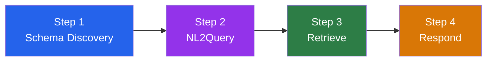
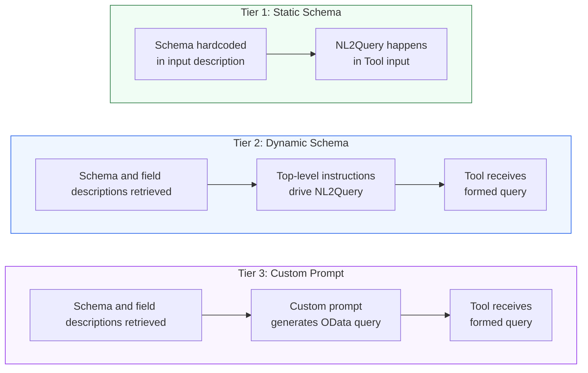
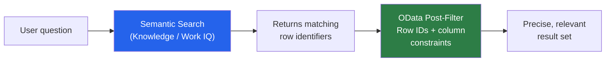

> **원문:** [Get Answers Over SharePoint Lists and Other Structured Data — Turning Natural Language into Dynamic Queries in Copilot Studio](https://microsoft.github.io/mcscatblog/posts/tool-inputs-sharepoint-list/)
> **게시일:** 2026-04-30 · **저자:** Karima Kanji-Tajdin

Copilot Studio 에이전트에게 SharePoint 목록의 **정형 데이터**에 대한 질문에 답하게 해 본 적이 있다면, 그 좌절감을 아실 거예요. "Chicago에서 출발한 대기 중인 배송을 모두 보여줘." "3일 넘게 운송 중인 주문은 뭐야?" "Dubai로 가는 배송 요약을 보여줘." 단순한 질문인데도 답변은... 실망스러워요.

흔한 조언은요? "SharePoint를 지식(Knowledge) 소스로 추가하면 돼요!" 하지만 문제는 이거예요. Copilot Studio의 지식 소스는 **비정형 콘텐츠** — 문서, 페이지, 파일 — 에 최적화되어 있어요. 정책 조회, FAQ 찾기, 매뉴얼 검색에는 훌륭하지만, 정형 목록에 대한 정밀한 행·열 필터링에는 최선의 방법이 아니에요. 억지로 시도해도 금방 벽에 부딪혀요. 잘린 결과, 필터링 불가, 그리고 3천 개 행 중 3개만 보고 자신 있게 요약하는 에이전트 말이죠.

이 글은 다른 접근법을 보여줘요. SharePoint 커넥터의 Get Items 작업에서 `$filter` 매개변수를 **동적 입력(dynamic input)**으로 설정하고, 입력 설명에 열을 기술하면, 오케스트레이터가 일반 영어에서 OData 필터 쿼리를 생성할 수 있어요. Power Automate 흐름도, 커스텀 코드도, API 래퍼도 필요 없어요. 도구 하나, 에이전트 하나면 돼요.

단순하게 시작할게요 — 배송 목록에 대한 자연어 쿼리를 처리하는 도구 하나로요. 그다음 프로덕션 패턴으로 확장해요. 동적 스키마 발견, 시맨틱 검색, 정형·비정형 검색 결합, 응답 형태 만들기까지요.

> **참고:** 이 글은 SharePoint를 예시로 쓰지만, 이 패턴은 쿼리로 변환할 수 있는 사용자 요청이라면 어떤 커넥터에서도 동작해요 — Dataverse List Rows, SQL 쿼리, 서비스 관리 API 등. SharePoint는 수단이고, 동적 도구 입력이 핵심이에요.

## Work IQ는 어떤가요?

**[Work IQ SharePoint](https://learn.microsoft.com/en-us/microsoft-agent-365/mcp-server-reference/sharepoint?context=/microsoft-copilot-studio/context)** 커넥터는 Copilot Studio에서 도구로 사용할 수 있고 비슷한 사용 사례를 다뤄요. 에이전트가 목록 데이터에 대해 대화할 수 있게 해주고, 검색 파이프라인의 더 많은 부분을 추상화해줘요. 사용 사례가 단순하다면 — 인증된 사용자가 잘 구조화된 목록을 쿼리하는 경우 — 거기서 시작하세요. 스키마 발견, 쿼리 생성, 검색, 응답 형식화를 내부적으로 처리해줘요. 다만 Work IQ는 단순한 검색 도구 모음이 아니라 완전한 문서 관리 도구 모음이에요.

검색에 대한 더 많은 제어가 필요할 때 — 도구를 특정 쿼리 패턴으로 범위 제한하기, 사용 사례별로 도구 전문화하기, 어떤 열과 몇 개의 행이 반환될지 결정하기 — 는 커넥터를 직접 구성해요. 이건 [Dataverse 검색 패턴](https://microsoft.github.io/mcscatblog/posts/dataverse-retrieval-patterns-copilot-studio/)과 같은 트레이드오프예요. 기본 제공 도구는 빠르게 시작하게 해주고, 직접 구성하면 정밀함을 얻어요.

어떻게 하는지 살펴볼게요.

## 시나리오: 배송 추적기

배송을 추적하는 SharePoint 목록이 있다고 해봐요.

_배송 추적 데이터가 있는 SharePoint 목록_

이 목록에는 `Title`(배송 ID), `Tracking`(추적 번호), `Origin`, `Destination`, `Status`("Pending" 또는 "In Transit"), `Daysintransit` 같은 열이 있어요. 수십에서 수백 개의 행이 있는 전형적인 엔터프라이즈 목록이에요.

사용자가 이런 질문을 할 수 있길 원해요.

- "Chicago에서 출발한 대기 중인 배송을 모두 보여줘"
- "Dubai로 가는 배송 중 운송 기간이 3일 넘는 것은?"
- "Miami에서 출발하거나 Tokyo로 가는 배송을 찾아줘"

## 1단계: SharePoint 커넥터를 도구로 추가

Copilot Studio에서 [새 도구를 추가](https://learn.microsoft.com/en-us/microsoft-copilot-studio/advanced-connectors-as-tools)하고 **SharePoint** 커넥터의 [Get Items](https://learn.microsoft.com/en-us/connectors/sharepointonline/#get-items) 작업을 선택하세요.

_SharePoint Get Items 작업을 도구로 추가_

오케스트레이터에게 이 도구의 용도를 알려주는 이름과 설명을 붙여주세요.

- **도구 이름:** `Get Shipping Info`
- **도구 설명:** `Answer questions about order and shipping information`

> **참고:** 도구 이름과 설명은 최종 사용자를 위한 게 아니라 **오케스트레이터**를 위한 거예요. LLM이 *언제* 도구를 호출할지, *어떻게* 입력을 채울지 결정하는 데 도움을 줘요.

## 2단계: 고정 입력 구성

일부 입력은 도구가 호출될 때마다 동일하므로 고정해야 해요.

| 입력 | 유형 | 값 |
|-------|------|-------|
| **Site Address** (`dataset`) | 고정 | SharePoint 사이트 URL |
| **List Name** (`table`) | 고정 | 목록의 GUID |
| **Top Count** (`$top`) | 고정 | `50` (또는 원하는 최댓값) |
| **View** (`view`) | 고정 | 목록 뷰 GUID |

이렇게 하면 도구가 항상 올바른 목록을 쿼리하고 반환 항목 수에 상한이 생겨요.

> **주의:** **데이터 볼륨에 대한 한마디.** 오케스트레이터는 여러분이 넘겨준 행들에 대해 추론해야 하고, 컨텍스트 윈도우는 한계가 있다는 걸 기억하세요. 필터가 너무 넓어서 수백 개의 행을 끌어오면, LLM이 마법처럼 전부 분석하지 못해요 — 잘라내거나, 환각을 일으키거나, 데이터 대부분을 대충 넘어갈 가능성이 높아요. 바로 그래서 이 패턴이 중요해요. **오케스트레이터가 보기 전에 관련 있는 부분 집합으로 필터링해야 해요.** `$top`을 합리적으로 유지하고, 모델이 좁은 쿼리를 만들도록 유도하는 설명적인 필터 입력을 작성하고, 사용자 요청이 너무 모호하면 명확화 질문을 하도록 에이전트를 설계하세요. 5,000개 행을 채팅 응답에 쏟아붓는 건 누구에게도 좋은 결말이 아니에요.

## 3단계: 동적 입력 구성 — 마법이 일어나는 곳

여기부터 흥미로워져요. `$filter` 매개변수는 [동적 입력](https://learn.microsoft.com/en-us/microsoft-copilot-studio/advanced-connectors-as-tools#add-tool-inputs)으로 설정해야 해요. 즉, 오케스트레이터가 사용자 질문을 기반으로 런타임에 값을 생성하는 거예요.

이걸 **NL2Query**<sup>1</sup> — 자연어를 구조화된 쿼리로 바꾸는 것 — 라고 생각하세요. 오케스트레이터는 입력 설명을 읽고, 사용자가 무엇을 묻는지 이해하고, 유효한 [OData 필터](https://learn.microsoft.com/en-us/sharepoint/dev/sp-add-ins/use-odata-query-operations-in-sharepoint-rest-requests#odata-query-operators-supported-in-the-sharepoint-rest-service)를 만들어내요. 이게 이 패턴의 심장이고, 입력 설명이 풍부할수록 생성되는 쿼리가 좋아져요.

> **팁:** 프로 팁: M365 Copilot을 사용해 이 설명을 생성할 수 있어요! SharePoint 목록의 스크린샷을 찍어 Copilot에게 열을 설명하고 예시 OData 쿼리를 생성해 달라고 요청하세요.

_목록 스크린샷으로 M365 Copilot을 사용해 OData 필터 설명 생성_

## 4단계: 최종 구성 검토

Copilot Studio UI에서 완성된 도구의 모습이에요.

_고정된 사이트/목록 입력과 동적 OData 필터가 있는 완성된 도구 구성_

그리고 도구 정의에 해당하는 YAML이에요.

```yaml
kind: TaskDialog
inputs:
  - kind: ManualTaskInput
    propertyName: dataset
    value: https://contoso.sharepoint.com/sites/retailers
  - kind: ManualTaskInput
    propertyName: table
    value: 05b4156a-317e-4ff9-83f0-7e0663531004
  - kind: AutomaticTaskInput
    propertyName: "'$filter'"
    name: User request about order and shipping
    description: "A generated ODATA filter query for sharepoint getitems 
      to restrict the entries returned (e.g. stringColumn eq 'string' 
      or numberColumn lt 123). Each row represents one shipment. 
      Columns (internal names without spaces): Title (text, e.g., 
      'SHIP-1'), Tracking (text, e.g., '5FP4PIFGSV'), Origin (text, 
      e.g., 'Chicago'), Destination (text, e.g., 'Dubai'), Status 
      (text, e.g., 'Pending' or 'In Transit'), Daysintransit (number, 
      e.g., 2). Build OData filters using exact column names, single 
      quotes for strings, and lowercase logical operators (and, or). 
      Example queries: Status eq 'Pending', Origin eq 'Chicago' and 
      Status eq 'Pending', Daysintransit gt 3, Destination eq 'London' 
      and Daysintransit ge 3, Status eq 'In Transit' and 
      Daysintransit lt 2, Origin eq 'Miami' or Destination eq 'Tokyo'."
  - kind: ManualTaskInput
    propertyName: "'$top'"
    value: 50
  - kind: ManualTaskInput
    propertyName: view
    value: 800eb42c-c1dc-474f-8baf-3e023ccfd40c
modelDisplayName: Get Shipping Info
modelDescription: Answer questions about order and shipping information
outputs:
  - propertyName: value
    name: value
    description: List of Items
outputMode: All
```

## 5단계: 이게 전부예요. 정말로요.

도구 하나와 커스텀 지침 없이도 에이전트가 목록에 대한 자연어 쿼리를 처리해요. 오케스트레이터가 입력 설명을 읽고, OData 필터를 생성하고, Get Items를 호출하고, 답변을 형식화해요. 전체가 도구 구성 하나로 실행돼요.

_도구 하나, 지침 없음 — 오케스트레이터가 모든 것을 처리_

## 실제로 동작하는 모습

이 에이전트와의 실제 대화예요.

**쿼리 1:** "Miami나 LA에서 출발한 배송 중 운송 기간 3일 제한을 초과한 것들의 보고서를 보여줘"

_오케스트레이터가 출발지, 상태, 숫자 필터를 하나의 OData 쿼리로 결합_

**쿼리 2:** "SHIP-10과 SHIP-12라는 제목의 배송 상태는?"

_오케스트레이터가 `Title eq 'SHIP-10' or Title eq 'SHIP-12'`를 생성하고 후속 작업까지 제안_

**쿼리 3:** "London으로 가는 배송과 Sydney로 가는 배송을 비교해줘"

_오케스트레이터가 목적지별로 도구를 두 번 호출한 다음, 두 결과 집합에 대해 추론하여 비교를 생성_

## 좋아요, 그런데 이게 실제로 어떻게 동작하나요?

패턴이 동작하는 걸 봤으니 한 걸음 물러서 볼게요. 오케스트레이터가 방금 한 일 — 입력 설명을 읽고, "Miami에서 출발한 배송"을 `Origin eq 'Miami'`로 바꾸고, 커넥터를 호출하고, 결과에 대해 추론하기 — 은 직접 만들든 Work IQ에 맡기든, 모든 정형 데이터 접근법이 쓰는 파이프라인을 따라요.



- **스키마 발견(Schema Discovery).**<br>
  열, 데이터 유형, 유효 값을 파악해요. 위 예제에서는 입력 설명에 하드코딩했어요. 파일에서 로드하거나 런타임에 발견할 수도 있어요.
- **NL2Query.**<br>
  사용자의 자연어를 구조화된 쿼리(OData, FetchXML, SQL)로 바꿔요. 방금 실제로 본 단계예요 — 오케스트레이터가 열 설명을 읽고 필터를 생성해요. 데이터 구조에 대한 컨텍스트가 많을수록 쿼리가 좋아져요.
- **검색(Retrieve).**<br>
  데이터 소스에 대해 쿼리를 실행하고 일치하는 행을 반환해요.
- **응답(Respond).**<br>
  검색된 데이터에 대해 추론해서 사용자의 실제 질문에 답해요. 올바른 행을 얻는 건 일의 절반에 불과해요 — [검색이 곧 응답은 아니다](#검색이-곧-응답은-아니다)에서 다시 다룰게요.

도구 하나 설정에서는 네 단계가 모두 단일 도구 호출 안에서 일어나요. 하지만 에이전트가 복잡해질수록 단계를 분리하고 싶어질 거예요. 다음 섹션이 바로 그 이야기예요.

## 보너스: 텍스트 필드에서 키워드 검색

OData 필터링은 정확한 일치에만 국한되지 않아요. 텍스트 열 전체에 대한 키워드 검색에 `substringof` 함수를 쓸 수도 있어요. 요령은 필터 설명을 조정해서 오케스트레이터에게 이 패턴을 가르치는 거예요.

> **주의:** **중요:** 이건 키워드 매칭이지 시맨틱 검색이 아니에요. `substringof('Customs', Description)`은 "Customs"라는 단어가 문자 그대로 나타나는 행을 찾아요. 의미적으로 관련이 있어도 "import regulations"나 "border compliance"는 찾지 못해요. 목록 데이터에 대한 진정한 시맨틱 검색은 아래의 [키워드를 넘어서](#키워드를-넘어서-시맨틱-검색과-정형-검색-결합하기)를 참고하세요.

그렇지만 입력 설명을 통해 키워드 선택에 어느 정도 지능을 더할 수 있어요. 오케스트레이터에게 가능성 있는 동의어로 키워드를 확장하도록 지시하세요. *"예를 들어 사용자가 customs에 대해 물으면 'import', 'export', 'clearance', 'border'도 검색하라."* 시맨틱 검색은 아니지만, 키워드 매칭을 단일 용어보다 훨씬 멀리 확장해줘요.

SharePoint 목록에 자유 텍스트 항목이 있는 `Description` 열이 있다고 해봐요.

_자유 텍스트 Description 열이 있는 SharePoint 목록_

동적 입력 설명에 부분 문자열 검색 구문을 포함하도록 업데이트해요.

_필터 설명에 substringof 예시 추가_

이제 에이전트는 "Tokyo와 Sydney 배송 중 Customs 정보가 있는 것은?" 같은 쿼리를 처리할 수 있어요.

_오케스트레이터가 목적지 필터와 `substringof('Customs', Explanation)`를 결합하여 관련 항목을 찾음_

## 보너스: 정밀도를 위한 범위 제한 도구

전체 필터 쿼리 생성을 LLM에 전부 맡길 필요는 없어요. 일부 필터 값을 고정하고 나머지만 생성하는 **범위 제한 도구(scoped tools)**를 만들 수 있어요.

- **지역별 도구 하나:** `Origin eq 'Chicago'`가 내장된 "Get Chicago Shipments" 도구, 나머지 필터만 동적
- **쿼리 패턴별 도구 하나:** 설명에 이렇게 적힌 "Track Shipment by ID" 도구: *"10자 문자열 형태의 추적 ID를 받아 필터를 생성: `Tracking eq '<ID>'`"*

범위 제한 도구는 LLM의 결정 공간을 줄이고 흔한 쿼리 패턴의 정확도를 높여요.

## 스키마가 바뀔 때: 정적 vs 동적

위 예제는 목록 스키마를 입력 설명에 하드코딩해요. 열이 몇 개뿐인 안정적인 목록에는 괜찮아요 — 하지만 누군가 SharePoint에서 새 열을 추가하거나 이름을 바꾸면 어떻게 될까요? 도구는 조용히 깨져요. 오케스트레이터는 더 이상 존재하지 않는 열에 대한 필터를 생성하거나, 새 열을 완전히 놓쳐요. Work IQ는 스키마를 동적으로 발견하기 때문에 이 문제가 없어요.

세 가지 설계 계층(tier)으로 생각해 보세요. 방금 본 예제가 Tier 1이에요. 이 글의 나머지 부분에서는 요구 사항이 커짐에 따라 Tier 1에서 Tier 2, 3으로 확장하는 방법을 살펴봐요.

## 오케스트레이터를 조종하는 지점

오케스트레이터가 쿼리를 처리하는 방식에 영향을 줄 수 있는 곳은 네 군데이며, 어느 걸 쓸지는 설정의 복잡도에 따라 달라져요.

| 위치 | 하는 일 | 예시 |
|---|---|---|
| **입력 설명** | 컨텍스트, 스키마, 형식, 가드레일로부터 특정 필터 값을 생성하는 방법을 오케스트레이터에게 알려줌 — 가장 단순한 경우 NL2Query가 사는 곳 | *"배송용 OData 필터. 열: Origin (텍스트), Status (텍스트, 'Pending' 또는 'In Transit')..."* |
| **도구 설명** | 도구를 *언제* 호출할지와 가벼운 라우팅 힌트를 오케스트레이터에게 알려줌 | *"주문 및 배송 정보 질문에 답변. 먼저 Schema Lookup 프롬프트를 호출."* |
| **최상위 지침** | 모든 도구에 걸친 광범위한 동작 — 조율, 응답 형식화, 폴백 로직 | *"주문 관련 요청은 GetShippingInfo부터 시작. 답변되지 않으면 지식 사용..."* |
| **커스텀 프롬프트** | 전용 NL2Query 단계 — 격리되고, 튜닝 가능하며, 다른 모델 사용 가능 | 사용자 질문 + 스키마 파일을 받아 완성된 OData 쿼리를 출력하는 프롬프트 |

세 계층이 이를 처리하는 방식이에요.



### Tier 1: 입력 설명의 정적 스키마 (위에서 만든 것)

적합한 경우는 스키마를 직접 제어하는 작고 안정적인 목록이에요. 입력 설명이 전체 열 목록, 데이터 유형, 유효 값, 예시 쿼리를 담아요. 설정은 간단하지만 스키마가 바뀔 때마다 도구 구성을 수동으로 업데이트해야 해요.

### Tier 2: CSV에서 로드하는 동적 스키마

목록이 진화하거나 열이 많다면 스키마를 동적으로 가져오세요. SharePoint 목록 메타데이터를 직접 조회하는 기본 제공 커넥터는 없어요 — 완전한 기능을 갖춘 경로는 SharePoint REST 또는 Microsoft Graph HTTP 작업을 호출해서 열 정의를 가져오는 **예약된 에이전트 흐름(scheduled agent flow)**이고, 재사용을 위해 커스텀 커넥터로 감쌀 수도 있어요.

흐름은 스키마를 파일로 저장하고, 에이전트는 대화 시작 시점이나 런타임에 이를 가져와요. 파일에는 원시 메타데이터가 제공하는 것 이상의 열 설명을 담을 수도 있어요 — 예: *"Name1 = 회사명, Name2 = 사용자명, Description = 지연 사유 설명."*

스키마가 로드되면 **최상위 지침**이 로드된 열을 사용해 OData 쿼리를 만드는 방법을 오케스트레이터에게 지시해요. 도구의 `$filter` 입력 설명은 단순히 *"생성된 OData 필터 쿼리"*로 간소화돼요 — 컨텍스트가 CSV에서 오기 때문에 더 이상 전체 스키마가 필요 없거든요.

### Tier 3: NL2Query를 위한 커스텀 프롬프트

스키마 설명과 비즈니스 규칙이 길어져 최상위 오케스트레이션을 방해하기 시작하면, 쿼리 생성을 **전용 커스텀 프롬프트**로 옮기세요. 이 프롬프트는 다음과 같은 일을 해요.

- 사용자의 맥락화된 질문과 스키마 파일을 입력으로 받아요
- 자연어를 잘 형성된 OData로 바꾸는 NL2Query에 특화되어 튜닝돼요
- 필요하면 오케스트레이터와 다른 모델을 쓸 수 있어요
- 완성된 OData 필터 문자열을 출력해요

도구 설명에는 이렇게 적어요. *"이 도구를 호출하기 전에 항상 NL2Query 프롬프트를 먼저 호출하여 필터를 생성하라."* 도구 자체는 완성된 쿼리를 받아 실행하고, 입력 설명은 최소화돼요.

이렇게 하면 오케스트레이터의 다른 책임과 경쟁하지 않는, 격리되고 튜닝 가능한 NL2Query 단계를 얻어요.

## 키워드를 넘어서: 시맨틱 검색과 정형 검색 결합하기

앞서 본 `substringof` 트릭은 편리하지만, 솔직해질게요 — 여전히 키워드 매칭이에요. 사용자가 "customs 문제가 있는 배송은?"이라고 물으면 "Customs"라는 단어가 포함된 행은 찾지만, "import clearance delayed"나 "border inspection pending"이라고 적힌 행은 놓쳐요. 의미는 가깝지만 키워드 검색에는 보이지 않는 거죠.

목록 데이터에 대한 진정한 **시맨틱 검색** — 키워드가 아니라 의미로 매칭 — 을 하려면 콘텐츠가 시맨틱 인덱스<sup>2</sup>에 있어야 해요. SharePoint 데이터는 Knowledge가 사용하는 **Microsoft Graph 인덱스**나 커스텀 검색 인덱스를 통해 인덱싱할 수 있어요.

강력한 패턴은 시맨틱 계층이 지속적인 항목 식별자를 반환할 때 **두 접근법을 결합**하는 거예요.



- **시맨틱 검색**은 정확한 단어가 일치하지 않아도 사용자가 관심 있는 주제에 *대해 이야기하는* 행을 찾아요. 시맨틱 계층이 지속적인 항목 식별자(목록 항목 ID, 레코드 GUID)를 반환하면, 다음 단계로 연쇄할 수 있어요.
- 그 ID에 대한 **OData 사후 필터**를 정형 열 제약(상태, 출발지, 날짜 범위)과 결합하면 정확히 올바른 부분 집합으로 좁혀져요.

이건 고급 하이브리드 패턴이에요 — 시맨틱 검색 경로가 정형 검색 경로가 소비할 수 있는 식별자를 노출해야 해요. 가장 깔끔한 방법은 오케스트레이터에게 명확한 게임 플랜을 주는 **최상위 지침**이에요.

```
For requests about orders and shipping:
1. Start with calling GetShippingInfo
2. If the request is not answered, use Knowledge to answer 
   the request and include the relevant order IDs
3. For follow-up questions on those same orders, 
   use GetShippingInfo with those order IDs
```

이렇게 하면 오케스트레이터에게 결정 계층 구조가 생겨요. 먼저 정형 검색 시도(빠르고 정밀), Knowledge 검색으로 폴백(더 넓고 시맨틱), 그 결과를 다시 정형 검색으로 연쇄하여 세부 정보 조회.

> **주의:** 사용자가 답변에서 ID를 보든 안 보든, 오케스트레이터가 ID를 받으면 다음 NL2Query 단계에서 은밀히 사용해요!

## 검색이 곧 응답은 아니다

지금까지의 모든 내용은 **검색** — 올바른 행을 오케스트레이터의 컨텍스트에 넣는 것 — 에 관한 거였어요. 하지만 핵심은 이거예요. 사용자는 행을 요청한 게 아니에요. 질문을 한 거예요. *"내 Miami 배송은 순조로운가요?"*라는 질문에 테이블을 쏟아붓는 건 답이 아니에요.

**응답**은 오케스트레이터가 검색된 데이터에 대해 추론해서 실제 답변을 만들어내는 곳이에요. 그리고 검색이 잘 겨냥되어 있다면 — 좋은 필터, 합리적인 `$top` 제한, 관련 있는 열 — 반환된 항목은 컨텍스트 윈도우에 여유 있게 들어가요. 그때 대화형 답변이 가능해져요.

응답에는 두 가지 유형이 있어요.

- **정성적.**<br>
  오케스트레이터가 검색 결과에 대해 추론해요 — 패턴 요약, 배송 비교, 이상치 강조, 권장 사항 제시. *"Miami 배송 5건 중 3건이 3일을 넘겨 지연되었고, 모두 같은 목적지로 향해요. Dubai 경로를 확인해 보시는 게 좋겠어요."*
- **분석적.**<br>
  오케스트레이터는 신뢰할 수 있는 계산 + 분석을 위해 코드 인터프리터도 사용할 수 있어요 — 개수, 평균, 추세 식별, 차트. *"Chicago 배송의 평균 운송 시간: 2.4일. 87%가 정시 도착."*

응답 동작은 **최상위 지침**으로 제어해요. *"사용자가 비교를 요청하면 나란히 지표를 보여주는 테이블을 제시하라. 요약을 요청하면 이상치를 강조하고 다음 단계를 제안하라. 추세를 요청하면 다음 도구로 차트를 생성하라..."* 오케스트레이터는 검색된 데이터에 대한 응답을 만들 때 이 지침을 따라요.

마지막 예시로, 커스텀 HTTP 커넥터를 통해 ECB 환율 API에 동적 필터 요청을 보내고 오케스트레이터의 코드 인터프리터로 통화 분석을 수행한 사례예요.

_사용자가 "최신 euro/usd 추세를 비교해줘"라고 요청 — 오케스트레이터가 ECB 커넥터로 환율을 가져온 다음, 코드 인터프리터로 분석과 차트 생성_

## 핵심 요약

- **지식 소스는 문서에 최적화되어 있지, 정형 목록 필터링에 최적화되어 있지 않아요.** 하지만 결합할 수 있어요 — 시맨틱 발견에는 Knowledge를, 정밀한 열 수준 검색에는 Get Items를 사용하세요.
- **파이프라인은 보편적이에요: 스키마 → NL2Query → 검색 → 응답.** 모든 정형 데이터 접근법이 이를 따라요. 다른 건 각 단계가 어디서 일어나고 얼마나 제어할 수 있는가예요.
- **지침이 NL2Query를 이끌어요.** 열 이름과 정의, 데이터 유형, 유효 값, 쿼리 유형, 가드레일, 예시 쿼리에 대해 구체적일수록 생성되는 OData가 좋아져요.
- **M365 Copilot으로 설명을 생성할 수 있어요.** 목록 스크린샷을 찍고, OData 생성 프롬프트를 요청하고, 결과를 붙여넣으세요.
- **복잡도에 맞춰 아키텍처를 확장하세요.** 입력 설명의 정적 스키마 → 동적 CSV + 최상위 지침 → NL2Query 전용 커스텀 프롬프트. 시나리오에 맞는 계층을 선택하세요.
- **범위 제한 도구는 LLM의 결정 공간을 줄여요.** 고정할 수 있는 건 고정하고, 생성해야 하는 것만 생성하세요.
- **검색이 곧 응답은 아니에요.** 잘 겨냥된 쿼리는 올바른 데이터를 컨텍스트에 넣고, 최상위 지침은 오케스트레이터가 그 데이터를 대화형 답변으로 바꾸는 방식을 결정해요.
- **이 패턴은 SharePoint뿐 아니라 어떤 커넥터에서도 동작해요.** 필터링 가능한 입력이 있는 어떤 작업이든 — Dataverse List Rows, SQL 쿼리, 서비스 관리 API — 자연어 쿼리 도구가 될 수 있어요. SharePoint는 예시이고, 동적 도구 입력이 핵심이에요.
- **MCP 서버는 제작자가 최적화한 범용 래퍼를 가진 도구 모음이에요.** Copilot Studio에서 커넥터를 도구로 구성하면 *여러분의* 사용 사례에 최적화된 자체 래퍼를 만드는 거예요. 그건 제약이 아니라 기능이에요.

동적 입력이 있는 커넥터 도구를 정형 데이터 검색에 사용해 보셨나요? 어떤 커넥터로 정형 데이터에 대한 답변을 직접 오케스트레이션했는지 듣고 싶어요. 아래에 댓글을 남겨 주세요!

---

## 어휘 주석

1. **NL2Query(Natural Language to Query):** 사용자가 일상 언어로 한 질문을 컴퓨터가 실행할 수 있는 구조화된 쿼리(OData, SQL 등)로 자동 변환하는 것.
2. **시맨틱 인덱스(semantic index):** 단어의 정확한 일치가 아니라 의미상 유사한 내용을 찾을 수 있도록, 문서나 데이터를 의미 기반으로 정리해 둔 검색용 색인.
