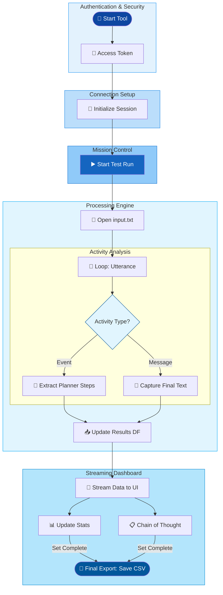

> **원문:** [Agentic Tooling: Making Agent Performance Transparent and Measurable](https://microsoft.github.io/mcscatblog/posts/response-analysis-copilot-tool/)
> **게시일:** 2026-01-16 · **저자:** Vineet Kaul

## 에이전트 분석이 없다면, 여러분의 미션은 정말 임파서블이에요

Copilot 에이전트를 구축하는 아키텍트와 개발자는 개발 라이프사이클에서 "블랙박스" 문제를 자주 마주해요. 기능적 정확성은 검증할 수 있어도, 응답 시간 분포나 플래너(planner)<sup>1</sup> 단계 실행에 대한 세밀한 가시성은 매우 제한적이에요.

이런 가시성이 없으면 개발자는 시스템 차원의 비효율을 찾기 어렵고, 다음과 같은 작업을 할 수 없어요.

1. 응답 시간 성능을 지식 소스 및 출력 크기와 연관 지어 분석하기
2. 서로 다른 쿼리 간 응답 시간의 변동성과 추세 파악하기
3. 도구 호출과 인수를 포함한 동적 플래닝 로직을 추적해 추론·실행 경로 검증하기
4. 지속적인 개선과 최적화를 위해 데이터를 집계·분석하기

이런 지표를 손으로 추적하는 건 시간이 많이 들고, 실수하기 쉽고, 규모가 커지면 감당이 안 돼요. 그래서 개발 과정에서 에이전트 동작의 성능과 투명성을 일관되게 지키기가 어려워요.

## 🧠 인셉션: 에이전트의 잠재의식 속으로

M365 Agents SDK를 Python DataFrame<sup>2</sup>과 함께 쓰면, 원시 응답 시간을 실시간 텔레메트리 스트림으로 바꿔서 메시지가 올 때마다 평균(Mean), 중앙값(Median), 표준편차(Standard Deviation) 같은 증분 지표를 계산할 수 있어요. 이 값들을 전체 대화에 걸쳐 모으면 더 높은 수준의 인사이트가 나와요.

M365 Agents SDK의 기반 API는 Bot Framework Activity 프로토콜을 쓰고, 메시지·이벤트·상호작용이 어떻게 흐르는지에 대한 정보를 내보내요. `Activity` 타입(메시지 및 이벤트)을 가로채고 기록하면 에이전트의 계획, 내부 추론, 도구 선택 같은 추가 데이터를 뽑아낼 수 있어요. 이 세밀한 데이터 덕분에 아키텍트는 에이전트 동작의 정확한 순서를 눈으로 볼 수 있어요.

Gradio UI를 쓰면, 스트리밍 응답 데이터로 구동되는 인터랙티브 대시보드를 통해 팀에 인사이트를 실시간 그래픽으로 보여줄 수 있어요.

## 🕵️ 도구 해부: 어떻게 코딩할까요?

**📡 보안 통신**

Microsoft MSAL(Microsoft Authentication Library)<sup>3</sup>로 보안 세션을 열어 인증된 세션을 만들어요.

```python
# Uses MSAL to get an access token for Power Platform APIs
pca = PublicClientApplication(client_id=app_client_id, ...)

# Try to get token from cache first
response = pca.acquire_token_silent(token_request["scopes"], account=accounts[0])

# Fallback to interactive login if silent fails
if retry_interactive:
    response = pca.acquire_token_interactive(**token_request)
```

M365 Agents SDK의 Copilot Studio Client는 이 세션 인증 토큰으로 Copilot Studio와 직접 통신을 맺어요.

```python
  settings = ConnectionSettings(
      environment_id=environ.get("COPILOTSTUDIOAGENT__ENVIRONMENTID"),
      agent_identifier=environ.get("COPILOTSTUDIOAGENT__SCHEMANAME"),
  )
  # Generates the client used to send/receive messages
  copilot_client = CopilotClient(settings, token)
  return copilot_client
```

**⚙️ "트리거 액션"**

코드는 `btn.click` 리스너로 UI 버튼을 백엔드 로직과 연결해요. 사용자가 테스트를 시작하면 `ask_question_file` 메서드가 Copilot 응답을 처리하고, 결과를 여러 UI 컴포넌트(차트, 숫자, 테이블)에 동시에 반영해요.

```python
btn.click(
    fn=proc.ask_question_file, # The backend processing function
    inputs=[],
    outputs=[btn, tb, process_status, mean_output, lineplot_output, frame_output, ...] 
)
```

**🔄 자동화된 메시지 디스패치 / 비동기 응답 처리**

입력 파일 `input.txt`의 각 줄은 고유한 사용자 발화(utterance)로 취급돼요. 코드가 쿼리를 순회하는 동안 세션이 유지되기 때문에 에이전트를 직접 건드리지 않고도 테스트할 수 있어요. M365 Agents SDK Copilot Studio Client가 이 쿼리들을 대화 순서대로 Copilot에 보내고, 응답을 받을 때까지 비동기 루프에서 수신 `Activity`를 기다려요.

```python
# Iterates through each line in the file as a new query
with open('./data/input.txt', 'r', encoding='utf-8') as file:
    for line in file:
        query = line.strip()
        # Signals the connection to start a dialogue
        replies = self.connection.ask_question(query, conversation_id)
```

**⏱️ 증분 지연 시간 계산**

`Activity` type=message의 응답 타임스탬프를 캡처해서, 쿼리를 보낸 순간부터 해당 발화의 최종 응답을 받은 순간까지 걸린 정확한 시간을 계산하고, 지연 시간(latency)과 시간 관련 통계를 기록해요.

```python
elif reply.type == ActivityTypes.message:
  start_time = time.perf_counter()
  # ... wait for agent response ...
  elapsed_time = time.perf_counter() - start_time
  resultsdf.loc[len(resultsdf)] = [querycounter, query, reply.text, elapsed_time, len(reply.text)]
```

Python DataFrame(Pandas)은 현재 테스트 실행의 상태를 메모리에 유지해서, 전체 대화에 걸친 평균·중앙값·표준편차를 실시간으로 계산할 수 있게 해줘요. 사후 처리 대신, 엔진은 이벤트 루프마다 성능 지표를 조금씩 쌓아가며 집계해요.

```python
# Real-time yield of calculated series for Gradio UI components
yield (
    # Arithmetic Mean & Median for central tendency
    resultsdf['Time'].mean().round(2),   
    resultsdf['Time'].median().round(2), 

    # Dispersion Metrics: Standard Deviation (Sigma) indicates system jitter
    resultsdf['Time'].std().round(2),    
    resultsdf['Time'].max().round(2),    
    
    # Statistical Correlation: Pearson coefficient between character length and latency
    resultsdf['Char-Len'].corr(resultsdf['Time']) if len(resultsdf) > 1 else 0,
    
    # Dynamic Box-and-Whisker Plot for outlier visualization
    self.generate_boxplot(resultsdf['Time']) 
)
```



**🕵️ 에이전트 계획 추출**

`Activity` type=event 안의 정보를 파싱해서 에이전트의 추론, 도구 호출, 계획 실행을 기록해요. M365 Agent SDK는 특정 이벤트를 계속 지켜보다가, 에이전트가 왜 그 경로를 골랐는지 설명해주는 "사고 사슬(Chain Of Thoughts)<sup>4</sup>"(추론, 도구 호출, 계획 실행 등)을 캡처해요.

```python
async for reply in replies:
    if reply.type == ActivityTypes.event:
        # Records the hidden "thoughts" of the LLM planner
        resultsaidf.loc[len(resultsaidf)] = [
            querycounter, query, reply.value_type, reply.value['thought'], ...
        ]
```

**📊 실시간 시각화**

실시간 성능 지표와 계획 데이터를 다중 탭 대시보드 인터페이스로 스트리밍해요. Gradio 같은 UX 프레임워크는 커스텀 테마를 쓸 수 있고, 대시보드를 두 개의 뷰로 구성해요.

- *Statistics 탭*: 수치 요약(평균, 중앙값, 표준편차)과 시각화 플롯을 담고 있어요.
- *Data 탭*: 검색 기능이 있는 고급 DataFrame으로 원시 "플래너" 로직과 응답 문자열을 살펴볼 수 있어요.

```python
with gr.Blocks(theme='shivi/calm_seafoam') as demo:
    with gr.Tab("Statistics"):
        # Metrics and Charts
        mean_output = gr.Number(label="Mean")
        lineplot_output = gr.LinePlot(...)
        
    with gr.Tab("Data"):
        # Granular logs for debugging
        frame_output = gr.DataFrame(label="Query Response / Time Data")
        frameai_output = gr.DataFrame(label="LLM Planner Steps Data")
```

`yield` 키워드로 코드는 데이터를 Gradio UI에 실시간으로 스트리밍해요. 그 덕분에 **"Statistics"**와 **"Data"** 탭이 쿼리가 끝날 때마다 동적으로 업데이트되고, 전체 배치가 끝나기를 기다리지 않고도 바로바로 피드백을 얻을 수 있어요.

```python
# Updates the UI components (Mean, Median, Charts) after each response
yield (
    f"Processing {querycounter} of {linecount}",
    resultsdf['Time'].mean().round(2),
    resultsdf['Time'].std().round(2),
    self.generate_boxplot(resultsdf['Time']),
    resultsdf.sort_index()
)
```

## 🎬 본편 상영: 완전한 동작 도구

이 도구의 완전한 동작 버전은 공개된 [ResponseAnalysisAgentsSDK](https://microsoft.github.io/CopilotStudioSamples/testing/functional/ResponseAnalysisAgentsSDK) 리포지토리에서 확인할 수 있어요.
코드베이스는 바로 쓸 수 있는 상태이고, 초기 환경 설정, 테스트 실행, 결과 해석까지 포괄적으로 안내하고 있어요.

## ⚠️ 경고편: 중요한 고려 사항

서둘러 구현에 나서기 전에, 몇 가지를 솔직하게 짚어볼게요.

> **주의:** 현재 구현은 단일 세션 분석 전용으로 설계되어 있어요.

> **주의:** 도구를 배포하기 전에 [요구 사항](https://microsoft.github.io/CopilotStudioSamples/testing/functional/ResponseAnalysisAgentsSDK#prerequisite)을 검토해 환경 호환성을 확인한 다음, [설정 단계](https://microsoft.github.io/CopilotStudioSamples/testing/functional/ResponseAnalysisAgentsSDK#step-1-create-an-agent-in-copilot-studio)를 실행해서 도구를 구성하세요.

> **주의:** 액세스 토큰이나 자격 증명을 소스 컨트롤에 절대 커밋하지 마세요. 항상 환경 변수나 보안 자격 증명 저장소를 쓰고, 적절한 토큰 갱신 로직을 넣으세요.

## 💡 감독판: 핵심 요약

- **M365 Agent SDK를 통한 커스텀 툴링.**<br>
  M365 Agent SDK를 기반 인터페이스로 삼아, 여러분의 Copilot Studio 환경에 맞춘 엔지니어링 도구와 진단 유틸리티를 만드세요.
- **글래스 박스(Glass-Box) 관측성.**<br>
  에이전트 `Activity`를 가로채 플래너 메타데이터를 드러내면, 모든 에이전트 응답 뒤에 있는 구체적인 도구 호출과 내부 처리 로직을 감사(audit)할 수 있어요.
- **데이터 기반 검증.**<br>
  Python 데이터 라이브러리로 일화적인 테스트에서 정형화된 검증으로 넘어가세요. 배치 실행을 자동화하면 평균, 분산, 상관계수 같은 엄밀한 통계 지표를 계산할 수 있어요.
- **로직 격리.**<br>
  단일 대화에 집중해 동시성 노이즈를 없애세요. 이렇게 격리하면 수집하는 텔레메트리가 "깨끗하게" 유지돼서, 시스템 지시문(instructions)과 에이전트 상태 머신 전환을 정밀하게 다듬을 수 있어요.

---

*여러분의 에이전트에서 이 접근 방식을 시도해 보셨나요? 아니면 더 우아한 해결책을 찾으셨나요? 아래에 댓글을 남겨 주세요.*

---

## 어휘 주석

1. **플래너(planner):** 에이전트가 사용자 요청을 처리하기 위해 어떤 도구를 어떤 순서로 호출할지 스스로 계획을 세우는 내부 구성 요소.
2. **DataFrame:** 표 형태의 데이터를 다루기 위한 Python 자료구조로, 행과 열로 이루어져 통계 계산과 데이터 가공에 널리 쓰인다.
3. **MSAL(Microsoft Authentication Library):** 애플리케이션이 Microsoft Entra ID 등을 통해 사용자를 인증하고 액세스 토큰을 발급받게 해주는 Microsoft의 인증 라이브러리.
4. **사고 사슬(Chain of Thought):** AI 모델이 최종 답을 내기까지 거치는 중간 추론 단계들을 순서대로 기록한 것.
