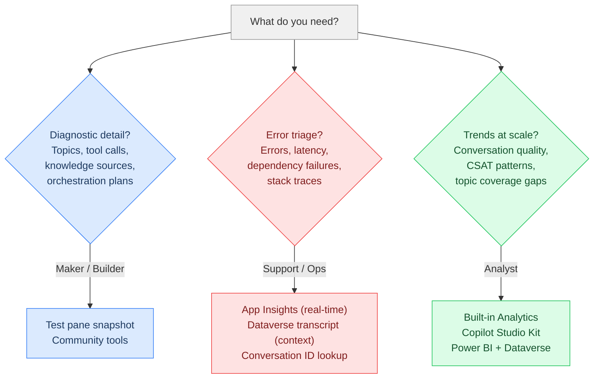
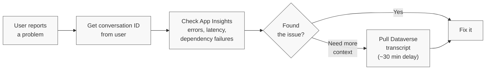

> **원문:** [Open the Hood: What Your Copilot Studio Agent Is Really Doing](https://microsoft.github.io/mcscatblog/posts/open-the-hood-copilot-studio-transcripts/)
> **게시일:** 2026-03-19 · **저자:** Roel Schenk

**사용자의 질문과 에이전트의 답변 사이에서 많은 일이 일어나요. 대부분의 사람들은 들여다보지 않아요.**

## TL;DR

Copilot Studio의 대화 기록(conversation transcript)은 에이전트가 나눈 모든 대화의 전체 그림을 보여 줘요. 단순한 "사용자가 말하고 / 봇이 말하고" 수준이 아니라, 그 밑에 깔린 진단 데이터까지 담고 있어요. 어떤 토픽이 발화했는지, 어떤 지식 소스가 조회되었는지, 어떤 도구가 호출되었는지, 어떤 에이전트나 MCP 서버가 실행되었는지, 오케스트레이션 계획은 무엇이었는지, 각 단계가 얼마나 걸렸는지 말이에요.

이 포스트는 세 가지 페르소나를 중심으로 구성되어 있어요.

- **[메이커 디버깅](#메이커-디버깅-만드는-중인데-뭔가-동작하지-않을-때)**<br>
  만드는 중인데 뭔가 이상해요. 대화 기록을 내려받아 읽고 고쳐요.
- **[지원/운영 트리아지](#지원운영-트리아지-사용자가-문제를-신고할-때)**<br>
  사용자가 문제를 신고해요. 해당 대화를 찾아 실패를 추적해요.
- **[분석가 트렌드](#트렌드-분석-대규모-대화-품질과-패턴)**<br>
  수백 건의 대화에 걸친 패턴이 필요해요. 대시보드와 파이프라인을 만들어요.

각 페르소나별로 알맞은 도구를 안내해요.

---

## 세 가지 페르소나, 서로 다른 출발점



### 메이커 디버깅: 만드는 중인데 뭔가 동작하지 않을 때

테스트 창(test pane)에 앉아 있어요. 에이전트가 올바른 지식 소스를 잡지 못하거나, 엉뚱한 토픽으로 라우팅되거나, 생성형 답변이 핵심을 놓쳐요. 트리거 문구를 손보고 지침도 다시 썼어요. 아무것도 소용이 없어요.

**후드를 여세요.**

테스트 창의 "Test your agent" 옆에 있는 **...**(점 세 개)를 클릭하고 **스냅샷 저장(Save snapshot)**을 선택해요. 대화 기록과 전체 에이전트 구성이 담긴 `botcontent`라는 zip 파일이 다운로드돼요. `dialog.json`을 열고 실제로 무슨 일이 있었는지 읽어 보세요.

**여기서 확인할 수 있는 것들의 몇 가지 예시예요.**

| 알고 싶은 것 | 어디서 찾을 수 있는가 |
|---|---|
| 어떤 토픽이 발화했고 에이전트의 확신도는 얼마였는지 | `TopicName`과 `Score`가 있는 `IntentRecognition` 활동 |
| 에이전트가 토픽 간에 어떻게 라우팅했는지 | 대상 다이얼로그 ID가 있는 `DialogRedirect` 활동 |
| **도구**나 **액션**이 호출되었는지(그리고 무엇을 반환했는지) | 커넥터 호출과 HTTP 요청을 포함한 도구 호출 이벤트 활동 |
| **하위 에이전트**나 **연결된 에이전트**가 실행되었는지 | 에이전트 간 핸드오프와 응답을 보여 주는 이벤트 활동 |
| **MCP 서버**가 호출되었는지 | 요청/응답 페이로드를 포함한 MCP 도구 호출 이벤트 활동 |
| **오케스트레이션 계획**이 무엇이었는지 | 에이전트의 추론과 계획된 단계를 보여 주는 생성형 오케스트레이션 트레이스 데이터 |
| 어떤 **지식 소스**가 검색되었고 무엇이 반환되었는지 | `nodeTraceData` 활동의 `SearchAndSummarizeContent` |
| 각 단계가 얼마나 걸렸는지 | 대화 흐름 내 각 활동의 타임스탬프 |
| 대화가 해결·에스컬레이션·이탈 중 어떤 결과였는지 | 결과와 턴 수가 있는 `SessionInfo` 활동 |
| 사용자가 경험을 어떻게 평가했는지 | `CSATSurveyResponse` 활동의 고객 만족도(CSAT) 설문 응답 |

데이터가 정말 많아요. 이것이 왜 중요한지 살펴볼게요.

#### 실제 사례: 에이전트가 가끔 침묵한 이유

한 고객의 에이전트는 대부분의 경우 잘 동작했지만, 가끔 그냥… 응답하지 않았어요. 오류도, 타임아웃 메시지도 없이 침묵뿐이었어요. 알고 보니 Copilot Studio에는 동기 응답 타임아웃이 있고([관찰된 동작](https://learn.microsoft.com/en-us/answers/questions/5619297/how-to-fix-a-flowactiontimedout-error-within-copil)과 [커뮤니티 보고](https://learn.microsoft.com/en-us/answers/questions/5722696/intermittent-non-response-issue-with-copilot-studi)에 따르면 약 120초 — 공식 문서 기준이 아니에요), Teams에서 이를 초과하면 조용히 실패해요. 사용자는 아무것도 받지 못해요.

스냅샷 다운로드가 첫 단계였지만, 정말 도움이 된 것은 [MCS Agent Analyser](https://github.com/Roelzz/mcs-agent-analyser)에 넣어 시간이 정확히 어디에 쓰였는지 시각화한 것이었어요. (실시간 성능 추적을 위한 다른 접근이 궁금하다면 [Agentic Tooling: 에이전트 성능을 투명하고 측정 가능하게](https://microsoft.github.io/mcscatblog/posts/response-analysis-copilot-tool/)를 참고하세요.) 트레이스가 보여 준 내용은 이래요.

1. **사용자 메시지**: "경비 보고서는 어떻게 제출하나요?"
2. **IntentRecognition**: 토픽 `ExpenseSubmission`이 확신도 0.92로 트리거됨. 올바른 토픽이에요.
3. **HTTP 커넥터 호출**: `expense_lookup` API가 사용자의 대기 중인 보고서를 확인. **34초 만에 반환.** 첫 번째 위험 신호예요.
4. **토픽 리디렉션**: 방법 안내 답변을 위해 `ExpenseGuidelines`로 라우팅.
5. **지식 소스 검색**: 에이전트가 **SharePoint 사이트 2곳**과 **업로드된 PDF 1개**를 검색. 셋 모두 **관련 청크 0건** 반환. 콘텐츠는 몇 달 전에 새 인트라넷으로 이전되었는데, 아무도 지식 소스 구성을 업데이트하지 않았던 거예요.
6. **폴백**<sup>1</sup>: 유용한 결과가 없어 오케스트레이터는 전체 문서 인덱스에 **Azure AI Search** 쿼리를 실행하는 캐치올(catch-all)<sup>2</sup> 토픽으로 넘어감. 이 호출 하나가 **62초** 소요.
7. **응답 생성**: LLM이 Azure AI Search 결과를 요약. **총 경과 시간: 34초 + 62초 + LLM 생성 = 약 130초.** 타임아웃을 넘겼어요. 사용자는 침묵만 받았어요.

**해결책**은 세 가지였어요.

- **지식 소스를 업데이트했어요.**<br>
  마이그레이션 중 비워진 옛 SharePoint 사이트가 아니라, 콘텐츠가 실제로 있는 새 인트라넷을 가리키도록 고쳤어요.
- **Azure AI Search 인덱스를 최적화했어요.**<br>
  시맨틱 랭킹을 추가하고 검색 범위를 줄여, 캐치올 쿼리가 전체 문서 코퍼스를 스캔하지 않도록 했어요.
- **캐치올 토픽을 재구성했어요.**<br>
  타임아웃을 설정하고, 멈춰 버리는 대신 정중한 폴백 메시지를 반환하도록 했어요.

결과: 평균 응답 시간이 약 35초로 떨어졌어요. 더 이상 조용한 실패는 없어요.

이것이 추측("설정을 좀 만져 볼까")과 데이터 기반 디버깅("지식 소스가 비어 있는 SharePoint 사이트를 가리키고 있고, 캐치올이 전체 인덱스 스캔을 하고 있다")의 차이예요.

그런데 테스트 창에 있지 않다면요? 에이전트가 이미 라이브 상태이고 사용자들이 문제를 신고하고 있을 수도 있어요. 그것은 완전히 다른 시나리오예요.

---

### 지원/운영 트리아지: 사용자가 문제를 신고할 때

에이전트가 라이브 상태예요. 사용자가 연락해요. "에이전트가 잘못된 답을 줬어요" 혹은 "이상한 오류가 났어요." 그 특정 대화를 찾아 무엇이 잘못됐는지 추적해야 해요.

**1단계: 대화 ID를 확보해요.** 사용자에게 세 가지를 요청하세요. 무엇을 하고 있었는지, 무엇을 기대했는지, 그리고 대화 ID예요. 사용자는 채팅에 `/debug conversationid`를 입력해 `0c4ebb21-3f74-4df4-b191-812aea31273d` 같은 GUID<sup>3</sup>를 받을 수 있어요([대화 ID를 얻는 방법](https://microsoft.github.io/mcscatblog/posts/conversationid-users/) 참조).

**2단계: Application Insights를 확인해요.** 프로덕션에서 에이전트를 운영한다면 [Copilot Studio를 Application Insights에 연결](https://learn.microsoft.com/en-us/microsoft-copilot-studio/advanced-bot-framework-composer-capture-telemetry)하는 것이 베스트 프랙티스예요. App Insights는 오류, 지연 시간, 종속성 실패, 스택 트레이스가 사는 곳이며, 거의 실시간에 가까운 텔레메트리를 제공해요. 1단계에서 얻은 대화 ID로 단일 대화의 모든 것을 반환하는 간단한 KQL 쿼리는 다음과 같아요.

```sql
customEvents
| extend conversationId = tostring(customDimensions["conversationId"])
| where conversationId == 'your-conversation-id'
| project timestamp, name, session_Id, customDimensions
| order by timestamp asc
```

이건 시작을 위한 것일 뿐이에요. 사전 구축된 대시보드는 [Copilot Studio Analytics Template Workbook](https://learn.microsoft.com/en-us/microsoft-copilot-studio/advanced-bot-framework-composer-capture-telemetry#analytics-template-workbook)을 확인하세요. 타이밍, 토픽 흐름, 액션 분해가 포함된 전체 대화 트레이스 쿼리는 곧 나올 포스트에서 다룰 예정이에요.

**3단계: App Insights로 부족할 때.** 도구 호출은 App Insights에 `TopicStart` 이벤트로 나타나므로 *어떤* 도구와 커넥터가 호출되었는지는 볼 수 있지만, Dataverse 대화 기록만큼 선명하지는 않아요. 지식 소스 세부 정보(어떤 소스가 검색되었는지, 어떤 청크가 돌아왔는지, 검색 소요 시간), 의도 인식 확신도 점수, 오케스트레이션 계획, 세션 결과(Resolved, Escalated, Abandoned)는 App Insights에 아예 없어요. 에이전트의 전체 오케스트레이션 계획을 따라가야 한다면 Dataverse 대화 기록이 훨씬 상세해요. 향후 업데이트에서 이 데이터가 App Insights에도 더 많이 들어오길 기대하지만, 지금은 Dataverse 대화 기록이 필요해요. `ConversationTranscript` 테이블의 `Name` 열(`ConversationId_BotId`가 저장됨)을 1단계의 대화 ID로 필터링하세요. 대화 기록은 대화 비활성 후 약 30분이 지나야 기록되므로, 최근 대화는 아직 없을 수 있다는 점에 유의하세요.

대화 기록을 탐색하고 파싱하려면 [Power Apps에서 직접 보거나](https://learn.microsoft.com/en-us/microsoft-copilot-studio/analytics-transcripts-powerapps), 사전 구축된 대시보드를 제공하는 [Copilot Studio Kit](https://github.com/microsoft/Power-CAT-Copilot-Studio-Kit)이나 앞서 언급한 커뮤니티 도구를 사용할 수 있어요.

**트리아지 워크플로:**



> **팁:** **App Insights는 오류를 보여 주고, 대화 기록은 맥락을 보여 줘요.** 도구 호출이 실패했다면 App Insights는 HTTP 상태 코드와 스택 트레이스를 알려 줘요. 대화 기록은 에이전트가 무엇을 하려 했는지, 그 전후로 무슨 일이 있었는지 알려 줘요. 까다로운 문제에는 보통 둘 다 필요해요.

---

### 트렌드 분석: 대규모 대화 품질과 패턴

일회성 디버깅은 지났어요. 에이전트가 대규모로 실제 대화를 처리하고 있고, 그 전반에서 무슨 일이 벌어지는지 추적해야 해요. 에스컬레이션율이 오르고 있나요? 어떤 토픽의 해결률이 가장 낮나요? 에이전트가 커버하지 못하는 사용자 의도가 있나요? 특정 채널에서 CSAT가 하락 추세인가요?

여기는 분석가의 영역이에요. 개별 대화 기록을 읽는 것이 아니라 패턴을 찾는 거예요.

**[내장 Analytics 창](https://learn.microsoft.com/en-us/microsoft-copilot-studio/analytics-overview)부터 시작하세요.** Copilot Studio의 **분석(Analytics)** 섹션은 기본 제공 기능만으로도 기대 이상을 보여 줘요. 세션 결과, 사용자 질문을 카테고리로 묶어 주는 AI 생성 [테마](https://learn.microsoft.com/en-us/microsoft-copilot-studio/analytics-themes), 개별 질문까지 드릴다운되는 [생성형 답변율과 품질](https://learn.microsoft.com/en-us/microsoft-copilot-studio/analytics-improve-agent-effectiveness#generated-answer-rate-and-quality-preview) 점수, 감정 분석, CSAT 점수, 도구 사용 지표, 예상 절감액까지. 설정도, 코드도 필요 없어요. 에이전트 성능을 이해하는 첫 번째 기착지예요.

**대화 기록 데이터에 대한 커스텀 분석**에는 [Copilot Studio Kit](https://github.com/microsoft/Power-CAT-Copilot-Studio-Kit)이 내장 분석과 완전 커스텀 파이프라인 사이의 중간 지대예요. Dataverse 대화 기록을 관계형 데이터 모델로 파싱하고, [Conversation KPIs](https://learn.microsoft.com/en-us/microsoft-copilot-studio/guidance/kit-conversation-kpi)와 참조 보고서를 기본 제공하며, 그 데이터 모델 위에 자체 보고서를 만들 수 있게 해 줘요. [Conversation Analyzer](https://learn.microsoft.com/en-us/microsoft-copilot-studio/guidance/kit-conversation-analyzer)는 커스텀 패턴 탐지를 위해 대화 기록에 대한 AI 기반 프롬프트를 추가로 제공해요.

**완전한 커스텀 대시보드**를 원한다면 [Dataverse의 Microsoft Fabric 연결](https://learn.microsoft.com/en-us/power-apps/maker/data-platform/azure-synapse-link-view-in-fabric)로 `ConversationTranscript` 테이블을 Fabric 레이크하우스에 동기화하세요. 원시 대화 기록 JSON은 파싱이 필요해요. 데이터플로나 자동화된 Fabric 노트북으로 구조화된 시맨틱 모델로 평탄화하세요. 그다음에는 원하는 Power BI 뷰를 만들면 돼요. 토픽별 CSAT, 채널별 에스컬레이션율, 시간에 따른 해결 트렌드 등. 이는 장기 저장 문제도 해결해요. 기본 30일의 Dataverse 보존 기간은 트렌드 분석에 부족하지만, Fabric 레이크하우스는 동기화한 모든 것을 보존해요.

---

## 대화 기록에 없는 것

대화 기록은 많은 것을 보여 주지만 전부는 아니에요. 스냅샷을 읽는 메이커든 커스텀 보고서를 만드는 분석가든, 공백을 알아 두면 존재하지 않는 데이터를 찾아 헤매는 일을 피할 수 있어요.

- **전체 LLM 프롬프트와 컴플리션은 노출되지 않아요.**<br>
  오케스트레이션 계획, 모델에 공급된 지식 소스 결과, 에이전트의 최종 응답은 볼 수 있어요. 하지만 오케스트레이터가 조립한 실제 시스템 프롬프트(LLM에 전달되는 전체 지침 집합)는 대화 기록에 없어요. 이는 의도된 거예요. 시스템 프롬프트에는 행동 지침, 안전 가드레일, 내부 로직이 담겨 있어요. 이를 노출하면 보안 위험이 생겨요. 애플리케이션 트레이스에 API 키를 로깅하지 않는 것과 같은 이유예요.
- **민감한 엔터프라이즈 데이터에 근거한 응답은 제외돼요.**<br>
  SharePoint를 지식 소스로 사용하면서 민감한 데이터가 담긴 문서를 참조한 에이전트 응답은 [대화 기록에 포함되지 않아요](https://learn.microsoft.com/en-us/microsoft-copilot-studio/analytics-transcripts-powerapps). 개인정보 보호 장치이지만, 지식 기반 응답이 생성되었으나 기록되지 않은 공백이 대화 기록에 보일 수 있다는 뜻이기도 해요.
- **토큰 수는 대화 기록에서 추적되지 않아요.**<br>
  Copilot Studio의 과금은 토큰당 가격이 아니라 [Copilot Credits](https://learn.microsoft.com/en-us/microsoft-copilot-studio/requirements-messages-management)로 이루어져요. 과금 기준이 아니기 때문에 토큰 수는 노출되지 않아요. 소비량은 Power Platform 관리 센터의 크레딧 사용량으로 모니터링하세요.
- **오케스트레이터의 추론은 모델에 따라 다르게 보여요.**<br>
  오케스트레이터가 *무엇을* 계획했는지는 볼 수 있어요(이 소스들을 검색하고, 이 도구를 호출한 뒤 요약한다). [딥 리즈닝(deep reasoning)](https://learn.microsoft.com/en-us/microsoft-copilot-studio/requirements-messages-management#reasoning-model-billing-rates) 모델을 사용하면 생각의 사슬이 대화 기록에 공유되어 *왜* 그 계획을 선택했는지까지 볼 수 있어요. 딥 리즈닝이 없으면 결과로 나온 계획만 볼 수 있고, 그 뒤의 추론은 볼 수 없어요.

---

## 마무리

이 포스트는 출발점이에요. 여러분은 어떤 페르소나이고, 어떤 데이터가 필요하며, 그것을 어디서 찾을 수 있는지예요. 메이커가 테스트 창 스냅샷으로 디버깅하는 방법, 지원·운영 팀이 App Insights와 Dataverse 대화 기록으로 트리아지하는 방법, 분석가가 내장 분석, Copilot Studio Kit, Fabric으로 트렌드 분석을 구축하는 방법을 다뤘어요.

파고들 것이 아직 많이 남아 있어요. Dataverse 대화 기록 데이터 모델, 상세한 App Insights 쿼리, 커스텀 분석 파이프라인 구축 방법, 자동화된 분석 설정 방법은 모두 별도의 포스트가 필요한 주제예요. 관심이 있으시면 더 깊이 들어갈게요.

**한 가지 부탁:** 다음에 보고 싶은 내용이나 이 포스트가 답하지 못한 질문을 아래에 댓글로 남겨 주세요. 여러분의 피드백이 다음 콘텐츠를 결정해요.

즐거운 조사 되시길, 그리고 여러분의 토픽 라우팅이 항상 첫 시도에 정확히 발화하기를 바라요.

---

## 어휘 주석

1. **폴백(fallback):** 기본 방법이 실패하거나 조건을 만족하지 못했을 때 대신 사용하는 대체 수단이나 메시지.
2. **캐치올(catch-all):** 정해진 어떤 조건에도 맞지 않는 나머지 모든 경우를 한꺼번에 받아 처리하도록 만든 범용 로직.
3. **GUID(Globally Unique Identifier):** 시스템에서 각 항목을 고유하게 식별하기 위해 부여하는, 문자와 숫자로 이뤄진 긴 식별자.
