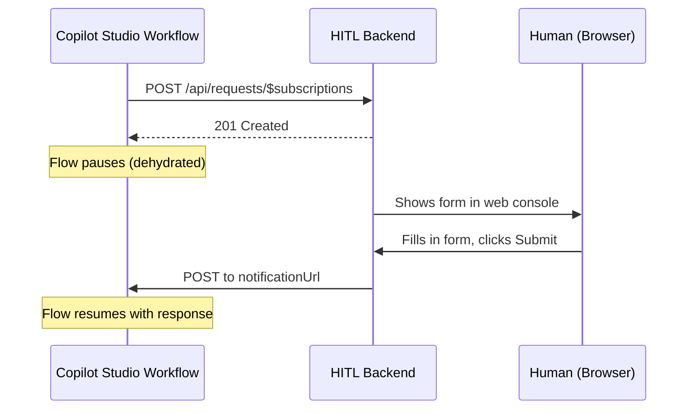

> **원문:** [Building a Custom Human-in-the-Loop Experience for Copilot Studio Workflows](https://microsoft.github.io/mcscatblog/posts/human-in-the-loop-custom-connector/)
> **게시일:** 2026-05-20 · **저자:** Adi Leibowitz

[Copilot Studio의 워크플로](https://learn.microsoft.com/en-us/microsoft-copilot-studio/flow-designer?tabs=workflows)는 종종 멈춰서 사람을 기다려야 해요. 승인, 검토, 확인 요청 같은 것들 말이죠. 기본 제공 옵션(Human Review를 통한 이메일, Teams 어댑티브 카드)도 동작은 하지만, 규모가 커지면 소음이 돼요. 여러 워크플로에서 하루에 수십 건의 요청이 모두 같은 받은 편지함이나 채팅에 떨어지고, 우선순위를 정하거나 묶어서 처리할 방법이 없어요. 그러다 사람이 요청을 분류하는 에이전트를 만들고, 그 에이전트가 사람의 입력이 필요한 요청을 더 많이 보내고, 그리고... 어디로 흘러가는지 보이시죠.

저희는 사람의 응답을 위해 *어떤* UI든 연결할 수 있게 해 주는 [커스텀 커넥터 샘플](https://microsoft.github.io/CopilotStudioSamples/extensibility/human-in-the-loop/)을 만들었어요. 샘플에는 웹 콘솔이 포함되어 있지만, 이 패턴은 커스텀 앱, Slack 통합(네, Slack이라고 했어요!), 또는 REST 엔드포인트를 호출할 수 있는 무엇에든 적용돼요.

_샘플 웹 콘솔. 모든 대기 중인 요청이 한곳에서 시간순으로 정리되며 Pending/Completed/All 탭이 있어요._

## 기본 제공 옵션의 문제

"멈추고 사람을 기다리기"를 지원하는 기본 제공 커넥터들은 각각 동일한 한계를 가지고 있어요. 전달 채널을 자기들이 소유한다는 점이에요.

- **Human Review**는 이메일을 보내요. 모든 요청이 누군가의 받은 편지함에 또 하나의 이메일로, 다른 모든 것과 뒤섞여 도착해요.
- **Post adaptive card and wait for a response**(Teams 커넥터)는 Teams 카드를 보내요. 이메일보다는 낫지만, 여전히 워크플로 전반에 걸쳐 무엇이 대기 중인지 볼 방법이 없는 개별 카드의 흐름일 뿐이에요.

둘 다 가끔 발생하는, 신호가 명확한 요청에는 잘 동작해요. 하지만 워크플로가 확장되어 사람의 입력이 필요한 실행이 하루에 수십 건이 되면, 이 채널들은 소음이 돼요. 사람은 우선순위를 정할 수 없고, 서로 다른 워크플로에 걸쳐 무엇이 기다리고 있는지 볼 수 없으며, 응답을 묶어서 처리할 수도 없어요.

우리가 원했던 것은 동일한 일시 중지·재개(pause-and-resume) 동작을 유지하면서 자체 UI를 연결하는 것이었어요. 이는 커스텀 커넥터를 만들어야 한다는 뜻이에요. 그런데 흐름을 *일시 중지*시키는 커넥터 작업을 어떻게 만들까요?

## 발견: 웹훅 작업(Webhook Actions)

Teams 커넥터의 "Post adaptive card and wait for a response" 작업은 커스텀 커넥터에서도 동작하는, 잘 알려지지 않은 패턴을 사용해요. 바로 **웹훅 작업(webhook action)**이에요. 새 흐름 실행을 시작하는 웹훅 *트리거*와 달리, 웹훅 작업은 현재 흐름을 **일시 중지**시키고 백엔드가 콜백할 때 재개해요. 흐름은 완전히 탈수(dehydrate)되어 대기하는 동안 리소스를 전혀 소비하지 않아요.

## OpenAPI 패턴

커넥터의 OpenAPI 정의에서 세 가지가 이를 동작하게 해요.

1. `notificationUrl` 매개변수의 **`x-ms-notification-url: true`**는 플랫폼에게 콜백 URL을 생성하여 주입하라고 알려줘요
2. 경로 수준의 **`x-ms-notification-content`**는 콜백 페이로드의 스키마(흐름이 재개될 때 받는 것)를 정의해요
3. **`x-ms-trigger`가 없다는 것**이 결정적인 차이예요. 이것이 없으면 플랫폼은 이를 시작하는 트리거가 아니라 일시 중지하는 작업으로 취급해요

커넥터에는 웹훅 구독 해지를 위한 `DELETE` 엔드포인트도 필요해요(흐름이 취소될 때 호출됨).

**전체 OpenAPI 정의:**

```yaml
paths:
  /api/requests/$subscriptions:
    x-ms-notification-content:
      description: Human's response
      schema:
        type: object
        properties:
          responseText:
            type: string
            description: The primary response text
          response:
            type: object
            description: All response fields
          respondedAt:
            type: string
            description: When the human responded
    post:
      operationId: RequestHumanInput
      summary: Request human input and wait for a response
      # No x-ms-trigger — this makes it an ACTION, not a trigger
      parameters:
        - name: body
          in: body
          required: true
          schema:
            type: object
            required:
              - notificationUrl
              - body
            properties:
              notificationUrl:
                type: string
                x-ms-notification-url: true
                x-ms-visibility: internal
              body:
                type: object
                required:
                  - title
                properties:
                  title:
                    type: string
                    description: Title shown to the human
                  message:
                    type: string
                    description: Instructions for the human
      responses:
        '201':
          description: Created — waiting for response
  /api/requests/{id}:
    delete:
      operationId: DeleteRequest
      x-ms-visibility: internal
      # Webhook unsubscribe — called when flow is cancelled
```

## 처음부터 끝까지 동작하는 방식



흐름은 폴링하지 않고, 몇 분이든 몇 시간이든 며칠이든 그대로 기다릴 수 있어요. 백엔드가 `notificationUrl`로 POST하면 Power Platform이 흐름을 재수화(rehydrate)하여 응답 데이터와 함께 계속 진행해요.

## 백엔드가 구현해야 하는 것

백엔드는 커넥터를 위해 두 개의 엔드포인트를 구현해야 해요.

| 엔드포인트 | 목적 |
|---|---|
| `POST /api/requests/$subscriptions` | 커넥터로부터 요청을 받아 저장(`notificationUrl` 포함)하고 201 반환 |
| `DELETE /api/requests/:id` | 웹훅 구독 해지. 흐름이 취소될 때 플랫폼이 호출 |

사람이 응답하면 앱은 `x-ms-notification-content`에 정의된 스키마에 맞춰 저장된 `notificationUrl`로 응답을 POST해야 해요. 그것이 흐름을 재개시키는 것이에요. 나머지는 모두 여러분에게 달려 있어요. 대기 중인 요청을 어떻게 보여줄지, 사람이 응답을 어떻게 제출할지, UI가 어떤 모습일지 말이죠. 샘플에는 간단한 웹 콘솔이 있는 Node.js/Express 구현(약 190줄)이 포함되어 있지만, 이 두 엔드포인트 위에 어떤 UI든 만들 수 있어요.

## 설정하기

[샘플](https://microsoft.github.io/CopilotStudioSamples/extensibility/human-in-the-loop/)은 5분 안에 실행되도록 설계되었어요.

**1. 리포지토리를 복제하고 백엔드 시작:**

```bash
cd extensibility/human-in-the-loop
node setup.js
```

이 스크립트는 의존성을 설치하고, 개발 터널(공개 HTTPS URL)을 만들고, 서버를 시작하고, 터널 호스트 URL을 출력해요.

**2. 솔루션 가져오기:**

[make.powerapps.com](https://make.powerapps.com) → 솔루션(Solutions) → 가져오기(Import) → `solution/customHIL_1_0_0_3.zip`을 업로드해요. 메시지가 표시되면 `HitlHostUrl`을 1단계의 터널 호스트 URL로 설정해요.

**3. 커넥터 사용:**

Copilot Studio에서 워크플로에 "Human-in-the-Loop"을 커넥터 작업으로 추가해요. 제목, 메시지를 설정하고 선택적으로 특정 담당자를 지정해요. 워크플로는 사람이 응답할 때까지 일시 중지돼요.

_Copilot Studio 워크플로의 커넥터 작업. 워크플로는 사람이 응답할 때까지 이 단계에서 일시 중지돼요._

**4. 응답하기:**

브라우저에서 로컬 또는 터널 URL을 열어요. 대기 중인 요청이 웹 콘솔에 나타나요. 양식을 채우고 Submit을 클릭하면 워크플로가 응답 데이터와 함께 재개돼요.

## 프로덕션 고려 사항

샘플은 인메모리 스토리지와 개발 터널을 사용하며, 데모에는 충분해요. 프로덕션에서는 다음을 고려하세요.

- **영구 스토리지** (인메모리 맵 대신 데이터베이스)
- 백엔드의 **OAuth 인증**
- **사용자 권한 부여** (누가 어떤 요청에 응답할 수 있는지 검증)
- **푸시 알림** (웹 콘솔 폴링 대신)
- Azure App Service, Azure Functions 등에서의 **HTTPS 호스팅**
- **콜백 URL 보호.** `notificationUrl`은 Power Platform이 SAS<sup>1</sup> 서명하지만 인증을 요구하지 않아요. URL을 가진 누구나 흐름을 재개할 수 있어요. 서버 사이드에만 보관하고, 브라우저나 최종 사용자에게 절대 노출하지 마세요.

전체 샘플은 [CopilotStudioSamples/extensibility/human-in-the-loop](https://microsoft.github.io/CopilotStudioSamples/extensibility/human-in-the-loop/)에서 확인할 수 있어요. 완전한 OpenAPI 정의, Node.js 백엔드, 가져올 수 있는 Power Platform 솔루션, 로컬 테스트 하네스가 포함되어 있어요.

여러분이라면 커스텀 HITL 커넥터를 어떤 시나리오에 사용하시겠어요? 기본 제공 승인 채널에서 같은 벽에 부딪히셨나요? 댓글로 알려주세요.

---

## 어휘 주석

1. **SAS(Shared Access Signature):** 별도 로그인 없이도, URL 자체에 서명을 붙여 정해진 기간·권한 내에서만 리소스 접근을 허용하는 Azure의 임시 접근 방식.
